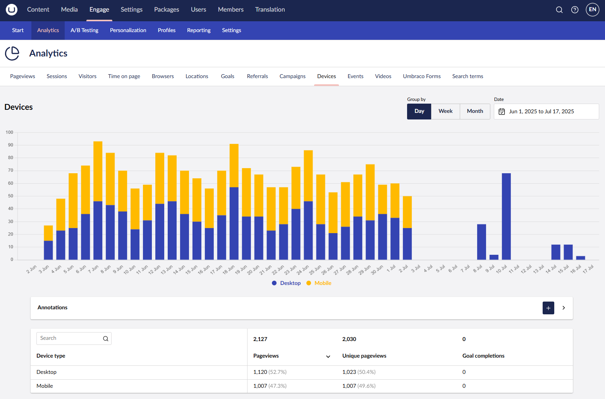

# Device Type

In the **Devices** report within **Analytics**, you can view the ratio of visitors using different devices. It shows how many visitors access your website via desktop, tablet, and mobile.

