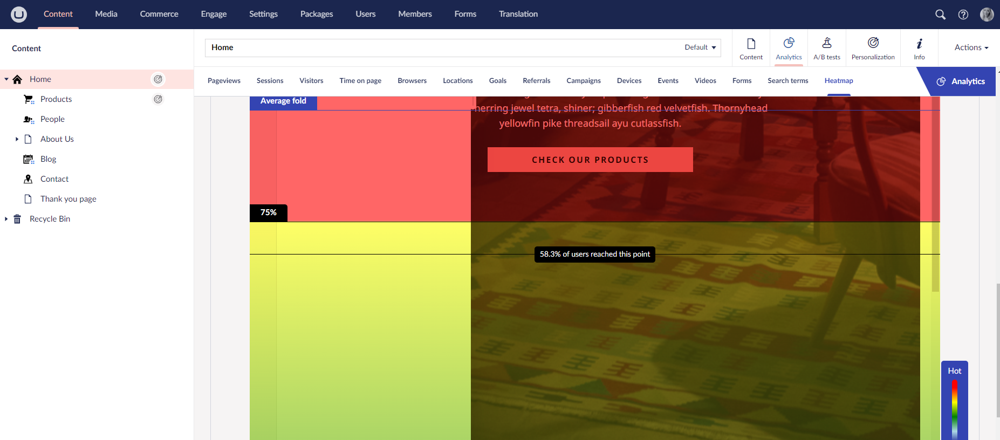

# Scroll Heatmap

The Scroll Heatmap shows you how your visitors consume your content.

The feature gives a visual representation of the average scroll depth of your visitors on a specific page. This feature is only available within the Analytics Content App on an Umbraco page.

An advantage is that you do not need to integrate any 3rd-party tools. This will prevent additional load times and possible issues with data ownership.

The heatmap only collects data if [the client-side script](../../developers/analytics/client-side-events-and-additional-javascript-files/) is installed on your website.
