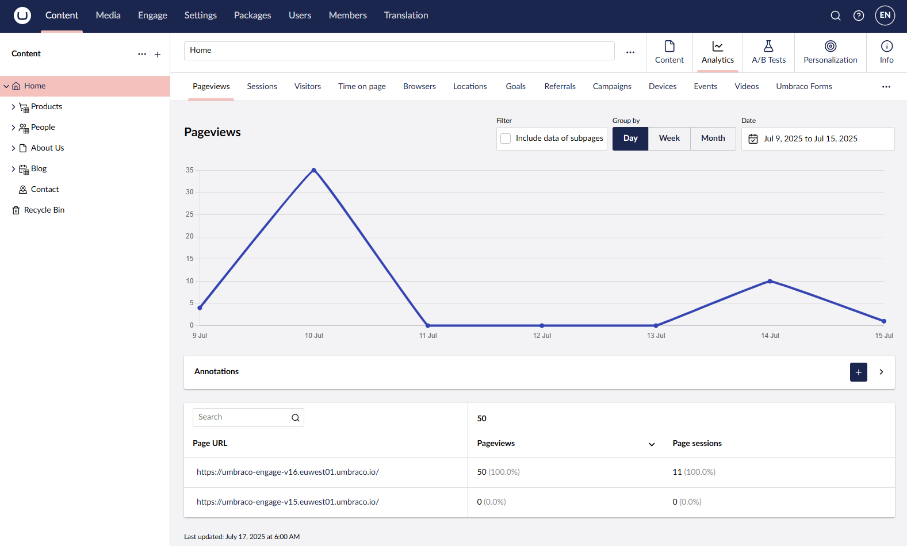
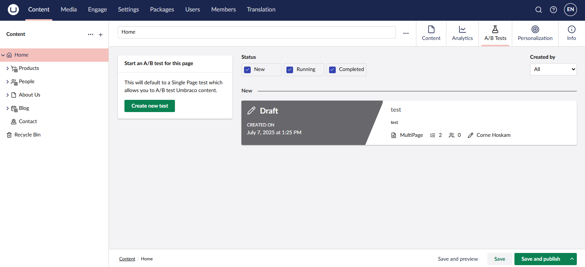
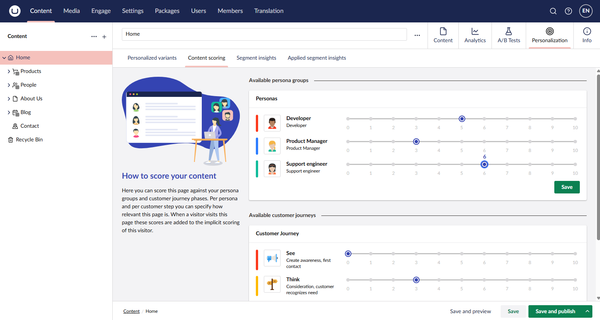
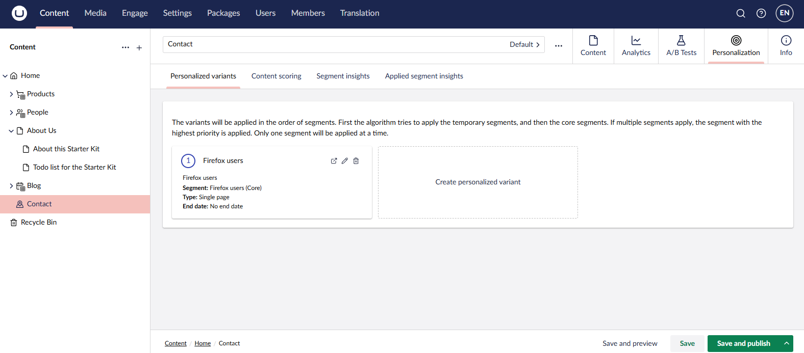

# Content Apps

In the Content section of Umbraco, you will see the Umbraco nodes. Most of them will relate to a specific page in your website. If you have installed the Umbraco Engage, each Umbraco node will have three extra Content Apps.

## Analytics

If you navigate to a node, you will see the Analytics content app. If you open the Content App, the Analytics data of this specific node is loaded.

## A/B Tests

The A/B Tests content app allows you to test your Umbraco node within the splitview functionality. Every Document Type can be A/B tested:

## Personalization

The Personalization content app allows you to score a specific page based on the customer journey and persona (for implicit content scoring).

It also allows you to set up personalized variants for each node.

## Managing the access to content apps

In the **Engage** -> **Settings** section, you can manage which Document Types the content apps are displayed, and which Umbraco user groups can access them. They can be managed per Document Type and per user group

