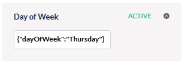

# Implement your own segment parameters

Umbraco Engage comes with built-in parameters to build a segment, such as "Customer Journey" and "Time of Day". 
However, you may want to build segments with custom rules that are not part of Engage by default. We've got you covered; you can add your own custom segment parameters to Engage.

The following guide will explain how this can be done. Note this is aimed at developers.
There are 3 steps, 2 of which are mandatory and the 3rd is optional:

1. C# definition
2. Web component definition
3. Cockpit visualization (optional)

This guide will use concrete code samples to add a "Day of week" segment parameter where you can select a single day of the week. If a pageview happens on that day the segment parameter will be satisfied.

## 1. C# definition

Your custom segment parameter will need to be defined in C# in order for Engage to use it.
In code we refer to a segment parameter as a "segment rule".

A segment rule is not much more than this:

* A unique rule identifier, e.g. "DayOfWeek".
* A configuration object, e.g. "{ dayOfWeek: "Monday" }"
    * This is optional, but most rules will have some sort of configuration that the user can alter in the Segment Builder. In our example, the user can configure the specific day of the week.
* A method that specifies whether the rule is satisfied by the current pageview.

You will have to implement the following interfaces for a new custom parameter:

* Umbraco.Engage.Infrastructure.Personalization.Segments.ISegmentRule
    * You can extend the existing BaseSegmentRule to simplify the implementation.
    * The most important part to implement is the bool IsSatisfied(IPersonalizationProfile context) method.
* Umbraco.Engage.Infrastructure.Personalization.Segments.Rules.ISegmentRuleFactory
    * Register your implementation of the segment rule factory with Lifetime.Transient in a composer.

For the "Day of week" example, the code looks like this:

```c#
public class DayOfWeekSegmentRule : BaseSegmentRule
{
    public DayOfWeekSegmentRuleConfig TypedConfig { get; }

    public override SegmentRuleValidationMode ValidationMode => SegmentRuleValidationMode.Once;

    public DayOfWeekSegmentRule(long id, Guid key, long segmentId, string type, string config, bool isNegation, DateTime created, DateTime? updated, DayOfWeekSegmentRuleConfig typedConfig)
        : base(id, segmentId, type, config, isNegation, created, updated)
        => TypedConfig = typedConfig;

    public override bool IsSatisfied(IPersonalizationProfile context)
        => context.Pageview.Timestamp.DayOfWeek == TypedConfig.DayOfWeek;
}
```

And the factory which is used to create an instance of this rule:

```c#
//The segment rule factory needs to be registered so Engage can use it.
[RegisterService(ServiceLifetime.Transient)]
public class DayOfWeekSegmentRuleFactory : ISegmentRuleFactory
{
    public string RuleType { get; } = "DayOfWeek";
    public ISegmentRule CreateRule(string config, bool isNegation, long id, Guid key, long segmentId, DateTime created, DateTime? updated)
    {
        var typedConfig = JsonConvert.DeserializeObject<DayOfWeekSegmentRuleConfig>(config);
        return new DayOfWeekSegmentRule(id, key, segmentId, RuleType, config, isNegation, created, updated, typedConfig);
    }
}
```

We are using the class DayOfWeekSegmentRuleConfig to represent the rule configuration. This is not strictly necessary but makes it easier. 
The configuration is stored as a string in the database. In code we like to have intellisense so we parse the stored configuration to this class:

```c#
//Generating config schema on client side.
[GenerateEngageSchema]
public class DayOfWeekSegmentRuleConfig
{
    public DayOfWeek DayOfWeek { get; set; }
}
```

That's the C# part of the custom segment parameter.

## 2. Web component definition

We have implemented the business logic for the segment parameter, but the parameter cannot be used in the backoffice yet. In this step we will add a web component to render the new rule in the Engage segment builder.

These steps will once again show concrete code samples that belong to our demo parameter "Day of week".
You can create a folder to manage new files. Those files look like this:
* segment-rule-base.ts
    * Type declaration for UeSegmentRuleBaseElement from Umbraco Engage. This is a temporary declaration until Umbraco Engage provides an npm package.
* segment-rule-day-of-week.ts
    * Declaration for your web component using Lit.
* index.ts
    * Exporting all your elements.
* manifest.ts
    * Declares your element as a backoffice extension and register it  in the Extension Registry. Read more about Extension Manifest [here](../../../../umbraco-cms/customizing/extending-overview/extension-registry/extension-manifest.md/).

First, re-generate the DayOfWeek config type on client side using the below command

```text
npm run generate:api
```

**segment-rule-base.ts**

```typescript
enum RuleDirection {
  INCLUDE = "include",
  EXCLUDE = "exclude",
}

export interface UeSegmentRuleParameterConfig<ValueType> {
  isNegation: boolean;
  config: ValueType;
}

export class UeSegmentRuleBaseElement<UeSegmentRuleParameterConfig> extends UmbLitElement {
  abstract renderReadOnly();
  abstract renderEditor();
  value: UeSegmentRuleParameterConfig;
  initialized: Promise<void>;

  @property({ type: Boolean, attribute: true, reflect: true })
  readonly?: boolean;

  updateParameterValue(value: any, key: keyof ValueType) {
    if (!this.value?.config) return;

    const config = { ...(this.value.config ?? {}), ...{ [key]: value } };
    this.pending = assignToFrozenObject(this.value, { config });
    this.renderReadOnly();
  }

  render() {
    return this.readonly ? this.#renderReadOnly() : this.#renderEditor();
  }

  #renderReadOnly() {
    return html`
        <div id="readonly" .title=${this.manifest?.meta.name ?? ""}>
            <uui-icon .name=${this.manifest?.meta.icon ?? "icon-document"}></uui-icon>
            ${this.renderReadOnly()}
        </div>
    `;
  }

  #renderEditor() {
    return html`
        <div id="editorHeader">
        <h3>${this.manifest?.meta.name}</h3>
        <ue-button-group
          .values=${Object.values(RuleDirection)}
          .value=${this.value?.isNegation
            ? RuleDirection.EXCLUDE
            : RuleDirection.INCLUDE}
        ></ue-button-group>
      </div>
      <div id="editor">${this.renderEditor()}</div>
    `;
  }
}

```

**segment-rule-day-of-week.ts**

```typescript
export interface UeSegmentRuleDayOfWeekConfig
  extends DayOfWeekSegmentRuleConfigModel {}

const elementName = "ue-segment-rule-day-of-week";

@customElement(elementName)
export class UeSegmentRuleDayOfWeekElement extends UeSegmentRuleBaseElement<UeSegmentRuleDayOfWeekConfig> {
  @state()
  private _options: Array<Options> = [];

  connectedCallback(): void {
    super.connectedCallback();
    this._options = makeArray<DayOfWeek>(
      "Sunday",
      "Monday",
      "Tuesday",
      "Wednesday",
      "Thursday",
      "Friday",
      "Saturday"
    ).map((x, i) => ({
      value: x,
      name: x,
      selected: this.value?.config.dayOfWeek === x || i === 0,
    }));
  }

  renderReadOnly() {
    return html`Day of week: ${this.value?.config.dayOfWeek}`;
  }

  renderEditor() {
    return html`
      <umb-property-layout label="Day" orientation="horizontal">
        <div slot="editor">
          <uui-select
            .options=${this._options}
            @change=${(e) => this.onSelectChange(e)}
          ></uui-select>
        </div>
      </umb-property-layout>
    `;
  }

  onSelectChange(e: UUISelectEvent) {
    if (!this.value) return;

    const selectedValue = e.target.value as string;

    this.updateParameterValue(selectedValue, "dayOfWeek");
  }
}

export { UeSegmentRuleDayOfWeekElement as api };

declare global {
  interface HTMLElementTagNameMap {
    [elementName]: UeSegmentRuleDayOfWeekElement;
  }
}

```

**index.ts**

```text
export { UeSegmentRuleDayOfWeekElement } from "./segment-rule-day-of-week.js";
export { UeSegmentRuleBaseElement } from "./segment-rule-base.js";
```

**manifest.ts**

```json
{
    type: ENGAGE_SEGMENT_RULE_EXTENSION_TYPE,
    name: 'Engage Day of Week Segment Rule',
    alias: 'Engage.Segment.Rule.DayOfWeek',
    elementName: 'ue-segment-rule-day-of-week',
    weight: 100,
    meta: {
        name: 'Day of week',
        icon: 'icon-calendar',
        type: 'DayOfWeek',
        config: { dayOfWeek: 'Sunday' },
    },
}
```

That's it. If all went well you will see your custom parameter editor show up in the segment builder:

<figure><figcaption><p>Day of week Segment.</p></figcaption></figure>

## 3. Cockpit visualization (optional)

The new segment parameter will show up automatically in the Cockpit that is part of our package. The cockpit is a live view of Engage data for the current visitor. This includes active segments of the current visitor, and therefore your new segment parameter can also show up in the cockpit. 

By default it will simply display the the raw configuration of the parameter as stored in the database ("{ dayOfWeek: Thursday }" in our example), and if you hover over it you will see the rule identifier "DayOfWeek" rather than a friendly name.

<figure></figure>

If you would like to change this to be a bit more readable you can implement the Engage.Web.Cockpit.Segments.ICockpitSegmentRuleFactory interface. For the DayOfWeek demo parameter, this is the implementation:

```c#
//Registering this factory.
[RegisterService(ServiceLifetime.Transient)]
public class DayOfWeekCockpitSegmentRuleFactory : ICockpitSegmentRuleFactory
{
    public DayOfWeekCockpitSegmentRuleFactory() { }

    public bool TryCreate(ISegmentRule segmentRule, bool isSatisfied, out CockpitSegmentRule? cockpitSegmentRule)
    {
        cockpitSegmentRule = null;
        if (segmentRule is DayOfWeekSegmentRule dayOfWeekRule)
        {
            cockpitSegmentRule = new CockpitSegmentRule
            {
                Name = "Day of week",
                Icon = "/path/to/icon.png",
                Config = dayOfWeekRule.TypedConfig.DayOfWeek.ToString(),
                IsNegation = segmentRule.IsNegation,
                IsSatisfied = isSatisfied,
                Type = segmentRule.Type,
            };
            return true;
        }
        return false;
    }
}
```

So we simply transform the JSON into a human readable representation and we configure an icon to show up in the cockpit. Make sure to register this class in a composer (you can reuse the composer from step 1):

After that the Engage will use the additional information to properly render your segment parameter in the cockpit as well. Note that the "DayOfWeek test" string is the name of the segment. This segment happens to have only 1 parameter which is the DayOfWeek parameter.

<figure></figure>
