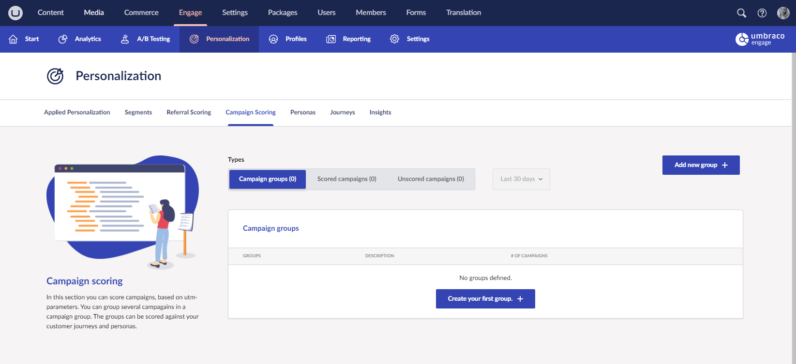

# Campaign Scoring

## Setting up your campaigns

Campaigns are automatically scored by using utm-parameters, that you may be already using for your marketing campaigns. You can add 5 different parameters to your URL:

* `utm_source`: Identify the advertiser, site, publication, etc. that is sending traffic to your property, for example, Google, newsletter4, billboard.
* `utm_medium`: The advertising or marketing medium, for example, Cost Per Click (CPC), banner, email newsletter.
* `utm_campaign`: The individual campaign name, slogan, and promo code for a product.
* `utm_term`: Identify paid search keywords. If you are manually tagging paid keyword campaigns, you should also use utm_term to specify the keyword.
* `utm_content`: Used to differentiate similar content, or links within the same ad. For example, if you have two call-to-action links within the same email message, you can use utm_content and set different values for each so you can tell which version is more effective.

Each parameter must be paired with a value that you assign. Each parameter-value pair then contains campaign-related information.

For example, if you want to link from a newsletter to the pricing page of the `umbraco.com`, you can use the following parameters:

* `utm_source` = newsletter-july-2024 to identify that this visitor came from this specific newsletter
* `utm_medium` = newsletter to show that the medium was a newsletter
* `utm_campaign` = `more_signups` because that newsletter was part of a bigger campaign
* `utm_content` = `bottom_button` to identify a specific link in the newsletter

If you want to use these parameters you'll need to set the URL as:



```none
https://www.umarketingsuite.com/pricing/?utm_source=newsletter-july-2021&utm_medium=newsletter&utm_campaign=more_signups&utm_content=bottom_button
```



## Scoring your campaigns

Now that you've created URLs for campaigns they will automatically be tracked by Umbraco Engage and you can score them for implicit personalization purposes.

going to **Personalization** -> **Campaign scoring** you will see all the campaign groups, the campaigns you already scored, and the campaigns that need scoring.



### Creating a campaign group

First, you need to create one or more campaign groups. Campaign groups allow grouping campaigns so you do not have to set personas and customer journey scoring for each campaign only on a group level.

You can create a group for a set of personas for example and assign scores to the group. Next, you can assign different campaigns to that group and every visitor who comes to the website via that campaign. They then get the points that are referred to the campaign group.

You can add a new campaign group by clicking "**Add new group**". This will open up a popup where you can specify the name of the campaign group and a short description. After that, you can specify specific points for this group:

<div align="left">

<figure><figcaption><p>Create new campaign group.</p></figcaption></figure>

</div>

In this case, we created a campaign group "**A campaign group for developers**" and assigned **7 points** to the **developer** persona. Visitors arriving via a URL with utm-parameters part of this campaign group, get 7 points for the developer persona.

Because we haven't assigned any campaigns yet, in this case, the group will never be triggered.

### Unscored campaigns

In the tab "**Unscored campaigns**" you find all campaigns that have not been assigned yet. Remember again that campaigns are created by adding `utm-parameters` to your URL. As soon as Umbraco Engage detects a new combination of utm-parameters it will add that combination to the list of Unscored Campaigns.

An example of this tab could look like this:

<figure><figcaption><p>Unscored campaigns.</p></figcaption></figure>

In the last row, for example, the `utm_source` is "**Activate account**", `utm_medium` is "**email**" and `utm_content` is **click here to activate your account**. The URL that the visitor used to get to the website looked something like `https://<url>?utm_source=activate account&utm_medium=email&utm_content=click here to activate your account.`

Every Unscored campaign can be assigned to a campaign group by clicking on the "**Assign**" button. If you do that a popup will open that allows you to assign the specific campaign to one of your created campaign groups.

<div align="left">

<figure><figcaption><p>Assign campaign.</p></figcaption></figure>

</div>

Assigning this to "**A campaign group for developers**" ensures all visitors with these `utm-parameters` will get the points assigned in the campaign group. In this example, this would be **7 points** for **developers**.

### Scored campaigns

On this tab, you will see all the campaigns that are linked already to a campaign group.

<figure><figcaption><p>Scored campaigns.</p></figcaption></figure>

You can assign the campaign to a different campaign group or delete it from the existing campaign group. By deleting it, the campaign will go back to the tab "Unscored campaigns".
