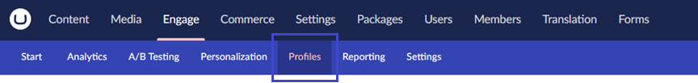
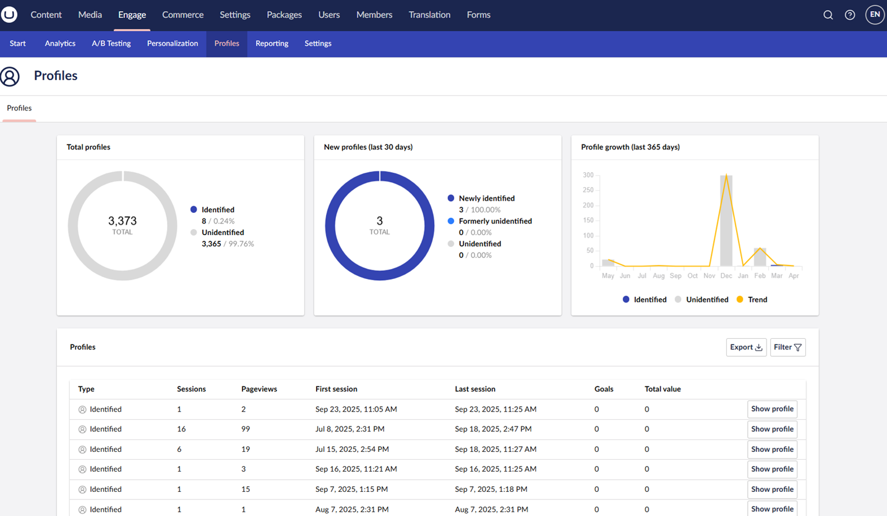
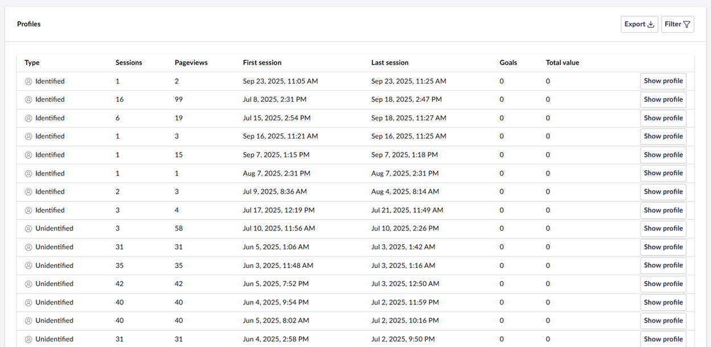
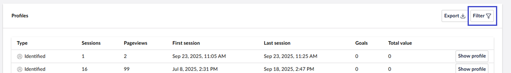
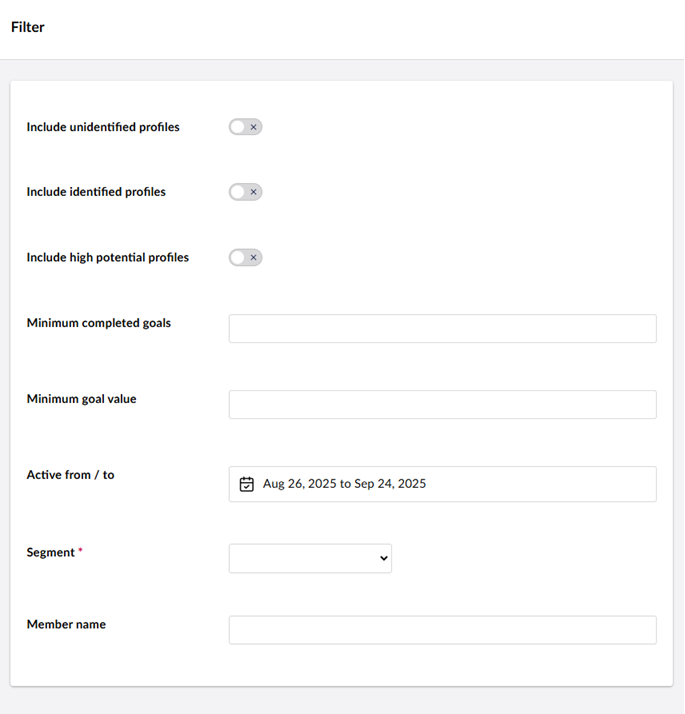

# Profiling

The **Profiles** section offers an overview of all the visitors that visited your website. To access the profiles section, navigate to **Engage** -> **Profiles**.

This section provides an overview of all visitors:

At the top, the total number of visitors that visited your website is displayed. You can also see how many visitors are identified versus unidentified.

The graph shows the number of new identified visitors over the last 30 days.

The table displays an overview of the profiles per month.

## Identified versus Anonymous Profiles

As long as there is no data of a visitor, this profile is called "Anonymous". If a visitor [does not give consent](../../developers/introduction/the-umbraco-engage-cookie/module-permissions.md) to be identified, they remain "Anonymous".

However, once a visitor logs in (via Umbraco's Members section) or submits an Umbraco Form, they become an "Identified Profile." For example: If you see a visitor name in the Profiles table it is because the visitor has logged in as a member.

## Profiles Overview

The Profiles table displays all visitors to the website, showing:

* Whether the visitor was identified or unidentified
* The number of sessions of the visitor
* The number of pageviews within those sessions
* The first session that the visitor had on the website
* The last session of the visitor
* The number of goals triggered by the visitor
* The total value of the goals

Finally, you can see a blue or a grey icon at the beginning of the row. A grey icon indicates that Umbraco Engage did not enrich the visitor's experience. A blue icon indicates that Umbraco Engage enriched the visitor's experience by showing an A/B test variant or a personalized version.

### Filtering the Results

It is possible to filter the profiles table by clicking the **Filter** button.

You can filter by:

* Unidentified or Identified profiles
* Profiles with high potential
* Profiles with more than X conversions
* Profiles with more than X total value achieved by triggered goals
* Specific date ranges
* Segment
* Member name

For more details, click **Show profile** in a specific profile's row. For more information, see the [Profile Detail](profile-detail.md) article.

