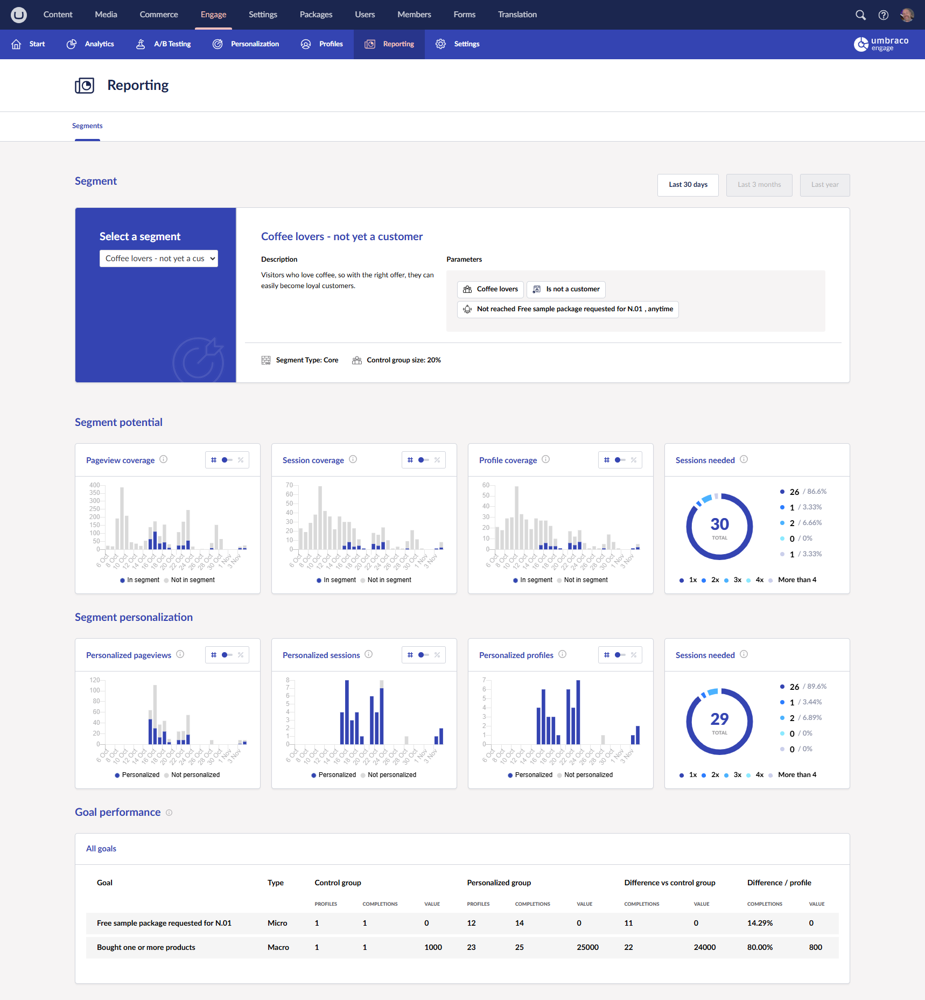

# Reporting

On the Reporting dashboard in the Engage section, you can monitor the personalization set up on your website.

## Segments

You can get an overview of how the segments you have configured for your website are doing.

<figure><figcaption>
Segment performance overview.
</figcaption></figure>

When you select a segment, you will see an overview of the configuration. As you scroll down, you can monitor its performance.

Learn more about segments and how to set them up in the [Personalization section](personalization/creating-a-segment.md).

### Segment Potential

The segment potential depends on how many pageviews, sessions, and profiles are covered within the segment.

In the Reporting dashboard, you can see the coverage of these parameters. You can also see the number of sessions a new profile requires to activate the selected segment.

### Segment Personalization

In many cases, it can be interesting to monitor how many of your website's sessions, page views, and profiles have been personalized.

In the Segment Personalization section, you can see how much of the incoming traffic on your website is personalized.

### Goal Performance

You can also get an overview of how the goals you have configured are performing. The table in the Goal Performance section compares the goal performance between the control group and the personalized group.
