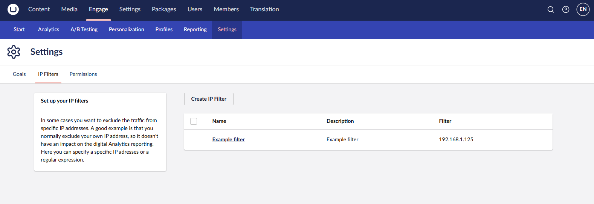
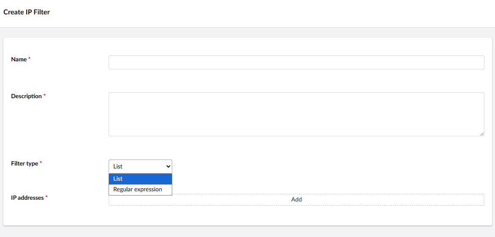

# IP Filtering

A good example is that you normally exclude your IP address, so it doesn't impact the digital Analytics reporting. Here you can specify a specific IP address, a list of IP addresses, or a regular expression.

<figure><figcaption>
Set up IP filters
</figcaption></figure>

<figure><figcaption>
Create IP filters
</figcaption></figure>
