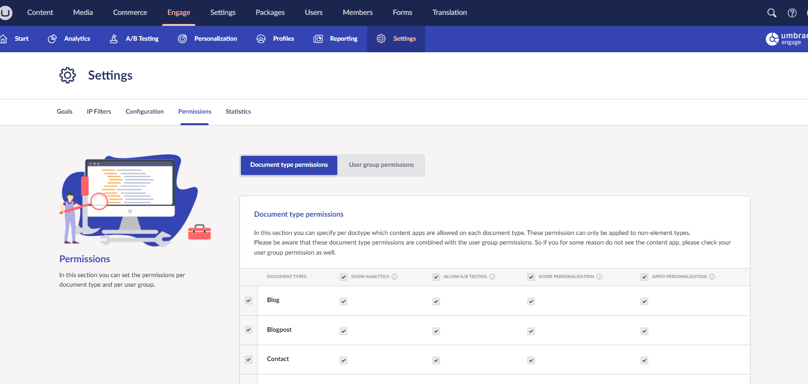
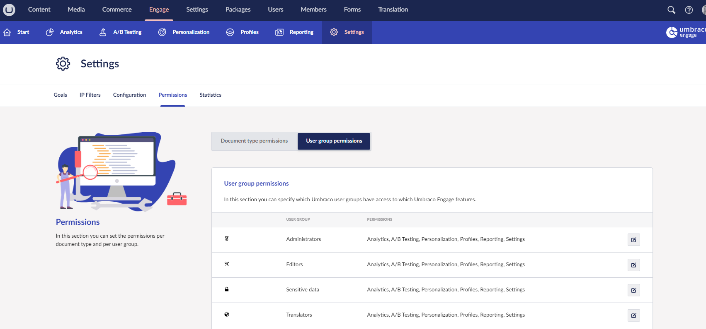

# Permissions

In the **Engage** -> **Settings** section, you can manage which Document Types the content apps are shown and which Umbraco user groups have access to them. This can be configured per Document Type and user group.

