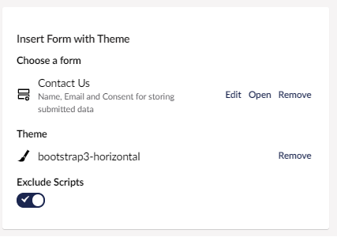

# Rendering Forms Scripts

Forms output some JavaScript which is by default rendered right below the markup.

In many cases, you might prefer rendering your scripts at the bottom of the page. For example, before the closing `</body>` tag. This generally improves site performance.

In order to render your scripts where you want, you need to add a snippet to your template. Make sure you add it below your scripts, right before the closing `</body>` tag.

By default, Forms uses `TempData` for tracking the forms rendered on a page. The stored values are used when rendering the form scripts and associated data.

The following snippet should be used.

```csharp
@using Umbraco.Forms.Web.Extensions;

@if (TempData.Get<Guid[]>("UmbracoForms") is Guid[] formIds)
{
    foreach (var formId in formIds)
    {
        @await Component.InvokeAsync("RenderFormScripts", new { formId, theme = "default" })
    }

    TempData.Remove("UmbracoForms");
}
```

If you have changed the configuration value `TrackRenderedFormsStorageMethod` to use `HttpContext.Items`, the snippet is:

```csharp
@if (Context.Items.TryGetValue("UmbracoForms", out object? formIdsObject) && formIdsObject is IEnumerable<Guid> formIds)
{
    foreach (var formId in formIds)
    {
        @await Component.InvokeAsync("RenderFormScripts", new { formId, theme = "default" })
    }
}
```

Read more about this configuration option in the [configuration ](./configuration/README.md#TrackRenderedFormsStorageMethod) article.

If you prefer to use a tag helper, that's an option too.

Firstly, in your `_ViewImports.cshtml` file, ensure you have a reference to the Umbraco Forms tag helpers with:

```cshtml
@addTagHelper *, Umbraco.Forms.Web
```

Then instead of reading from `TempData` and invoking the view component directly, you can use:

```cshtml
<umb-forms-render-scripts theme="default" />
```

This will use the appropriate storage method that you have configured.

## Enabling `ExcludeScripts`

If you do not want to render the associated scripts with a Form, you need to explicitly say so. You need to make sure `ExcludeScripts` is checked/enabled, whether you are inserting your Form using a macro or adding it directly in your template.

To enable `ExcludeScripts`:

*   Using the **Insert Form with Theme** macro:

    
*   While inserting Forms **directly** in your template:

    ```csharp
    @await Umbraco.RenderMacroAsync("renderUmbracoForm", new {FormGuid="6c3f053c-1774-43fa-ad95-710a01d9cd12", FormTheme="bootstrap3-horizontal", ExcludeScripts="1"})
    ```


`ExcludeScripts = "1"` prevents the associated scripts from being rendered. Any other value, an empty value, or if the parameter is excluded, will render the scripts on the Form.

