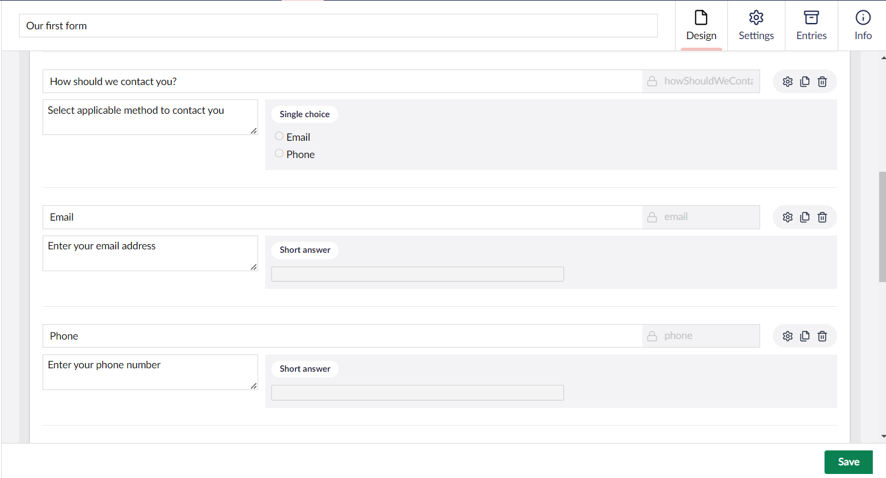
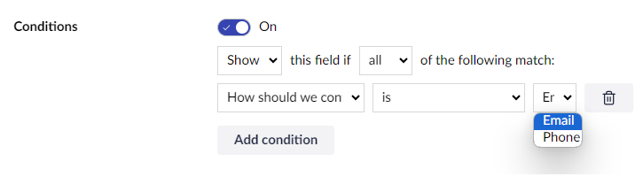
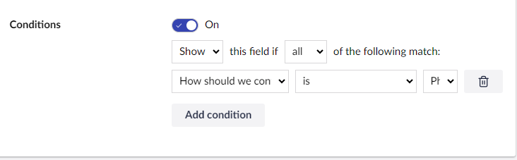
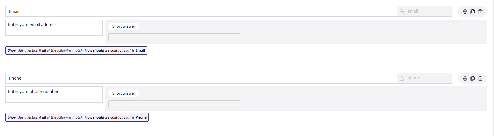
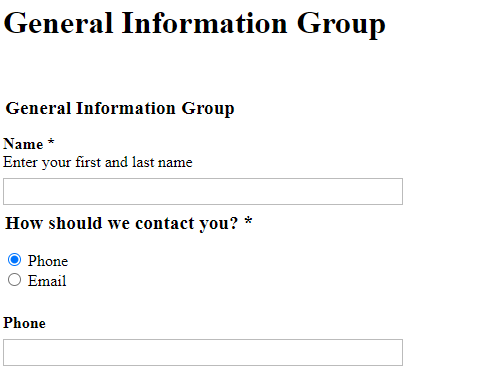

# Setting-up Conditional Logic on Fields

Sometimes you might have a field in your Form, that you want to show _only_ if the user has entered a specific value in another field.

You can achieve this setting by using **conditional logic** on Fields.

## Example

Take a look at the following:



In this case, it makes sense to *only* show the email or phone field when the corresponding option is selected in the **How should we contact you?** field.

To enable conditions for the **Email** and **Phone** fields, do the following:

1. Click the `cog` wheel next to the **Email** and **Phone** field. The **Edit question** dialog opens.
2. Enable **Conditions**. The condition field displays more options:

    

3. Set the appropriate conditions and click **Submit**.

### Action and Logic Types

There are two **Action Types**:

* Show: the field will be displayed if the rules match
* Hide: the field will be hidden if the rules match

Next up, you'll need to specify the **Logic Type**. This setting is only important if you have multiple rules.

* All: All of the rules must match
* Any: Any of the rules may match

## Adding a new condition

When adding a new condition, you'll need to select the field where you want to evaluate the value and can select an operator.

In this example, we only want to show the **Phone** field if the value of the **How should we contact you** field is `Phone`.



Similarly, you can display the **Email** field, if the value of the **How should we contact you** field is `Email`. You can see the conditions added to each field in the Forms designer:



## Result

When both the conditions have been set as shown above, this is how it will look on the frontend:



In this example, we have only selected **Phone** but it is possible to choose both _Phone_\* and **Email** and display both the fields.

## Conditions for Pages and Fieldsets

As well as showing or hiding a field based on conditions, you can also apply conditions to groups of fields (known as fieldsets) or to pages. The process is the same as described above.

When applying a condition to a page, effectively you are controlling the display of the submit button (for a single-page form) or the next/previous buttons (available on multi-page forms). In this way you can ensure that the entry so far is complete before accepting it or allowing the user to move onto the next page.

## Conditions for Dates

To use less-than or greater-than conditions on dates, you must change the date format.

By default, date is shown like `September 5, 2025`. This needs to change to a format only containing numbers: `09/05/2025`.

To change the default format setting for dates, follow the steps below:

1. Open the `appSettings.json` file.
2. Change the `DatePickerFormat` value to `L` (the default is `LL`):

```json
"Forms": {
  "FieldTypes": {
    "DatePicker": {
      "DatePickerFormat": "L"
    }
  }
}
```
