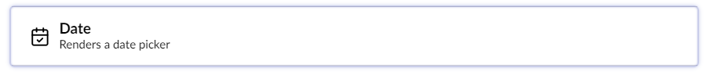

# Date

The date picker uses a front-end library called [Pikaday](https://github.com/dbushell/Pikaday) to display a UI to pick dates.

Pikaday date picker can be localized based on the page the Form is rendered on.

The date picker displays the picked date in the required locale. Using JavaScript, a hidden field is updated with a standard date format to send to the server for storing record submissions. This avoids the locale mixing up the dates.

To achieve localized date, a Razor partial view is included at `/Views/Partials/Forms/Themes/default/DatePicker.cshtml`.

The **DatePicker.cshtml** includes the `moment-with-locales.min.js` library to help with the date locale formatting and the appropriate changes to Pikaday to support the locales. If you wish to use a different DatePicker component, edit the **DatePicker.cshtml** file as per your needs.

## Configure the date picker

The Date picker has [configuration settings](../../../developer/configuration/README.md#date-picker-field-type-configuration) to control the number of years shown in the picker and the date format.

