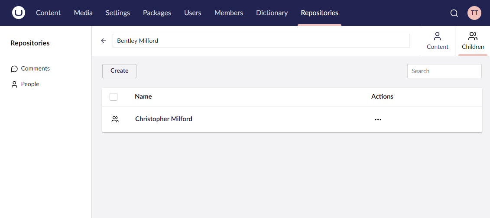

# Child Collections


This page is a work in progress and may undergo further revisions, updates, or amendments. The information contained herein is subject to change without notice.


A child collection is a container for data models that are tied to a parent collection. The child collection system shares the [Collections](the-basics.md) API, offering flexibility for managing and displaying related data within your backoffice UI.



By default, child collections are displayed as context apps within the parent model's editor view. If multiple child collections lead to an overcrowded context apps area, consider using the [Child Collection Groups API](child-collection-groups.md). Using the API, you can group related child collections under a single context app, with each child collection appearing in separate tabs.

## Defining a Child Collection

To define a child collection, use the `AddChildCollection` method on the given collection config builder instance.

### Using the `AddChildCollection()` Method

This method adds a child collection with the specified names, description, and default icons. Both the entity ID and foreign key fields must be specified using property accessor expressions.

#### Method Syntax

```cs
AddChildCollection<TChildEntityType>(Lambda idFieldExpression, Lambda fkFieldExpression, string nameSingular, string namePlural, string description, Lambda childCollectionConfig = null) : ChildCollectionConfigBuilder<TEntityType>
```

#### Example

```csharp
collectionConfig.AddChildCollection<Child>(c => c.Id, c => c.ParentId, "Child", "Children", "A collection of children", childCollectionConfig => {
    ...
});
```

### Using the `AddChildCollection()` Method with Custom Icons

This method adds a child collection to the current collection with the specified names, description and custom icons. Both the entity ID and foreign key fields must be specified using property accessor expressions.

#### Method Syntax

```cs
AddChildCollection<TChildEntityType>(Lambda idFieldExpression, Lambda fkFieldExpression, string nameSingular, string namePlural, string description, string iconSingular, string iconPlural, Lambda childCollectionConfig = null) : ChildCollectionConfigBuilder<TEntityType>
```

#### Example

```csharp
collectionConfig.AddChildCollection<Child>(c => c.Id, c => c.ParentId, "Child", "Children", "A collection of children", "icon-umb-users", "icon-umb-users", childCollectionConfig => {
    ...
});
```

## Configuring a Child Collection

Child collections share the same API as the `Collection` config builder API, except child collections cannot contain further child collections. For more information, see the [Basics](the-basics.md) article.
