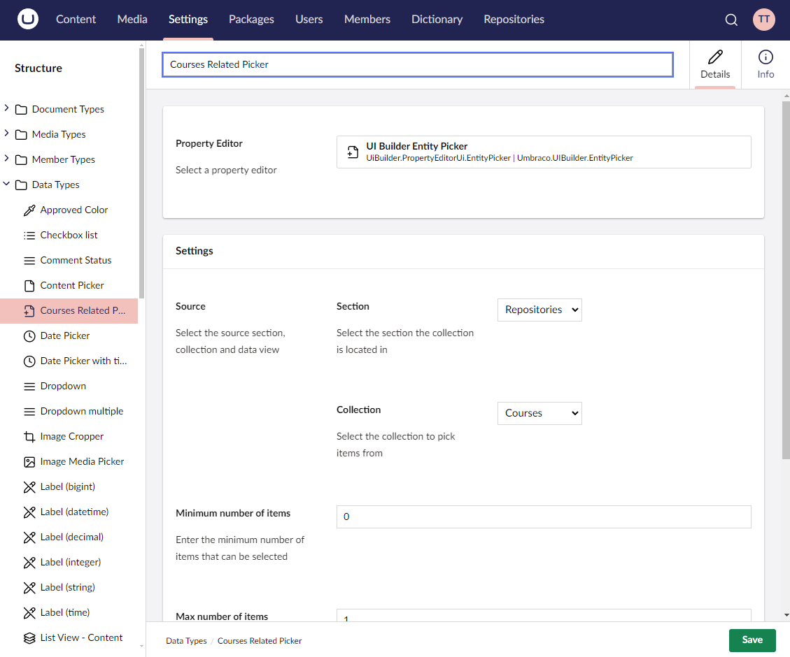

# Related Collections

Related collections support the editing of many-to-many relationships in UI Builder. These are used when multiple entities from one collection are linked to multiple entities from another collection, commonly represented through a junction table.

## Example Use Case

A classic example is the relationship between `Students` and `Courses`, where each student takes many courses, and each course has many students.




## Collections Representation

This is how the collections would be represented:


The models representing the entities would be as follows:

```csharp
[TableName("Students")]
[PrimaryKey("Id")]
public class Student
{
    [PrimaryKeyColumn]
    public int Id { get; set; }

    public string FirstName { get; set; }

    public string LastName { get; set; }

    public string Email { get; set; }
}
```

```csharp
[TableName("Courses")]
[PrimaryKey("Id")]
public class Course
{
    [PrimaryKeyColumn]
    public int Id { get; set; }

    public string Title { get; set; }

    public string Description { get; set; }
}
```

```csharp
[TableName("StudentsCourses")]
[PrimaryKey(new[] { "StudentId", "CourseId" })]
public class StudentCourse
{
    [PrimaryKeyColumn]
    public int StudentId { get; set; }

    [PrimaryKeyColumn]
    public int CourseId { get; set; }
}
```

## Defining a Related Collection

To define a related collection, follow these two steps:

1. Add the collection definition
2. Add the related collection entity picker and definition

### Collection definition

Define a related collection by calling the `AddRelatedCollection` method on the collection config builder instance.

### Using the `AddRelatedCollection()` Method

This method adds a related collection to the current collection, specifying names, descriptions, and default icons. The ID property must be defined, and the relation configuration defines the junction entity with references to parent and child entities.

#### Method Syntax

```cs
AddRelatedCollection<TEntityType, TRelatedEntityType, TJunctionEntityType>(Expression<Func<TRelatedEntityType, object>> idPropertyExpression, string nameSingular, string namePlural, Action<RelationConfigBuilder<TBuilder, TEntity, TRelatedEntityType, TJunctionEntityType>> relationConfig)
```

#### Example

```csharp
collectionConfig.AddRelatedCollection<Student, Course, StudentCourse>(x => x.Id, "Student Course", "Students Courses", relationConfig =>
{
    relationConfig
        .SetAlias("studentsCourses")
        .SetJunction<StudentCourse>(x => x.StudentId, y => y.CourseId);
});
```

### Configuring a Related Collection Entity Picker

Define the child collection entity picker by calling the `AddRelatedCollectionPickerField` method on the parent collection's fieldset config.

### Using the `AddRelatedCollectionPickerField()` Method

This method adds an entity picker with the specified Data Type name to the parent collection editor.

#### Method Syntax

```cs
AddRelatedCollectionPickerField<TValueType>(string alias, string dataTypeName, string label)
```

#### Example

```csharp
collectionConfig.Editor(editorConfig =>
{
    editorConfig.AddTab("General", tabConfig =>
        tabConfig.AddFieldset("General", fieldsetConfig =>
        {
            fieldsetConfig.AddField(x => x.FirstName).MakeRequired();
            fieldsetConfig.AddField(x => x.LastName).MakeRequired();
            fieldsetConfig.AddField(x => x.Email).MakeRequired();

            fieldsetConfig.AddRelatedCollectionPickerField<Course>("studentsCourses", "Courses Related Picker", "Courses");
        }));
});
```


The relation config alias must match the related collection picker field alias, for example, `studentsCourses`.


## Defining Repository Methods

### Using the `GetRelationsByParentIdImpl<>()` Method

Retrieves related collections based on the ID of the parent entity.

#### Method Syntax

```cs
IEnumerable<StudentCourse> GetRelationsByParentIdImpl<StudentCourse>(int parentId, string relationAlias)
```

#### Example

```csharp
{
    var db = _scopeProvider.CreateScope().Database;
    var sql = db.SqlContext.Sql()
            .Select(new[] { "StudentId", "CourseId" } )
            .From("StudentsCourses")
            .Where($"studentId = @0", parentId);

    var result = db.Fetch<StudentCourse>(sql);

    return result;
}
```

### Using the `SaveRelationImpl<>()` Method

Adds a new related collection to the current parent entity.

#### Method Syntax

```cs
StudentCourse SaveRelationImpl<StudentCourse>(StudentCourse entity)
```

#### Example

```csharp
{
    var db = _scopeProvider.CreateScope().Database;

    var type = entity.GetType();
    var studentId = type.GetProperty("StudentId").GetValue(entity);
    var courseId = type.GetProperty("CourseId").GetValue(entity);

    // delete relation if exists
    db.Execute("DELETE FROM StudentsCourses WHERE StudentId = @0 AND CourseId = @1",
        studentId,
        courseId);

    db.Execute("INSERT INTO StudentsCourses (StudentId, CourseId) VALUES (@0, @1)",
        studentId,
        courseId);

    return entity;
}
```
