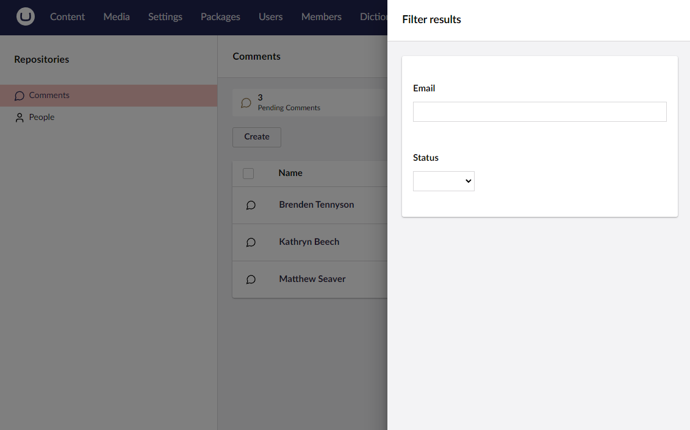

# Filtering

In addition to [Searching](../searching/overview.md), you may need to create specific views of a collection's data. Umbraco UI Builder provides multiple filtering mechanisms to help with this.

Choose a filtering method from the list below to find out more.


[global-filters.md](global-filters.md)


[data-views.md](data-views.md)


[filterable-properties.md](filterable-properties.md)

