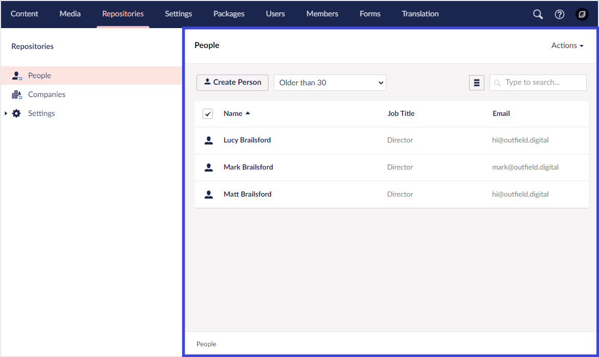
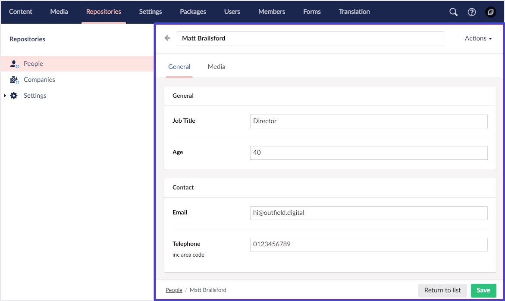
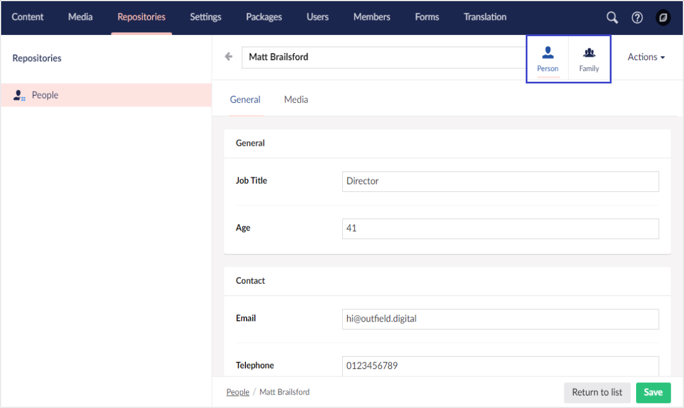
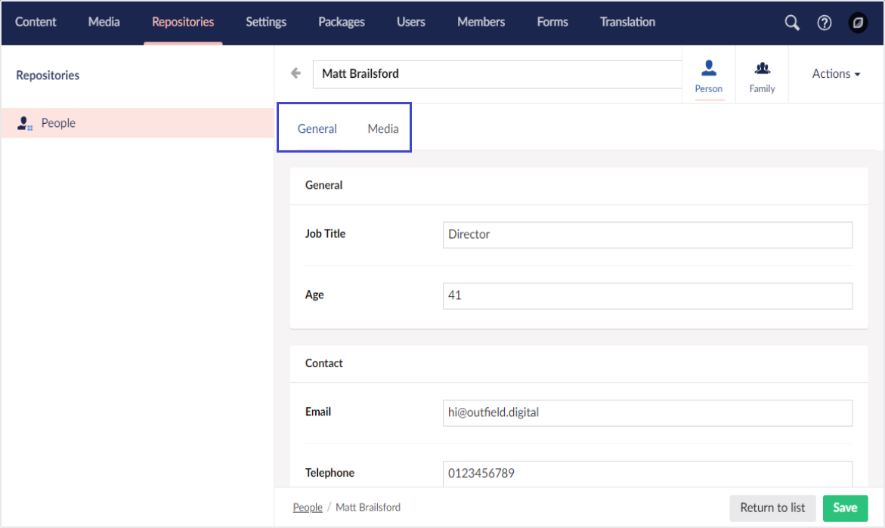

# User Interface

Before diving into Umbraco UI Builder, it’s important to understand some of the fundamental concepts of the Umbraco UI. This knowledge will help you navigate and leverage the UI Builder more effectively, as it uses the same UI components to construct interfaces.

## Section

A section in Umbraco is a distinct area within the backoffice where related content and functionality are grouped. For example, the Content section is where content management happens, while the Media section handles media files.

## Tree

The tree represents the hierarchical structure of items within a section. It organizes content, settings, and data, for quick navigation and locating items. For example, the content tree shows the pages of a website in a nested format.

## Dashboard

Each section in the Umbraco backoffice typically starts with a dashboard. This is an introductory screen for the section. It often includes useful links or shortcuts, providing an overview or quick access to the most commonly used features.

## Collection

The collection displays a list of items in a tree or grid view. It provides an overview of content or data in a table format, with sortable columns and the option to filter or search through the items. This view is used when you need to work with multiple items at once.

## Editor

The editor is where the main content editing occurs. It is structured using tabs, fieldsets, and fields. Tabs organize different sections of content, and fieldsets group related fields together. Each field represents a specific piece of data, such as a text box or an image upload.

## Workspace Views

Workspace Views are additional functionality that can be added to an editor. They provide extra features based on the content of the item being edited. For instance, a media Workspace View might allow you to resize or crop an image directly from the editor.

## Tabs

Tabs are used to organize content within the editor, allowing users to switch between different sections of a content item. For example, one tab might contain the general settings, while another contains media or advanced options.

## Menu Item

A menu item represents an action within the context of a tree node or a list item. It is a clickable item that triggers specific tasks, such as deleting or editing an item.

## Bulk Action

Bulk actions allow you to perform an operation on multiple items in the list view at once. For example, you might use a bulk action to delete multiple content items or update their status in a single step.

