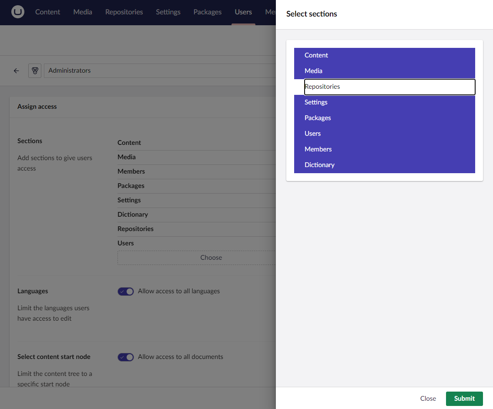
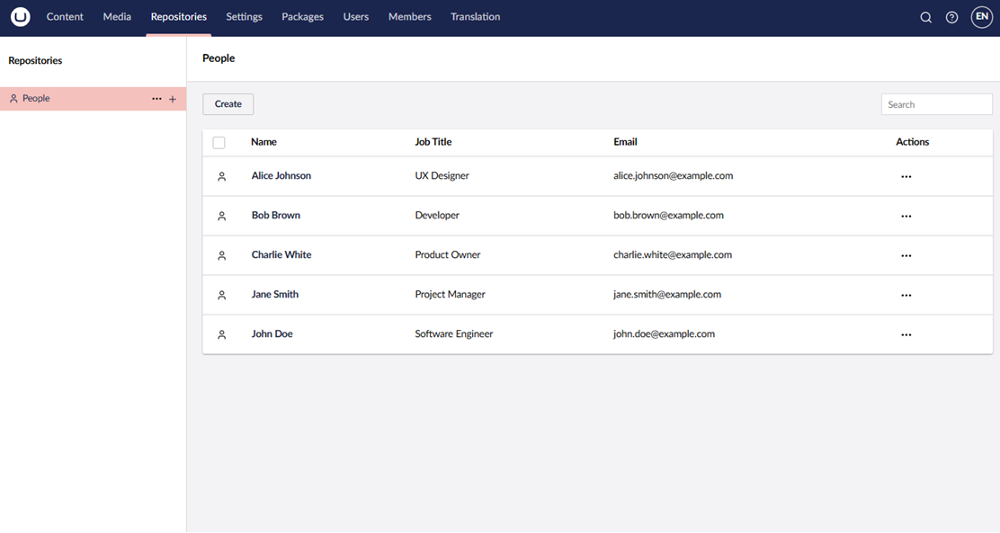
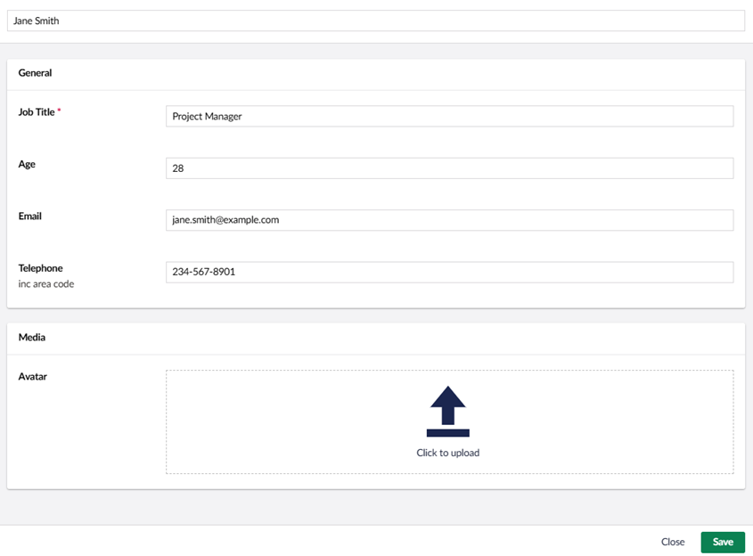

# Creating Your First Umbraco UI Builder Integration

This guide walks you through a basic implementation of Umbraco UI Builder to manage a custom database table.


By default, Umbraco UI Builder uses a database for data storage. However, you can configure this using a custom [Repository](../advanced/repositories.md) class instead.


## Setting Up the Database

Umbraco UI Builder uses PetaPoco as its default persistence layer.

In this section, you will create a `Person` table to store data.

To create a `Person` table, run the following script in SQL Server Management Studio (SSMS).

```sql
CREATE TABLE [Person] (
    [Id] int IDENTITY (1,1) NOT NULL,
    [Name] nvarchar(255) NOT NULL,
    [JobTitle] nvarchar(255) NOT NULL,
    [Email] nvarchar(255) NOT NULL,
    [Telephone] nvarchar(255) NOT NULL,
    [Age] int NOT NULL,
    [Avatar] nvarchar(255) NOT NULL
);
```

This script creates a table for storing people’s details. You may want to populate it with some dummy data for testing.

## Setting Up the Model

With the database table created, define the `Person` model in your project.

To create a Model:

1. Create a new folder called **Models** in your project.
2. Add a new class file called `Person.cs`.
3. Add the following code:

```csharp
using NPoco;
using Umbraco.Cms.Infrastructure.Persistence.DatabaseAnnotations;

[TableName("Person")]
[PrimaryKey("Id")]
public class Person
{
    [PrimaryKeyColumn]
    public int Id { get; set; }
    public string? Name { get; set; }
    public string? JobTitle { get; set; }
    public string? Email { get; set; }
    public string? Telephone { get; set; }
    public int Age { get; set; }
    public string? Avatar { get; set; }
}
```

## Configure Umbraco UI Builder

With the database and model set up, it is time to configure Umbraco UI Builder to work with the `Person` model. This will allow you to manage `Person` entities from the Umbraco backoffice.


You can configure Umbraco UI Builder either through a Composer or by using the `AddUIBuilder` extension method in `Program.cs`.


The following steps cover the `Program.cs` approach. For more details, including configuring via a Composer, see the the [Configuration](../getting-started/configuration.md) article.

### Configuring via `Program.cs`

1. Open the `Program.cs` file in your project.
2. Locate the `CreateUmbracoBuilder()` method.
3. Add `AddUIBuilder` before `AddComposers()`.

```csharp
builder.CreateUmbracoBuilder()
    .AddBackOffice()
    .AddWebsite()
    .AddDeliveryApi()
    .AddComposers()
    .AddUIBuilder(cfg => {
        // Apply your configuration here
    })
    .Build();
```

### Example Configuration

Here’s an example configuration defining a section, a list view, and an editor for managing `Person` entities:

```csharp
...
.AddUIBuilder(cfg => {

    cfg.AddSectionAfter("media", "Repositories", sectionConfig => sectionConfig
        .Tree(treeConfig => treeConfig
            .AddCollection<Person>(x => x.Id, "Person", "People", "A person entity", "icon-umb-users", "icon-umb-users", collectionConfig => collectionConfig
                .SetNameProperty(p => p.Name)
                .ListView(listViewConfig => listViewConfig
                    .AddField(p => p.JobTitle).SetHeading("Job Title")
                    .AddField(p => p.Email)
                )
                .Editor(editorConfig => editorConfig
                    .AddTab("General", tabConfig => tabConfig
                        .AddFieldset("General", fieldsetConfig => fieldsetConfig
                            .AddField(p => p.JobTitle).MakeRequired()
                            .AddField(p => p.Age)
                            .AddField(p => p.Email).SetValidationRegex("[a-zA-Z0-9_.+-]+@[a-zA-Z0-9-]+.[a-zA-Z0-9-.]+")
                            .AddField(p => p.Telephone).SetDescription("inc area code")
                        )
                        .AddFieldset("Media", fieldsetConfig => fieldsetConfig
                            .AddField(p => p.Avatar).SetDataType("Upload File")
                        )
                    )
                )
            )
        )
    );

})
...
```

## Accessing the Umbraco Backoffice

After defining the configuration, compile and run your project. To access the newly defined section, you need to give permission to the backoffice user account:

1. Login to the Umbraco backoffice.
2. Go to the **Users** section.
3. Navigate to the user group you wish to assign the newly defined section.



4. Submit the changes.
5. Refresh the browser to view the new section.



If you click on a person's name, you will see the following screen:



## Summary

This setup allows you to extend and customize your Umbraco site by managing data and entities directly in the backoffice. The simplicity of the implementation allows to create dynamic, user-friendly interfaces for your own data models.
