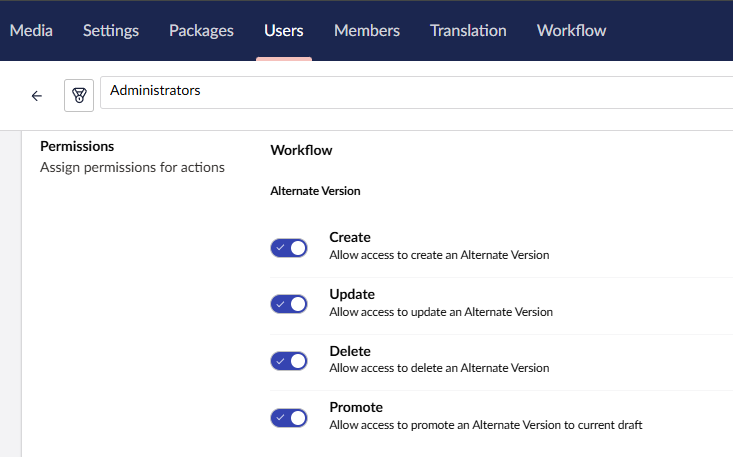
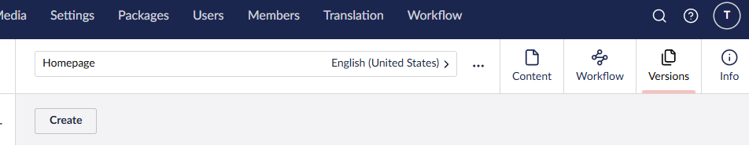
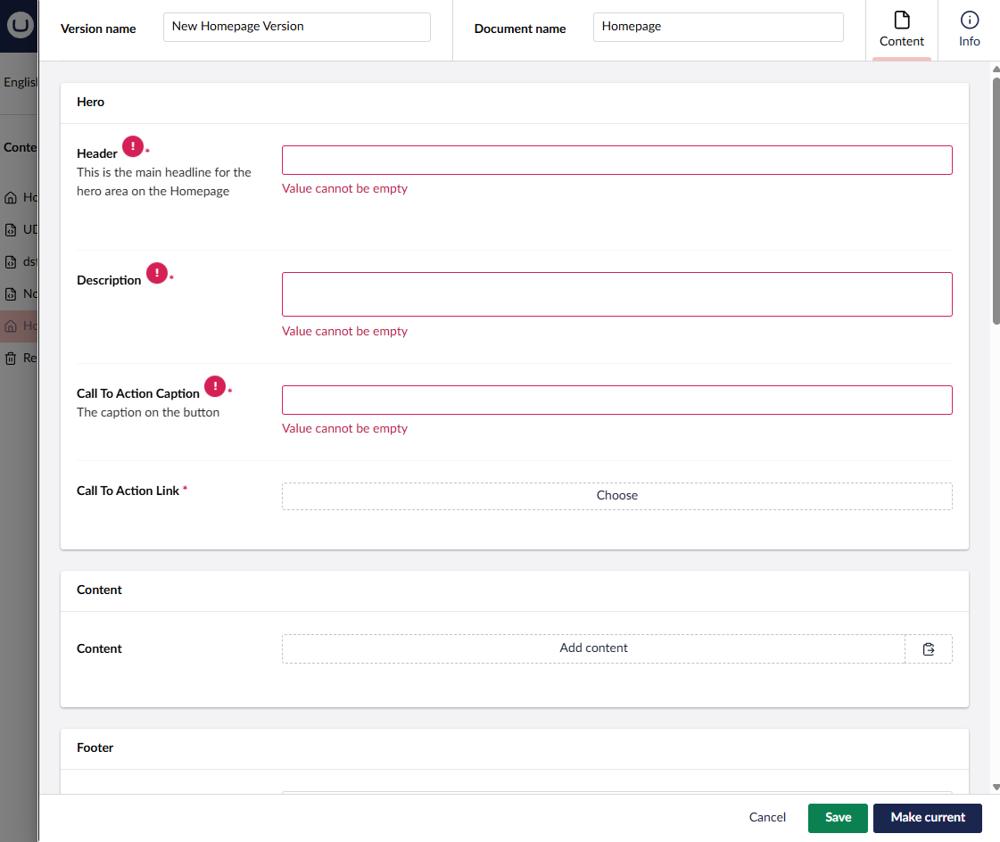
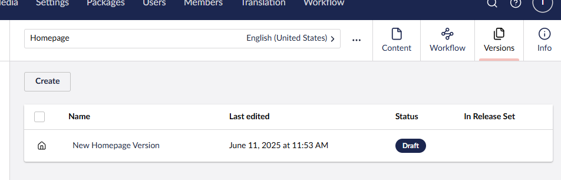

# Alternate Versions


This feature requires a license. Learn more about [Workflow's licensing model](https://umbraco.com/products/umbraco-workflow).


Alternate Versions enables the creation of additional draft versions of documents. These can be created and updated without impacting the editing or publishing of the 'main' draft version.

Versions are managed from a Workpace View on a document, and inherit workflow permissions from the host document. Permissions to create, update, promote and delete versions can be set per User Group.

## Working with Alternate Versions

- Ensure the User Group permissions are set to allow appropriate access.

- Navigate to the Versions Workspace View on a content item

- Clicking the `Create` button opens a workspace modal with a copy of the current draft.

- Update and save the new version
- Find the new version in the collection view

Editors can create multiple versions of a document and update these independently.

An alternate version is not published directly, instead it is set as the current draft version.

If the host document has an approval workflow configured, versions must be approved via the same workflow before being set to current.

If the host has no workflow configured, versions can be set to current by any user with the `Promote` permission.

When a version is promoted to be the current draft, it can be further edited before being published. Publishing can be via workflow approval or directly, depending on configuration and permissions.

## Variant versions

Alternate versions can vary by culture or segment. 

To create a variant version, select the desired variant from the document variant selector, then create the new version as outlined above.

The collection in the workspace view will show only versions matching the current document variant.