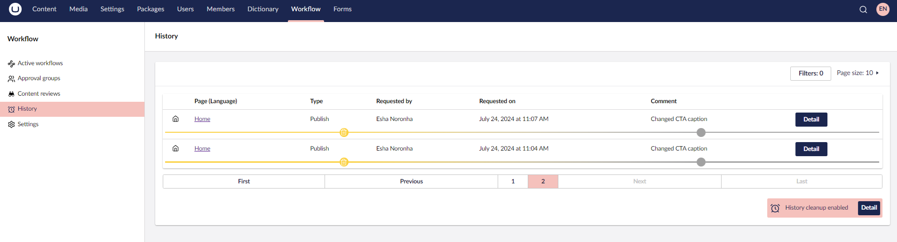
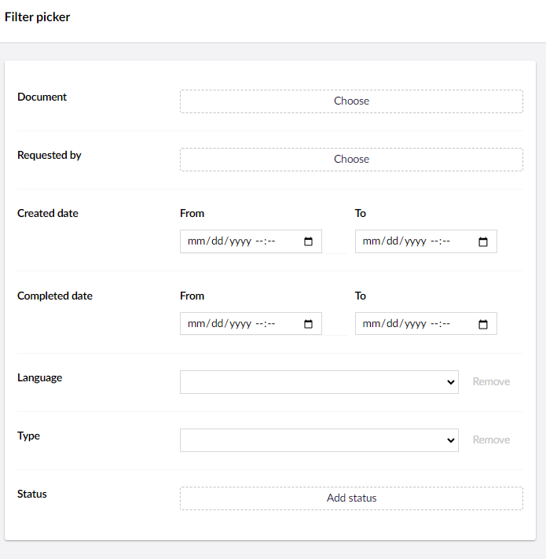
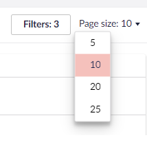
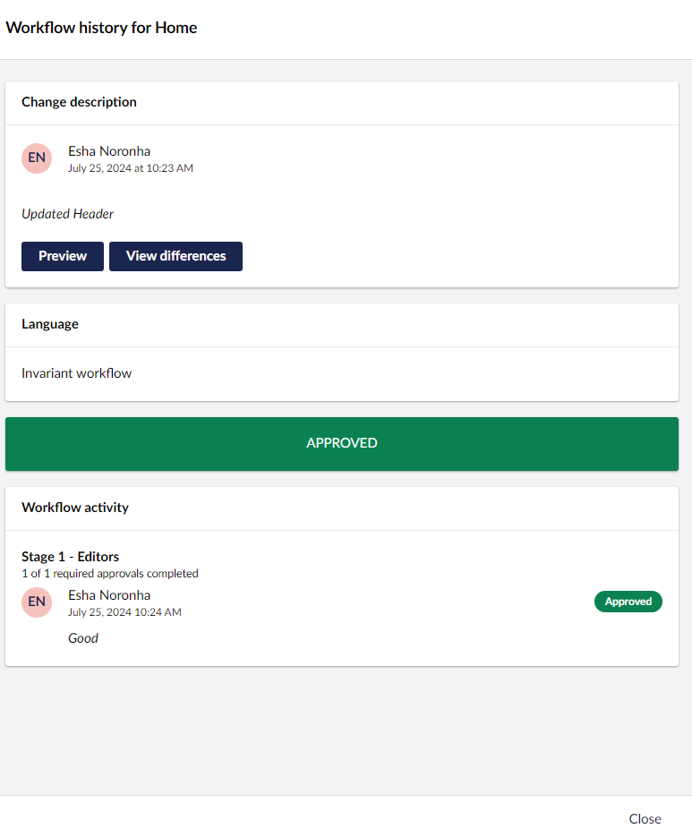

# Workflow History

The Umbraco Workflow History provides a chronological audit trail of workflow activity for all the nodes.

It displays a table containing the following details:

* Page name/Node with the Language variant.
* Type of Publish.
* Editor/Original author requesting the workflow.
* Date the workflow was requested on.
* Comment describing the changes.

You can also **Filter** the records based on the Document Type, Requested by, Created date, Completed date, Page Language, Workflow Type, and Workflow Status.

Additionally, you can adjust the total number of records displayed on a page.

The **Detail** button at the end of the record displays an overlay with content similar to the [Active workflow](active-workflows.md) sub-section.

