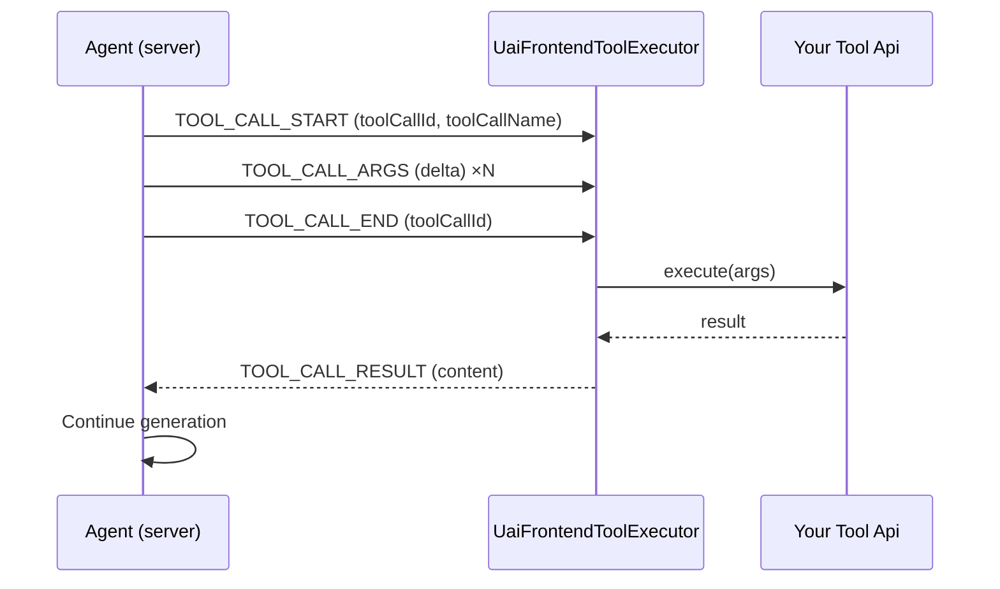

# Frontend Tools

Frontend tools allow agents to execute actions directly in the browser. When the agent decides to call a tool, the Copilot UI runs your tool code locally and returns the result back to the agent, which then continues generating its response.

Frontend tools are registered as Umbraco backoffice extensions (manifests). You never wire up a dispatcher or event loop yourself — the Agent UI package provides the `UaiFrontendToolManager` and `UaiFrontendToolExecutor` services that discover your manifests, execute tools, and publish results back into the AG-UI stream.

## How Frontend Tools Work



AG-UI event type strings are UPPER\_SNAKE\_CASE (`TOOL_CALL_START`, `TOOL_CALL_ARGS`, `TOOL_CALL_END`, `TOOL_CALL_RESULT`, `TOOL_CALL_CHUNK`) — matching the official AG-UI protocol. Arguments arrive as a stream of `TOOL_CALL_ARGS` events each carrying a `delta` string fragment; the executor reassembles them, parses JSON, calls your tool, then emits a `TOOL_CALL_RESULT`.

## Anatomy of a Frontend Tool

A frontend tool is made up of two manifests:

1. `uaiAgentFrontendTool` — **execution**. Declares the tool to the LLM (name, description, JSON Schema parameters) and points at an API class that runs in the browser.
2. `uaiAgentToolRenderer` — **rendering**. Provides the label, icon, and (optionally) a custom element to display the tool call in the chat transcript or an HITL approval dialog.

Both manifests are registered through the Umbraco extension registry. The Agent UI package observes them by type:

- `UaiFrontendToolManager` subscribes to `uaiAgentFrontendTool` manifests and produces the `UaiFrontendTool[]` list sent to the agent.
- `UaiToolRendererManager` subscribes to `uaiAgentToolRenderer` manifests and picks the element to render when a tool call appears.

## Defining a Tool

### 1. Implement the Tool Api

Create a class that extends `UmbControllerBase` and implements `UaiAgentToolApi`:



```typescript
import { UmbControllerBase } from "@umbraco-cms/backoffice/class-api";
import type { UaiAgentToolApi } from "@umbraco-ai/agent-ui";

export default class GetCurrentTimeApi extends UmbControllerBase implements UaiAgentToolApi {
    async execute(args: Record<string, unknown>): Promise<string> {
        const now = new Date();
        const format = (args.format as string) || "locale";

        if (format === "iso") {
            return JSON.stringify({ format, value: now.toISOString() });
        }

        return JSON.stringify({
            format: "locale",
            date: now.toLocaleDateString(),
            time: now.toLocaleTimeString(),
        });
    }
}
```



The `execute` method receives the parsed arguments object and returns the result. Return a string (typically JSON) or any serializable object — the executor forwards whatever you return to the agent as the tool result content.

### 2. Register the Manifests



```typescript
import type { ManifestUaiAgentFrontendTool, ManifestUaiAgentToolRenderer } from "@umbraco-ai/agent-ui";

const frontendToolManifest: ManifestUaiAgentFrontendTool = {
    type: "uaiAgentFrontendTool",
    alias: "My.AgentFrontendTool.GetCurrentTime",
    name: "Get Current Time Frontend Tool",
    api: () => import("./get-current-time.api.js"),
    meta: {
        toolName: "get_current_time",
        description: "Get the current date and time in the user's timezone.",
        parameters: {
            type: "object",
            properties: {
                format: {
                    type: "string",
                    description: "Output format: 'iso', 'locale', or 'unix'",
                    enum: ["iso", "locale", "unix"],
                },
            },
        },
    },
};

const rendererManifest: ManifestUaiAgentToolRenderer = {
    type: "uaiAgentToolRenderer",
    kind: "default",
    alias: "My.AgentToolRenderer.GetCurrentTime",
    name: "Get Current Time Tool Renderer",
    meta: {
        toolName: "get_current_time",
        label: "Get Current Time",
        icon: "icon-time",
    },
};

export const manifests = [frontendToolManifest, rendererManifest];
```



The `meta.toolName` on both manifests must match — this is the name the agent emits in AG-UI events and the key the managers use to pair execution with rendering. Register `manifests` either from an extension entry point, an `umbraco-package.json`, or via another manifest loader in your package.

### `uaiAgentFrontendTool` meta reference

| Field | Required | Description |
| --- | --- | --- |
| `toolName` | Yes | Name sent to the LLM and matched in AG-UI `TOOL_CALL_START` events. |
| `description` | Yes | Description shown to the LLM so it can choose the tool. |
| `parameters` | Yes | JSON Schema describing the arguments object. |
| `scope` | No | Permission grouping string (for example `"entity-write"`, `"navigation"`). Used by agent permissions to decide which tools an agent may call. |
| `isDestructive` | No | When `true`, signals a destructive action. Used together with `scope` for permission filtering. |

### `uaiAgentToolRenderer` meta reference

| Field | Required | Description |
| --- | --- | --- |
| `toolName` | Yes | Must match the `toolName` of the corresponding frontend tool. |
| `label` | No | Display label used in the transcript and in approval dialogs. |
| `icon` | No | Icon shown next to the tool call. |
| `approval` | No | HITL approval configuration — see [Human-in-the-Loop Approval](#human-in-the-loop-approval). |

Renderers can either use `kind: "default"` (the built-in tool-status element) or provide a custom element via the standard `element: () => import(...)` pattern for generative UI.

## Human-in-the-Loop Approval

To pause execution and ask the user to approve a tool call, add an `approval` field to the renderer manifest:



```typescript
const rendererManifest: ManifestUaiAgentToolRenderer = {
    type: "uaiAgentToolRenderer",
    kind: "default",
    alias: "My.AgentToolRenderer.ConfirmAction",
    name: "Confirm Action Tool Renderer",
    meta: {
        toolName: "confirm_action",
        label: "Confirm Action",
        icon: "icon-check",
        approval: {
            config: { title: "#uaiChat_approvalDefaultTitle" },
        },
    },
};
```



Allowed `approval` values:

- `true` — Use the default approval element (`uai-agent-approval-default`) with localized defaults.
- `{ elementAlias?, config? }` — Optionally specify a custom approval element and/or pass static config to the approval element.

When approval is required, `UaiFrontendToolExecutor` shows the approval dialog via the HITL context. The default element renders **Approve** and **Deny** buttons (localized from `#uaiChat_approvalApprove` / `#uaiChat_approvalDeny`). When the user clicks Approve, the executor injects the response under `args.__approval` before calling `execute`:



```typescript
import { UmbControllerBase } from "@umbraco-cms/backoffice/class-api";
import type { UaiAgentToolApi } from "@umbraco-ai/agent-ui";

interface ApprovalResponse { approved?: boolean; }

export default class ConfirmActionApi extends UmbControllerBase implements UaiAgentToolApi {
    async execute(args: Record<string, unknown>): Promise<string> {
        const approval = args.__approval as ApprovalResponse | undefined;

        if (!approval?.approved) {
            return JSON.stringify({ success: false, reason: "User denied the action" });
        }

        // Perform the action
        return JSON.stringify({ success: true, action: args.action });
    }
}
```



If the user cancels, `UaiFrontendToolExecutor` produces an error result automatically — the tool's `execute` method is not called.

## Generative UI

For tool calls that produce rich results (charts, cards, previews), provide an `element` on the renderer manifest instead of using `kind: "default"`. The element receives the tool call arguments, status, and result as properties:



```typescript
import { customElement, property } from "@umbraco-cms/backoffice/external/lit";
import { UmbLitElement } from "@umbraco-cms/backoffice/lit-element";
import type { UaiAgentToolStatus, UaiAgentToolElementProps } from "@umbraco-ai/agent-ui";

@customElement("uai-tool-weather")
export class UaiToolWeatherElement extends UmbLitElement implements UaiAgentToolElementProps {
    @property({ type: Object }) args: Record<string, unknown> = {};
    @property({ type: String }) status: UaiAgentToolStatus = "pending";
    @property({ type: Object }) result?: unknown;

    // Render pending / executing / complete states using `status` and `result`
}
```



`UaiAgentToolStatus` values are: `"pending"`, `"streaming"`, `"awaiting_approval"`, `"executing"`, `"complete"`, `"error"`. Use them to drive skeletons, spinners, and final output.

## Tool Schema

Tools use JSON Schema for the `parameters` field:



```json
{
    "type": "object",
    "properties": {
        "query": {
            "type": "string",
            "description": "Search query"
        },
        "contentType": {
            "type": "string",
            "enum": ["article", "page", "product"],
            "description": "Type of content to search"
        },
        "limit": {
            "type": "integer",
            "default": 10,
            "description": "Maximum results to return"
        }
    },
    "required": ["query"]
}
```



## Best Practices

1. **Single responsibility** — Each tool does one thing.
2. **Clear descriptions** — Help the model pick the right tool.
3. **Validate arguments** — JSON Schema guides the model; still guard inside `execute`.
4. **Return structured results** — JSON strings or objects; the model reads what you return.
5. **Handle errors gracefully** — Return an error object rather than throwing. Thrown errors are captured by the executor and surfaced as an error result, but returning a structured error lets you add context.
6. **Use `scope` and `isDestructive`** — They let administrators restrict which agents can call the tool.
7. **Pair execution and rendering** — Always register an `uaiAgentToolRenderer` alongside your tool so the call appears correctly in the transcript.

## Related

- [Copilot](copilot.md) — Using the chat interface
- [Concepts](../agent/concepts.md) — Agent and tool concepts
- [Streaming](../agent/streaming.md) — AG-UI event handling
