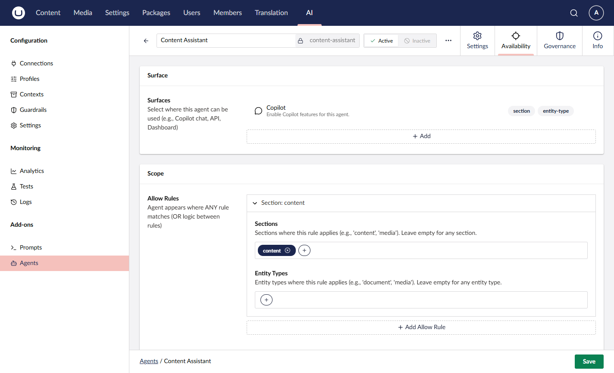

# Agent Surfaces and Scopes

Umbraco.AI has **two related but distinct** concepts for controlling where an agent appears:

- **Surfaces** are categorisation tags that group agents by where they should be surfaced in the UI (for example, "copilot" agents shown in the chat sidebar). Surfaces are registered by add-on packages.
- **Scopes** are availability rules applied to an individual agent that allow/deny the agent based on context (e.g., only in the `content` section, or never in `settings`).

Surfaces and scopes work together: a Surface describes *which part of the UI* an agent belongs to, while a Scope describes *under what conditions* an agent may be used within that UI.

## Surfaces

A surface is an `IAIAgentSurface` registered with the system. Agents reference one or more surfaces via `SurfaceIds` to indicate which UIs they belong to.


An agent with no `SurfaceIds` appears in general listings but is not returned when filtering by a specific surface.


### Built-in Surfaces

The **Agent Copilot** add-on registers the `copilot` surface, which identifies agents that should appear in the copilot chat sidebar.

| Surface ID | Package                  | Icon        | Description                                  |
| ---------- | ------------------------ | ----------- | -------------------------------------------- |
| `copilot`  | Umbraco.AI.Agent.Copilot | `icon-chat` | Agents available in the copilot chat sidebar |

### Assigning Surfaces to Agents

#### Via Backoffice

When creating or editing an agent in the backoffice, you can assign surfaces in the **Surfaces** section. Available surfaces are populated from all registered `IAIAgentSurface` implementations.



#### Via API

Include `surfaceIds` when creating or updating an agent:



```json
{
    "alias": "content-assistant",
    "name": "Content Assistant",
    "surfaceIds": ["copilot"],
    "config": {
        "$type": "standard",
        "instructions": "You are a helpful content assistant."
    }
}
```



#### Via Code



```csharp
var agent = new AIAgent
{
    Alias = "content-assistant",
    Name = "Content Assistant",
    SurfaceIds = ["copilot", "content-editing"],
    Config = new AIStandardAgentConfig
    {
        Instructions = "You are a helpful content assistant."
    }
};

await _agentService.SaveAgentAsync(agent);
```



### Querying Agents by Surface

#### List Agents by Surface

Use the `surfaceId` query parameter to filter agents:



```http
GET /umbraco/ai/management/api/v1/agents?surfaceId=copilot
```



#### Get All Registered Surfaces

Retrieve all surfaces registered in the system:



```http
GET /umbraco/ai/management/api/v1/agents/surfaces
```





```json
[
    {
        "id": "copilot",
        "icon": "icon-chat"
    }
]
```



#### Via Service



```csharp
// Get agents by surface
var copilotAgents = await _agentService.GetAgentsBySurfaceAsync("copilot");

// Or use paged query with surface filter
var pagedResult = await _agentService.GetAgentsPagedAsync(
    skip: 0,
    take: 10,
    surfaceId: "copilot"
);
```



### Creating Custom Surfaces

Add-on packages can register their own surfaces to categorise agents for their specific features.

#### 1. Define the Surface Class

Create a class that derives from `AIAgentSurfaceBase` and decorate it with the `[AIAgentSurface]` attribute:



```csharp
using Umbraco.AI.Agent.Core.Surfaces;

namespace MyPackage.Surfaces;

[AIAgentSurface("my-feature", Icon = "icon-settings",
    SupportedScopeDimensions = ["section", "entityType"])]
public class MyFeatureSurface : AIAgentSurfaceBase
{
    /// <summary>
    /// Constant for referencing this surface ID in code.
    /// </summary>
    public const string SurfaceId = "my-feature";
}
```



The `SupportedScopeDimensions` property declares which scope dimensions this surface uses when evaluating agent availability. Common dimensions are `"section"`, `"entityType"`, and `"workspace"`. If empty or null, the surface performs no context-based filtering.

#### 2. Automatic Registration

Surfaces are automatically discovered and registered during application startup. The framework scans for all types with the `[AIAgentSurface]` attribute that derive from `AIAgentSurfaceBase`.

#### 3. Manual Registration (Optional)

For more control, you can manually register surfaces in a composer:



```csharp
using Umbraco.AI.Agent.Extensions;
using Umbraco.Cms.Core.Composing;
using Umbraco.Cms.Core.DependencyInjection;

namespace MyPackage;

public class MyComposer : IComposer
{
    public void Compose(IUmbracoBuilder builder)
    {
        builder.AIAgentSurfaces()
            .Add<MyFeatureSurface>();
    }
}
```



#### 4. Query Agents by Your Surface



```csharp
public class MyFeatureService
{
    private readonly IAIAgentService _agentService;

    public MyFeatureService(IAIAgentService agentService)
    {
        _agentService = agentService;
    }

    public async Task<IEnumerable<AIAgent>> GetMyFeatureAgentsAsync(
        CancellationToken cancellationToken = default)
    {
        return await _agentService.GetAgentsBySurfaceAsync(
            MyFeatureSurface.SurfaceId,
            cancellationToken);
    }
}
```



### Frontend Localization

Surface names and descriptions are localised on the frontend using a naming convention:

| Key Pattern                              | Purpose                      |
| ---------------------------------------- | ---------------------------- |
| `uaiAgentSurface_{surfaceId}Label`       | Display name for the surface |
| `uaiAgentSurface_{surfaceId}Description` | Description shown in UI      |

**Example for a custom "content-editing" surface:**



```typescript
export default {
    uaiAgentSurface_contentEditingLabel: "Content Editing",
    uaiAgentSurface_contentEditingDescription: "Agents for inline content editing",
};
```



## Scopes

A scope is a set of availability rules stored on an agent as `AIAgent.Scope` (of type `AIAgentScope`). Scopes determine whether an agent can be used in a given context, based on dimensions such as section and entity type.

Scopes are independent of surfaces — an agent may be assigned to a surface (for example, `copilot`) *and* carry a scope that further restricts when it appears inside that surface.


If `AIAgent.Scope` is `null`, the agent is available in every context. This is the default and preserves backwards compatibility.


### Scope Rules

A scope contains two rule lists:

| Property     | Type                              | Description                                                                                  |
| ------------ | --------------------------------- | -------------------------------------------------------------------------------------------- |
| `AllowRules` | `IReadOnlyList<AIAgentScopeRule>` | If any rule matches, the agent is available (OR logic between rules). Empty means everywhere. |
| `DenyRules`  | `IReadOnlyList<AIAgentScopeRule>` | If any rule matches, the agent is denied. Deny takes precedence over allow.                  |

Each `AIAgentScopeRule` has the following dimensions:

| Property      | Type                     | Description                                                                     |
| ------------- | ------------------------ | ------------------------------------------------------------------------------- |
| `Sections`    | `IReadOnlyList<string>?` | Section aliases (e.g., `"content"`, `"media"`). Null/empty means any section.   |
| `EntityTypes` | `IReadOnlyList<string>?` | Entity type aliases (e.g., `"document"`, `"media"`). Null/empty means any type. |

Within a rule, non-null properties use **AND** logic (all constraints must match). Values inside an array use **OR** logic (any value in the array satisfies that constraint).

### Configuring Scopes



```csharp
var agent = new AIAgent
{
    Alias = "content-assistant",
    Name = "Content Assistant",
    SurfaceIds = ["copilot"],
    Scope = new AIAgentScope
    {
        // Only available in the content section
        AllowRules = new List<AIAgentScopeRule>
        {
            new AIAgentScopeRule { Sections = ["content"] }
        }
    },
    Config = new AIStandardAgentConfig
    {
        Instructions = "You help editors work with documents."
    }
};

await _agentService.SaveAgentAsync(agent);
```



### Scope Examples

**Content-only agent** (only in the content section):

```csharp
Scope = new AIAgentScope
{
    AllowRules = [ new AIAgentScopeRule { Sections = ["content"] } ]
};
```

**Document-editing agent** (content section AND document entity types):

```csharp
Scope = new AIAgentScope
{
    AllowRules = [ new AIAgentScopeRule
    {
        Sections = ["content"],
        EntityTypes = ["document", "documentType"]
    } ]
};
```

**General agent excluded from settings**:

```csharp
Scope = new AIAgentScope
{
    DenyRules = [ new AIAgentScopeRule { Sections = ["settings"] } ]
};
```

### Best Practices

- **Choose the right concept** — Use a **surface** to say *where* an agent appears (which UI). Use a **scope** to say *when* it appears (which contexts inside that UI).
- **Use lowercase, hyphenated surface IDs** — URL-safe identifiers like `content-editing`. Define a public `SurfaceId` constant for code references.
- **Keep surfaces single-purpose** — Each surface should represent one clear use case, with localization keys for UI display.
- **Keep scopes simple** — Prefer a small number of allow rules. Use deny rules sparingly, only for contexts where an otherwise-broad agent must be suppressed.

## Related

- [Agent Concepts](concepts.md) - Agent overview
- [API: List Agents](api/list.md) - List endpoint with surface filtering
- [Agent Copilot](../agent-copilot/README.md) - Copilot surface usage
