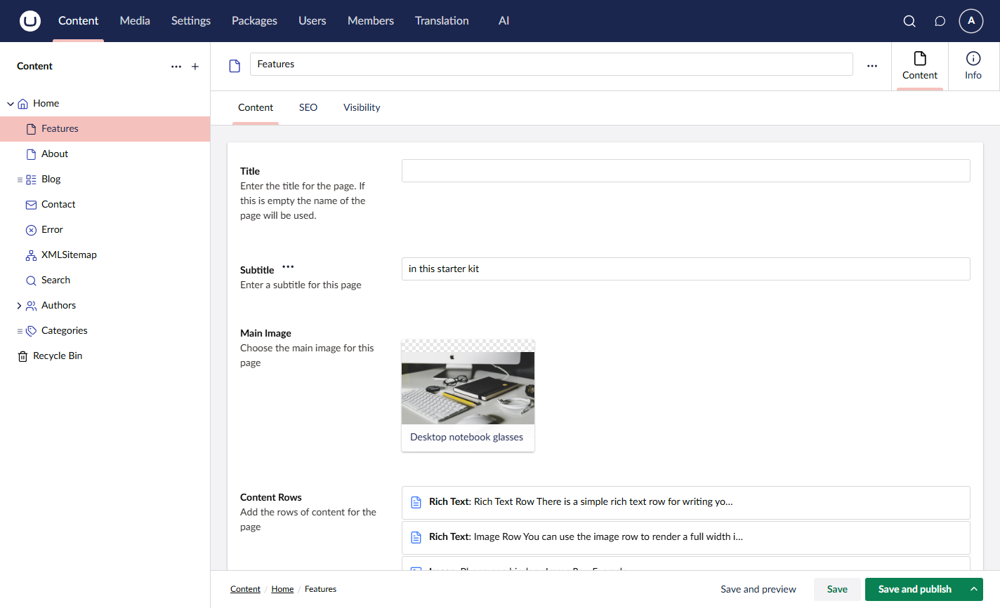

# Property Actions

Prompts are automatically registered as property actions in the Umbraco backoffice. Editors can execute prompts directly from text-based property editors.

## How Property Actions Work

When you create an active prompt:

1. The prompt is registered as a property action
2. The action appears on compatible property editors
3. Editors can click to execute the prompt
4. Results can be inserted or applied to properties

```
┌─────────────────────────────────────────────────────┐
│ Page Title                                    [AI ▼]│
│ ┌─────────────────────────────────────────────────┐ │
│ │ Welcome to Our Website                          │ │
│ └─────────────────────────────────────────────────┘ │
│                                                     │
│ AI Actions:                                         │
│ ├── Improve SEO                                     │
│ ├── Translate to French                             │
│ └── Generate Alternatives                           │
└─────────────────────────────────────────────────────┘
```



## Compatible Property Editors

Property actions appear on text-based editors:

| Editor           | Support                                         |
| ---------------- | ----------------------------------------------- |
| Textstring       | Yes                                             |
| Textarea         | Yes                                             |
| Rich Text Editor | Yes (with TipTap toolbar integration)           |
| Markdown         | Yes                                             |
| Block List/Grid  | Yes (on text properties within blocks)          |

## Scoping Property Actions

Control where a prompt appears using its `Scope`. A scope is made up of `AllowRules` (whitelist) and `DenyRules` (blacklist). Each rule can match against content type aliases, property aliases, and/or property editor UI aliases. See [Scoping](scoping.md) for full details.

### Allow on Specific Content Types



```csharp
var prompt = new AIPrompt
{
    Alias = "blog-enhancer",
    Name = "Enhance Blog Post",
    Instructions = "...",
    Scope = new AIPromptScope
    {
        AllowRules = [
            new AIPromptScopeRule
            {
                ContentTypeAliases = ["blogPost", "article"]
            }
        ]
    }
};
```



### Allow on Specific Property Editors



```csharp
var prompt = new AIPrompt
{
    Alias = "text-improver",
    Name = "Improve Text",
    Instructions = "...",
    Scope = new AIPromptScope
    {
        AllowRules = [
            new AIPromptScopeRule
            {
                PropertyEditorUiAliases = [
                    "Umb.PropertyEditorUi.TextBox",
                    "Umb.PropertyEditorUi.TextArea"
                ]
            }
        ]
    }
};
```



### Deny Specific Properties

Use deny rules to exclude specific places, even when they are otherwise allowed:



```csharp
var prompt = new AIPrompt
{
    Alias = "general-assistant",
    Name = "Writing Assistant",
    Instructions = "...",
    Scope = new AIPromptScope
    {
        AllowRules = [
            new AIPromptScopeRule
            {
                ContentTypeAliases = ["article", "blogPost"]
            }
        ],
        DenyRules = [
            new AIPromptScopeRule
            {
                PropertyAliases = ["legalDisclaimer"]
            }
        ]
    }
};
```




A prompt with no scope, or with an empty `AllowRules` list, is not available anywhere. To make a prompt appear in the backoffice you must define at least one allow rule.


## Rich Text Editor Integration

Prompts with the `TipTapTool` display mode appear as a toolbar button in the rich text editor (TipTap). This integration supports text selection:

- **With selection** - The selected text is captured and passed as context to the prompt. The AI response replaces the selected text.
- **Without selection** - The full editor content is used as context. The response is appended at the end of the document.

The toolbar button opens a dropdown showing all prompts configured with the `TipTapTool` display mode that match the current scope.


The TipTap integration also works within Block List and Block Grid editors. When a rich text property exists inside a block, the toolbar button is available and the block's entity context is passed to the prompt.


## Block Editor Support

Prompts work inside Block List and Block Grid editors. When a prompt executes within a block:

- The block's content type, properties, and values are extracted as entity context
- Scope validation runs against the block's content type (not the parent document)
- Results can be applied to properties within the block

Scoping a prompt to a specific block element type makes the prompt appear only when editing blocks of that type.

## Display Modes

Prompts have a display mode that determines how they are presented to editors:

| Mode               | Value | Description                                         |
| ------------------ | ----- | --------------------------------------------------- |
| **Property Action**| `0`   | Appears as an action button on compatible property editors |
| **TipTap Tool**    | `1`   | Appears as a toolbar button in the rich text editor  |

### Property Action (Default)

The prompt appears as an action on text-based property editors. When executed, results are shown in a dialog where editors can preview, copy, or insert the generated content.

### TipTap Tool

The prompt appears as a toolbar button in the rich text editor. This mode supports text selection for targeted content transformation. See [Rich Text Editor Integration](#rich-text-editor-integration) above.

## Context Extraction

When a property action executes, it automatically extracts context:

| Context         | Description                     |
| --------------- | ------------------------------- |
| `entityId`      | The content/media item ID       |
| `entityType`    | "document" or "media"           |
| `propertyAlias` | The property being edited       |
| `culture`       | Current culture variant         |
| `segment`       | Current segment (if applicable) |
| `currentValue`  | Current property value          |

This context is available in your prompt template:

```
The current value is:
{{currentValue}}

Improve this text for better readability.
```

## Applying Results

Property actions can apply results in multiple ways:

### Single Property

Replace or append to the current property:

```csharp
// Apply result to property (implementation depends on your backoffice integration)
// e.g. update the property value via the content service or frontend event
await ApplyToPropertyAsync(propertyAlias, result);
```

### Multiple Properties

Update multiple properties atomically:

```csharp
var changes = new Dictionary<string, object>
{
    ["pageTitle"] = generatedTitle,
    ["metaDescription"] = generatedMeta,
    ["summary"] = generatedSummary
};

// Apply changes to properties (implementation depends on your backoffice integration)
await ApplyChangesAsync(changes);
```


Multi-property updates are applied as a single operation, allowing editors to undo all changes at once.


## Creating Prompts for Property Actions

When designing prompts for property actions:

### 1. Be Context-Aware

Reference the current content context:

```
You are editing "{{name}}" ({{contentType}}).
The current {{propertyAlias}} value is:

{{currentValue}}

Improve this text while maintaining the same tone.
```

### 2. Provide Clear Output

Structure prompts to produce directly usable output:

```
Generate an improved version of this text.
Return ONLY the improved text, no explanations.

Original:
{{currentValue}}
```

### 3. Consider the Editor Experience

- Keep prompts focused on single tasks
- Use clear, action-oriented names
- Group related prompts with tags

## Managing Property Actions

### Via Backoffice

1. Navigate to the **AI** section > **Prompts**
2. Create or edit a prompt
3. Configure the scope settings
4. Set `IsActive` to true

### Visibility

Only active prompts appear as property actions. Deactivate a prompt to remove it from property editors without deleting it.

## Troubleshooting

### Prompt Not Appearing

- Verify the prompt is active (`IsActive = true`)
- Check the scope allows the content type
- Ensure the property editor is compatible
- Confirm a default chat profile is configured

### Wrong Context

- Verify variable names match your template
- Check that entity context is being passed
- Review the prompt's `IncludeEntityContext` setting

## Related

- [Concepts](concepts.md) - Prompt fundamentals
- [Template Syntax](template-syntax.md) - Variable interpolation
- [Scoping](scoping.md) - Allow and deny rules
