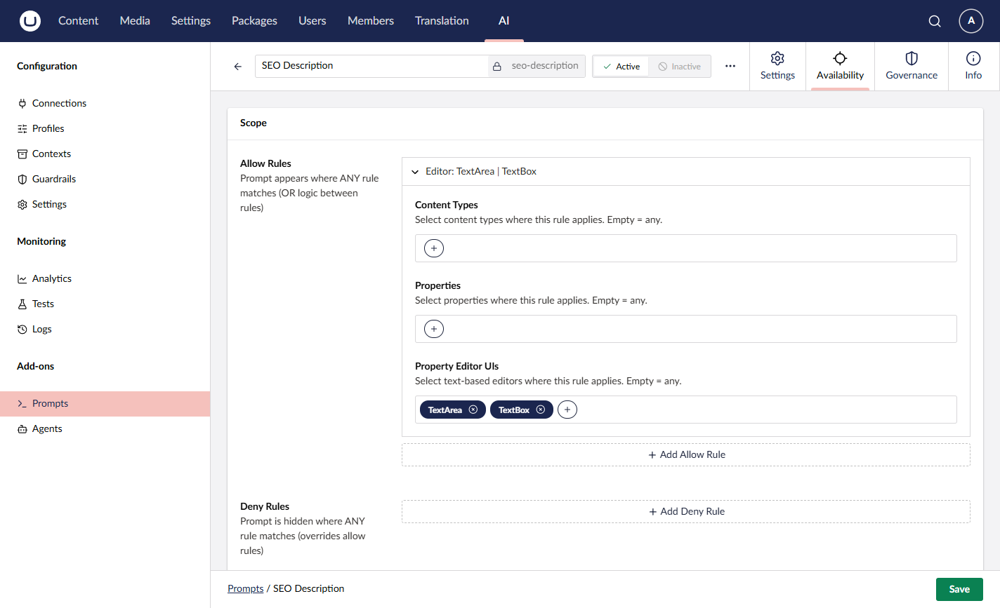

# Prompt Scoping

Scoping controls where a prompt is allowed to run. You can restrict prompts to specific content types, property editors, or properties, and use a combination of allow and deny rules to shape editorial workflows.

## How Scoping Works

A prompt's scope is made up of two lists:

- **Allow rules** - Whitelist the places where a prompt **can** be used. At least one allow rule must match for the prompt to execute.
- **Deny rules** - Blacklist the places where a prompt **cannot** be used. If any deny rule matches, execution is blocked. Deny rules take precedence over allow rules.

Each rule is an `AIPromptScopeRule` that can match against one or more of the following:

| Property                  | Description                                                      |
| ------------------------- | ---------------------------------------------------------------- |
| `ContentTypeAliases`      | Document, media, member, or element type aliases to match        |
| `PropertyAliases`         | Property aliases to match (for example `pageTitle`, `summary`)   |
| `PropertyEditorUiAliases` | Property Editor UI aliases (for example `Umb.PropertyEditorUi.TextBox`) |


Within a single rule, every non-empty property must match (AND logic). Within each list, any value can match (OR logic). Between rules, any rule matching is enough (OR logic).



A prompt with no scope, or with an empty `AllowRules` list, is **not allowed to run anywhere**. To make a prompt available, you must add at least one allow rule.


## Configuring Scope

### Via Backoffice

1. Edit the prompt.
2. Expand the **Scope** section.
3. Add one or more **Allow Rules** describing where the prompt should be available.
4. Optionally add **Deny Rules** to exclude specific places.
5. Save.



### Via Code



```csharp
var prompt = new AIPrompt
{
    Alias = "product-description",
    Name = "Product Description",
    Instructions = "Write a product description...",
    Scope = new AIPromptScope
    {
        AllowRules = [
            new AIPromptScopeRule
            {
                ContentTypeAliases = ["product", "productVariant"]
            }
        ]
    }
};

await _promptService.SavePromptAsync(prompt);
```



### Via API



```json
{
    "alias": "product-description",
    "name": "Product Description",
    "instructions": "Write a product description...",
    "scope": {
        "allowRules": [
            {
                "contentTypeAliases": ["product", "productVariant"]
            }
        ],
        "denyRules": []
    }
}
```



## Scope Model



```csharp
public class AIPromptScope
{
    public IReadOnlyList<AIPromptScopeRule> AllowRules { get; set; } = [];
    public IReadOnlyList<AIPromptScopeRule> DenyRules { get; set; } = [];
}

public class AIPromptScopeRule
{
    public IReadOnlyList<string>? PropertyEditorUiAliases { get; set; }
    public IReadOnlyList<string>? PropertyAliases { get; set; }
    public IReadOnlyList<string>? ContentTypeAliases { get; set; }
}
```



## Examples

### Allow on specific content types

Make the prompt available on any property of two content types:

```csharp
Scope = new AIPromptScope
{
    AllowRules = [
        new AIPromptScopeRule
        {
            ContentTypeAliases = ["blogPost", "article"]
        }
    ]
}
```

### Allow on specific property editors

Make the prompt available on any textbox or textarea, regardless of content type:

```csharp
Scope = new AIPromptScope
{
    AllowRules = [
        new AIPromptScopeRule
        {
            PropertyEditorUiAliases = [
                "Umb.PropertyEditorUi.TextBox",
                "Umb.PropertyEditorUi.TextArea"
            ]
        }
    ]
}
```

### Combine constraints within a rule

Require both a content type and a property alias match (AND logic):

```csharp
Scope = new AIPromptScope
{
    AllowRules = [
        new AIPromptScopeRule
        {
            ContentTypeAliases = ["blogPost"],
            PropertyAliases = ["summary", "excerpt"]
        }
    ]
}
```

### Allow and deny combined

Allow the prompt for all blog posts, but exclude a sensitive property:

```csharp
Scope = new AIPromptScope
{
    AllowRules = [
        new AIPromptScopeRule
        {
            ContentTypeAliases = ["blogPost"]
        }
    ],
    DenyRules = [
        new AIPromptScopeRule
        {
            PropertyAliases = ["legalDisclaimer"]
        }
    ]
}
```

## Enforcement

Scope validation runs both in the backoffice (to decide which prompts appear on a given property) and server-side when a prompt is executed. A prompt execution request that does not match any allow rule, or that matches a deny rule, is rejected by the `AIPromptScopeValidator`.

## Related

- [Concepts](concepts.md) - Prompt fundamentals
- [Template Syntax](template-syntax.md) - Variable interpolation
