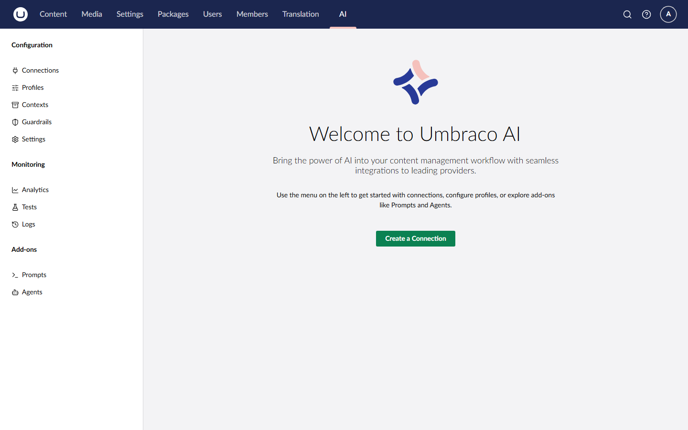

# Backoffice

Umbraco.AI adds an AI section to the Umbraco backoffice where you can manage connections, profiles, contexts, guardrails, and related settings without writing code.

## Accessing the AI Section

1. Log in to the Umbraco backoffice.
2. Click on the **AI** section in the main navigation.
3. Expand the tree to access Connections, Profiles, Contexts, Guardrails, Settings, Version History, Audit Logs, and Usage Analytics.




The AI section is a standalone section in the backoffice (not under Settings). If you don't see it, ensure your user group has been granted access to the AI section, then refresh your browser.


## What You Can Manage

<table data-view="cards">
<thead>
<tr>
<th></th>
<th></th>
</tr>
</thead>
<tbody>
<tr>
<td><strong>Connections</strong></td>
<td>Configure credentials and settings for AI providers</td>
</tr>
<tr>
<td><strong>Profiles</strong></td>
<td>Create use-case specific configurations with model settings</td>
</tr>
<tr>
<td><strong>Contexts</strong></td>
<td>Define reusable content collections injected into AI operations</td>
</tr>
<tr>
<td><strong>Guardrails</strong></td>
<td>Enforce safety, compliance, and quality rules on AI operations</td>
</tr>
<tr>
<td><strong>Settings</strong></td>
<td>Configure system-wide defaults like default profiles</td>
</tr>
<tr>
<td><strong>Version History</strong></td>
<td>View and restore previous versions of AI entities</td>
</tr>
<tr>
<td><strong>Audit Logs</strong></td>
<td>Review detailed logs of every AI operation</td>
</tr>
<tr>
<td><strong>Usage Analytics</strong></td>
<td>Monitor aggregated usage statistics and trends</td>
</tr>
</tbody>
</table>

## Connections vs Profiles

Understanding the relationship:

- **Connection** = Your credentials for an AI provider (for example, your OpenAI API key)
- **Profile** = A specific configuration using a connection (for example, "Content Writer" using GPT-4 with creative settings)

You need at least one connection before you can create profiles. Multiple profiles can share the same connection.

```
Connection: "OpenAI Production"
    ├── Profile: "Content Writer" (gpt-4o, temp 0.8)
    ├── Profile: "Code Assistant" (gpt-4o, temp 0.2)
    ├── Profile: "Embeddings" (text-embedding-3-small)
    └── Profile: "Voice Transcription" (whisper-1, language en)
```

## In This Section


[Managing Connections](managing-connections.md)



[Managing Profiles](managing-profiles.md)



[Managing Contexts](managing-contexts.md)



[Managing Guardrails](managing-guardrails.md)



[Managing Settings](managing-settings.md)



[Version History](version-history.md)



[Audit Logs](audit-logs.md)



[Usage Analytics](usage-analytics.md)

