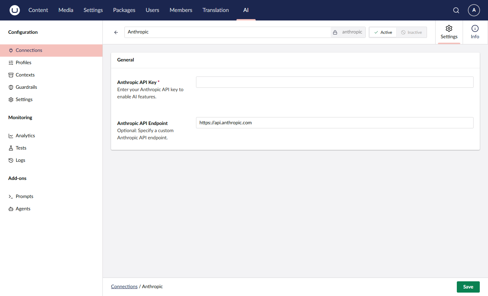

# Anthropic

Anthropic provides access to Claude models, supporting the Chat capability.

## Installation



```powershell
Install-Package Umbraco.AI.Anthropic
```



Or via .NET CLI:



```bash
dotnet add package Umbraco.AI.Anthropic
```



## Connection Settings

| Setting  | Required | Description                                                                        |
| -------- | -------- | ---------------------------------------------------------------------------------- |
| API Key  | Yes      | Your Anthropic API key from [console.anthropic.com](https://console.anthropic.com) |
| Endpoint | No       | Custom endpoint URL (defaults to `https://api.anthropic.com`)                      |

### Getting an API Key

1. Sign up at [console.anthropic.com](https://console.anthropic.com)
2. Navigate to **API Keys**
3. Click **Create Key**
4. Copy the key (it won't be shown again)


Keep your API key secure. Never commit it to source control or expose it in client-side code.




## Related

- [Providers Overview](README.md)
- [Managing Connections](../backoffice/managing-connections.md)
