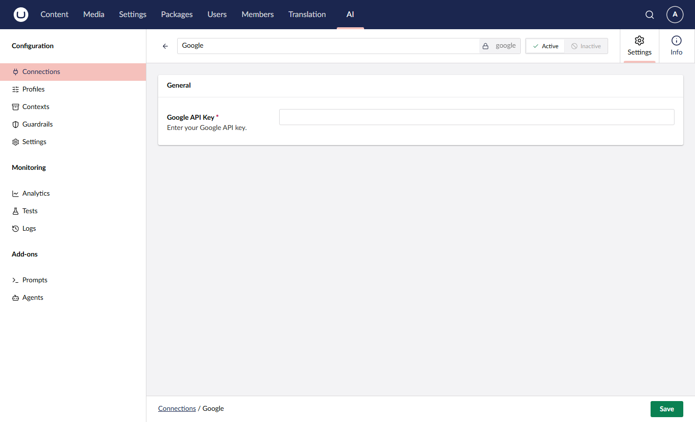

# Google Gemini

Google Gemini provides access to Google's Gemini models, supporting the Chat capability.

## Installation



```powershell
Install-Package Umbraco.AI.Google
```



Or via .NET CLI:



```bash
dotnet add package Umbraco.AI.Google
```



## Connection Settings

| Setting | Required | Description                                                          |
| ------- | -------- | -------------------------------------------------------------------- |
| API Key | Yes      | Your Google AI API key from [AI Studio](https://aistudio.google.com) |

### Getting an API Key

1. Go to [Google AI Studio](https://aistudio.google.com)
2. Sign in with your Google account
3. Click **Get API key** in the sidebar
4. Create a new API key or use an existing one
5. Copy the key


Keep your API key secure. Never commit it to source control or expose it in client-side code.




## Related

- [Providers Overview](README.md)
- [Managing Connections](../backoffice/managing-connections.md)
