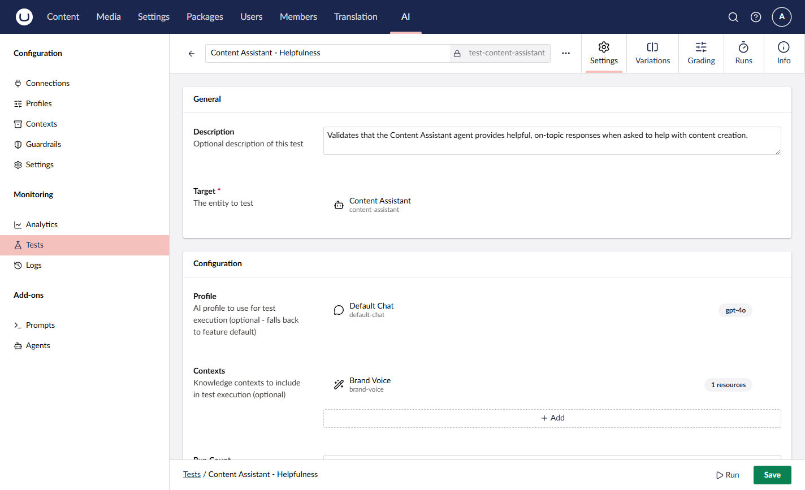
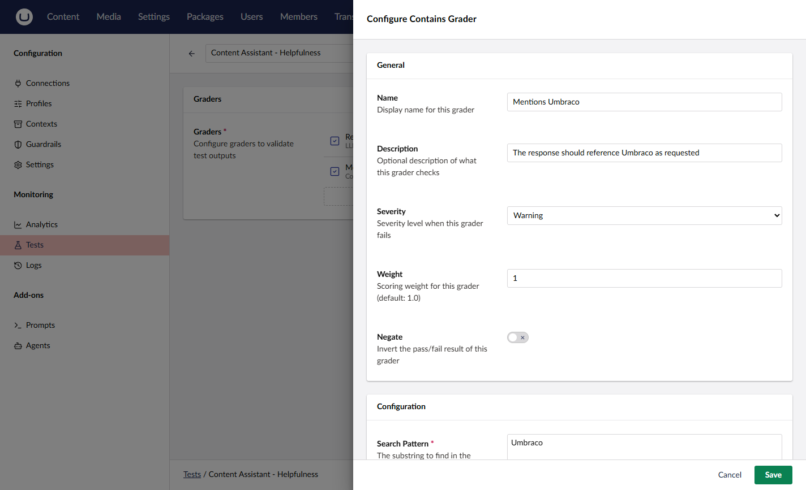
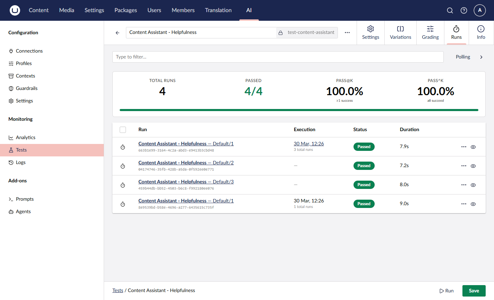
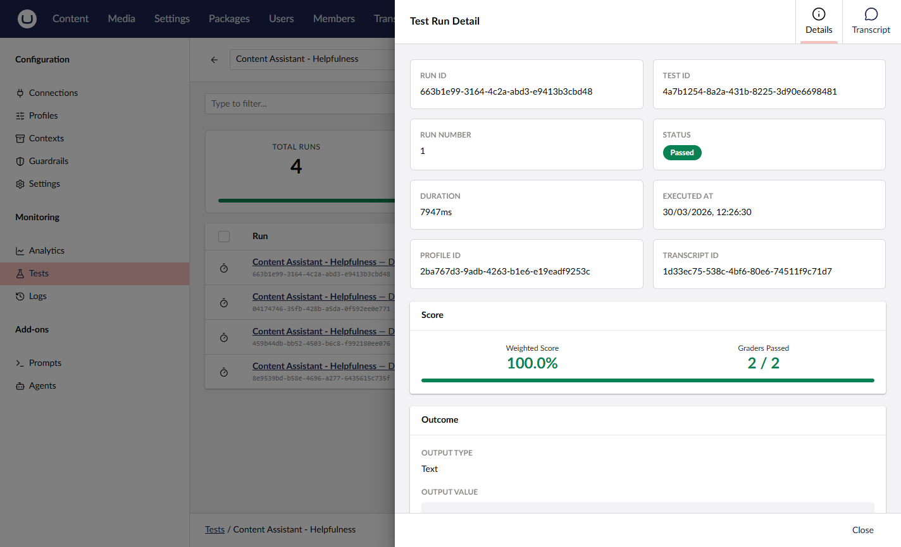

# Getting Started with Testing

This guide walks you through creating and running your first AI test.

## Prerequisites

- At least one prompt or agent configured
- At least one chat profile with a valid connection

## Step 1: Create a Test

1. Navigate to the **AI** section > **Tests**
2. Click **Create**
3. Fill in the test details:

| Field | Description |
|-------|-------------|
| Name | A descriptive name for the test |
| Alias | Unique identifier |
| Description | What the test validates |

4. Select the **Target** — the prompt or agent to test
5. Configure the **Profile** and **Contexts** to use during execution

## Step 2: Add Graders

Graders define the success criteria for the test output.

1. Click **Add Grader** in the Graders section
2. Select a grader type (e.g., Contains, Regex Match, LLM Judge)
3. Configure the grader settings

See [Graders](graders.md) for details on all available grader types.

## Step 3: Run the Test

1. Click **Run** in the toolbar
2. The test executes against the target with the configured graders
3. View the results in the **Runs** tab

## Step 4: Review Results

Click a run to see the details:

- **Score** — overall pass rate
- **Graders Passed** — how many graders passed
- **Outcome** — the actual output from the AI

## Next Steps

- [Graders](graders.md) — Configure success criteria
- [Variations](variations.md) — A/B test across models
- [Concepts](concepts.md) — Understand tests, features, and metrics
