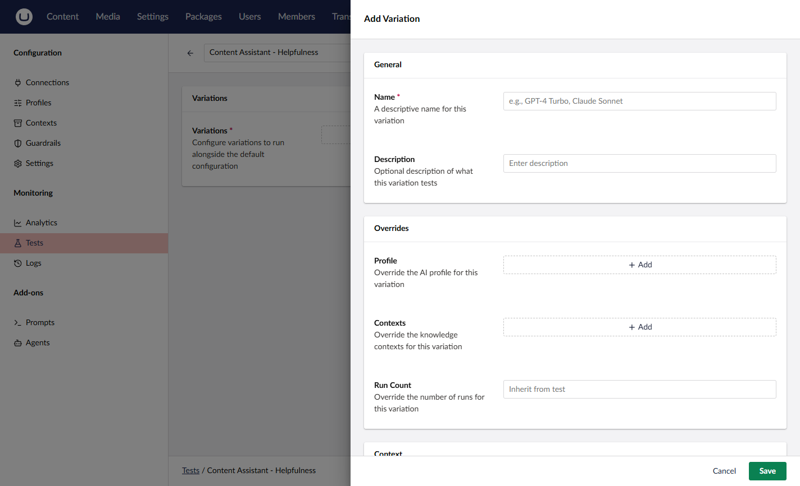

# Variations

Variations let you run the same test with different configurations to compare results side by side. Each variation can override the profile, run count, context IDs, and feature configuration.

## How Variations Work

When you execute a test with variations:

1. The framework runs the **default configuration** first (`RunCount` times)
2. Each **variation** runs with its own settings (`RunCount` times, inherited or overridden)
3. All runs share a single **execution ID**
4. The response includes separate metrics for the default config, each variation, and an aggregate

This lets you compare how different models or settings perform on the same test.

## Variation Properties

| Property            | Type       | Required | Description                                    |
| ------------------- | ---------- | -------- | ---------------------------------------------- |
| `Name`              | string     | Yes      | Display name (for example, "GPT-4o", "Claude Sonnet") |
| `Description`       | string     | No       | What this variation tests                      |
| `ProfileId`         | guid       | No       | Profile override. Null inherits from the test. |
| `RunCount`          | int        | No       | Run count override. Null inherits from the test. |
| `ContextIds`        | guid[]     | No       | Context IDs override. Null inherits from the test. |
| `TestFeatureConfig` | JSON       | No       | Feature config override (deep-merged with the test's config). |

## Deep Merge Behavior

When a variation provides `TestFeatureConfig`, the framework deep-merges the variation config with the test's base config:

- **Object properties** are recursively merged
- **Arrays and primitives** are replaced (not merged)
- **Null** properties in the variation are ignored (the base value is kept)

This means you only need to specify the properties you want to override.



```json
{
    "variables": {
        "language": "English",
        "format": "bullet points"
    },
    "maxTokens": 500
}
```





```json
{
    "variables": {
        "language": "Spanish"
    }
}
```





```json
{
    "variables": {
        "language": "Spanish",
        "format": "bullet points"
    },
    "maxTokens": 500
}
```



## Creating a Test with Variations



```bash
curl -X POST "https://your-site.com/umbraco/ai/management/api/v1/tests" \
  -H "Authorization: Bearer YOUR_ACCESS_TOKEN" \
  -H "Content-Type: application/json" \
  -d '{
    "alias": "test-seo-model-comparison",
    "name": "SEO Description - Model Comparison",
    "testFeatureId": "prompt",
    "testTargetId": "PROMPT_GUID_HERE",
    "profileId": "GPT4O_PROFILE_GUID",
    "runCount": 3,
    "graders": [
      {
        "graderTypeId": "regex",
        "name": "Length 50-160 chars",
        "config": { "pattern": "^.{50,160}$" },
        "severity": "Error"
      },
      {
        "graderTypeId": "llm-judge",
        "name": "SEO quality",
        "config": {
          "evaluationCriteria": "Is this a compelling, keyword-rich meta description?",
          "passThreshold": 0.7
        },
        "severity": "Error"
      }
    ],
    "variations": [
      {
        "name": "Claude Sonnet",
        "description": "Test with Anthropic Claude Sonnet",
        "profileId": "CLAUDE_PROFILE_GUID"
      },
      {
        "name": "GPT-4o Mini",
        "description": "Test with smaller, faster model",
        "profileId": "GPT4O_MINI_PROFILE_GUID",
        "runCount": 5
      }
    ],
    "tags": ["seo", "model-comparison"]
  }'
```





In this example:
- The default config (GPT-4o) runs 3 times
- The "Claude Sonnet" variation runs 3 times (inherited)
- The "GPT-4o Mini" variation runs 5 times (overridden)

## Reading Variation Results

The execution response includes per-variation metrics:



```json
{
    "testId": "3fa85f64-5717-4562-b3fc-2c963f66afa6",
    "executionId": "a1b2c3d4-e5f6-7890-abcd-ef1234567890",
    "defaultMetrics": {
        "testId": "3fa85f64-5717-4562-b3fc-2c963f66afa6",
        "totalRuns": 3,
        "passedRuns": 3,
        "passAtK": 1.0,
        "passToTheK": 1.0,
        "runIds": ["run-1", "run-2", "run-3"]
    },
    "variationMetrics": [
        {
            "variationId": "var-1-guid",
            "variationName": "Claude Sonnet",
            "metrics": {
                "testId": "3fa85f64-5717-4562-b3fc-2c963f66afa6",
                "totalRuns": 3,
                "passedRuns": 2,
                "passAtK": 0.67,
                "passToTheK": 0.0,
                "runIds": ["run-4", "run-5", "run-6"]
            }
        },
        {
            "variationId": "var-2-guid",
            "variationName": "GPT-4o Mini",
            "metrics": {
                "testId": "3fa85f64-5717-4562-b3fc-2c963f66afa6",
                "totalRuns": 5,
                "passedRuns": 4,
                "passAtK": 0.8,
                "passToTheK": 0.0,
                "runIds": ["run-7", "run-8", "run-9", "run-10", "run-11"]
            }
        }
    ],
    "aggregateMetrics": {
        "testId": "3fa85f64-5717-4562-b3fc-2c963f66afa6",
        "totalRuns": 11,
        "passedRuns": 9,
        "passAtK": 0.82,
        "passToTheK": 0.0,
        "runIds": ["run-1", "...", "run-11"]
    }
}
```



## Comparing Variations

Use the compare-variations endpoint to do pairwise drill-down between any two variation groups (or default vs variation):



```bash
curl -X POST "https://your-site.com/umbraco/ai/management/api/v1/test-runs/compare-variations" \
  -H "Authorization: Bearer YOUR_ACCESS_TOKEN" \
  -H "Content-Type: application/json" \
  -d '{
    "executionId": "a1b2c3d4-e5f6-7890-abcd-ef1234567890",
    "sourceVariationId": null,
    "comparisonVariationId": "var-1-guid"
  }'
```



Set `sourceVariationId` to `null` to compare the default configuration against a variation.

The response includes pass rate deltas, duration deltas, and regression/improvement indicators.

## Related

- [Concepts](concepts.md) - Core testing concepts
- [Run a Test](api/run.md) - Single test execution endpoint
- [Compare Variations](api/compare.md) - Comparison endpoints
