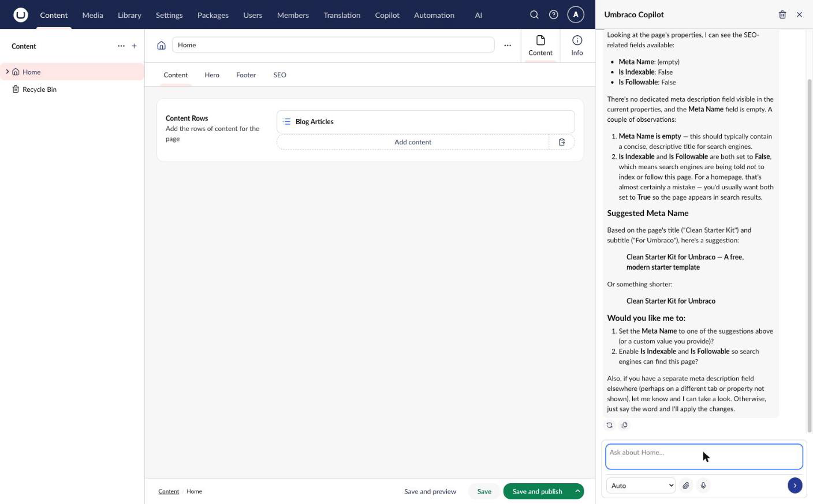
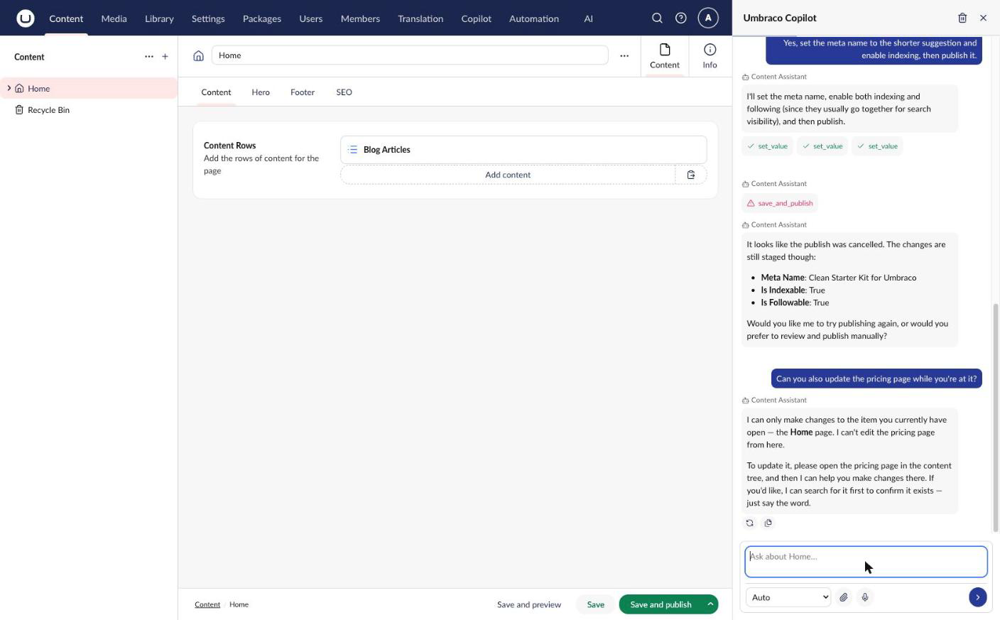
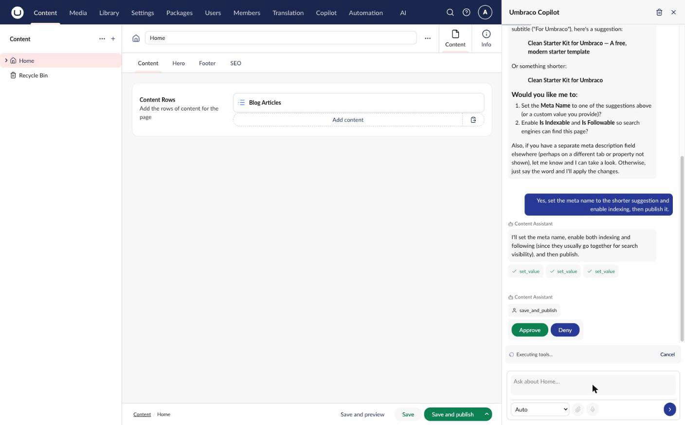

# Contextual Copilot

Contextual Copilot is an AI-powered assistant that appears as a sidebar in the Umbraco backoffice. It provides conversational AI capabilities directly within your content editing workflow.


In the backoffice itself, this sidebar is simply labeled **Copilot**. These docs use **Contextual Copilot** to distinguish it from [Copilot Workspace](../copilot-workspace/README.md), a separate add-on for broader, cross-site conversations. This is a documentation naming convention only, not a rename of the product or UI.


## Accessing Contextual Copilot

Contextual Copilot is available in the **Content** and **Media** sections. Open a document or media item and look for the floating **AI Assistant** button in the bottom-right corner of the editing workspace:

1. Open the content or media item you want help with
2. Click the floating button to toggle the sidebar open/closed
3. The button shows an active state when the sidebar is open


The Contextual Copilot button only appears in sections where it's relevant (Content and Media), and only once you have a document or media item open. It is not shown in the backoffice header -- it floats over the workspace of the item you're editing.




## Contextual Scope

Contextual Copilot is intentionally scoped to the item you currently have open. It can read across your site for reference (for example searching other content for consistency), but it only makes changes to the item that is open in the editor.

Contextual Copilot **cannot** perform destructive, site-wide operations such as creating new pages, or publishing/deleting content or media it hasn't been asked to change as part of editing the current item. If you ask it to do something outside this scope, it explains the limitation and points you to the standard backoffice workflow instead:



For broader, multi-page or site-wide AI-assisted work -- including tasks that create or publish content across the site -- see [Copilot Workspace](../copilot-workspace/README.md).

## Features

### Conversational Interface

Chat naturally with the AI assistant:

- Ask questions about your content
- Request suggestions and improvements
- Get help with writing tasks
- Multi-turn conversations maintain context

### Content Awareness

Contextual Copilot understands your current editing context:

- Current content item being edited
- Property values and structure
- Content type information
- Media items and relationships

### Tool Execution

Agents can execute tools to interact with Umbraco:

- Read property values
- Update content fields
- Navigate to related content
- Perform custom actions


Contextual Copilot always restricts destructive backend tools -- such as creating, publishing, or deleting content or media outside the open item -- regardless of the tool permissions granted to the agent. This is enforced by the Contextual Copilot surface itself, not by agent configuration, and cannot be overridden. See [Contextual Scope](#contextual-scope) above.


### Human-in-the-Loop Approval

For sensitive operations on the item you have open -- such as saving and publishing changes Contextual Copilot has staged -- it requests confirmation before proceeding:

The approval workflow ensures editors maintain control over content changes.



## Configuring Contextual Copilot Agents

Agents power Contextual Copilot's capabilities. Any agent in the **AI > Agents** backoffice section that is associated with the **Copilot** surface becomes available inside the sidebar.

### Opting an agent into Contextual Copilot

The Contextual Copilot package registers an agent surface via `CopilotAgentSurface` with `SurfaceId = "copilot"`. When editing an agent in the backoffice, tick **Copilot** in the **Surfaces** selection to expose it to the sidebar -- this is the option registered by the Contextual Copilot add-on, as distinct from the **Copilot Workspace** option next to it. Internally this adds `"copilot"` to the agent's `SurfaceIds` collection, and the sidebar loads agents filtered by that surface ID.

If only one agent is associated with the Contextual Copilot surface, the sidebar uses it directly. If multiple agents are available, Contextual Copilot uses Auto mode to route each prompt (see below).

### Agent Instructions

Configure agent instructions for Contextual Copilot behavior:

```
You are an AI assistant helping editors create content in Umbraco.

Your capabilities:
- Suggest improvements to content
- Help with writing and editing
- Answer questions about the current page
- Update properties when asked

Always be helpful and concise.
```

## Auto Mode and Agent Routing

When multiple agents are available on a surface, Contextual Copilot uses "Auto" mode to automatically select the best agent for each user message. Auto mode works by sending the user's prompt to a classifier model that picks an agent based on each agent's name and description. [Copilot Workspace](../copilot-workspace/README.md) uses the same Auto mode mechanism for its own surface.

### Classifier Profile

By default, the classifier uses the default chat profile, which may be a powerful (and expensive) model. Since classification only returns a single GUID, you can configure a cheaper or faster model specifically for this task:

1. Navigate to the **AI** section > **Settings**
2. Set the **Classifier Chat Profile** to a lightweight model (e.g., GPT-4o Mini, Claude Haiku)
3. Save

See [Settings](../../concepts/settings.md#classifier-chat-profile) for more details on the fallback chain.

## Related

- [Copilot Workspace](../copilot-workspace/README.md) - Broader, cross-site AI conversations with persisted history and projects
- [Agent Runtime](../agent/README.md) - Backend agent functionality
- [Frontend Tools](frontend-tools.md) - Custom tool integrations
