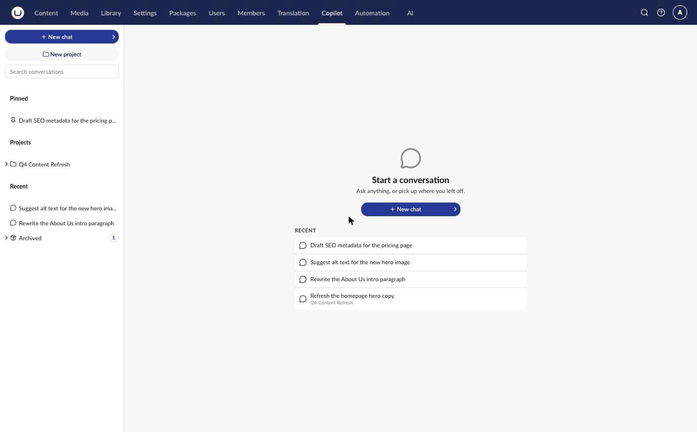
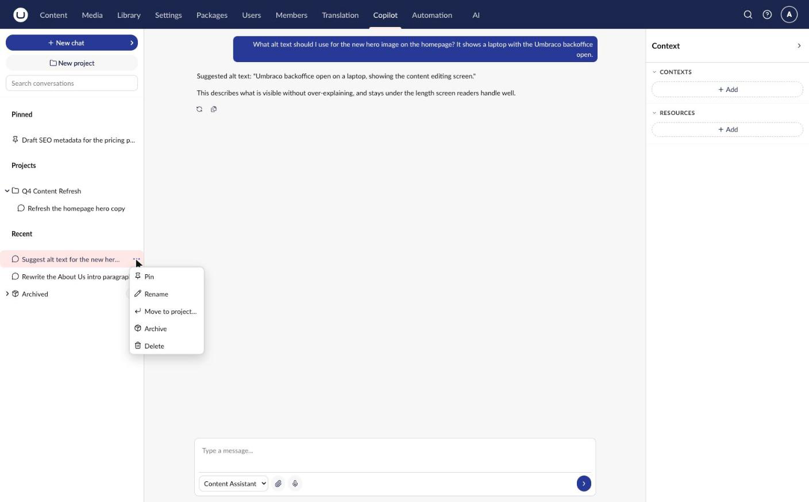
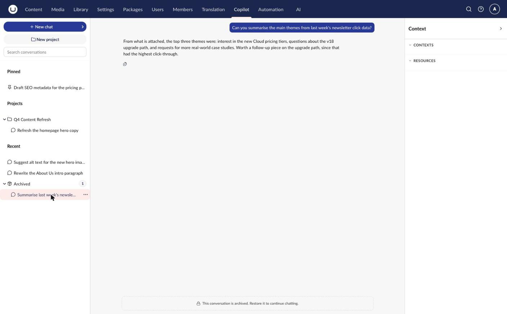
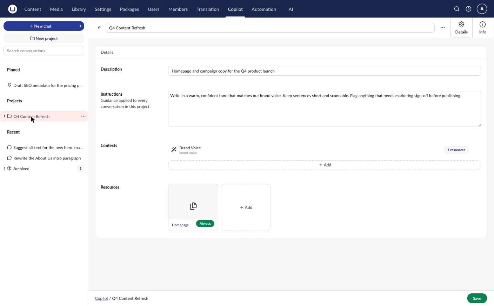
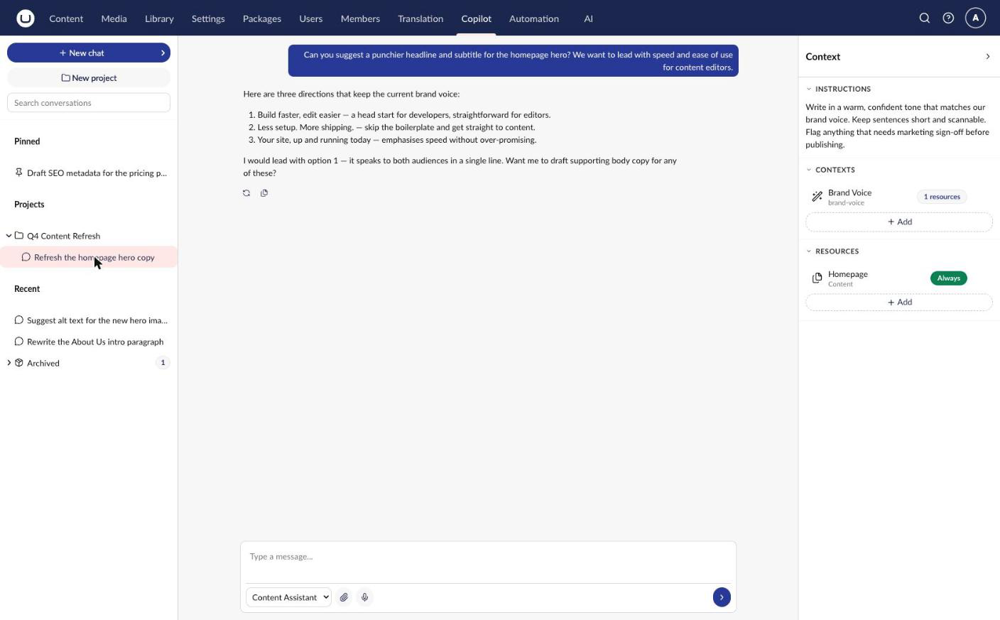

# Using Copilot Workspace

Copilot Workspace is a full backoffice section for AI conversations, opened via the **Copilot** entry in the section rail. Unlike the [Contextual Copilot](../agent-copilot/copilot.md) sidebar, conversations here are not tied to a single content or media item. They persist across sessions and can span whatever you need help with.

## The Workspace Layout

Copilot Workspace uses a three-region layout:

- **Sidebar** - Projects and recent conversations, with search.
- **Center** - The active chat.
- **Context panel** - Instructions, contexts, and resources grounding the current conversation (collapsible).

Before you open a conversation, the sidebar shows a launcher. Use it to start a new chat or pick up a recent one:

## Starting a Conversation

Use **New chat** to start an unsaved conversation, or **New chat in a project** to start one inside a specific [project](#projects). A conversation is only persisted once you send its first message.

## Conversations

Each conversation in the sidebar supports the following actions via its **...** menu:

- **Pin** / **Unpin** - Keep important conversations at the top.
- **Rename** - Give a conversation a custom title (conversations are auto-titled otherwise).
- **Move to project...** - Attach or move a conversation to a project.
- **Archive** - Remove a conversation from the active list without deleting it.
- **Delete** - Permanently remove a conversation.

### Archived Conversations

Archiving hides a conversation from your active lists without deleting it. Archived conversations are grouped under **Archived** in the sidebar and are read-only until restored:

## Projects

A project groups related conversations under shared instructions and reusable context. Anything you attach to a project is inherited by every conversation inside it:

- **Instructions** - Guidance applied to every conversation in the project (for example, "Talk like a pirate" or brand-specific tone rules).
- **Contexts** - Existing [AI Contexts](../../concepts/contexts.md), such as brand voice guidelines.
- **Resources** - Attached content, files, or other resources, each with an injection mode (for example, **Always** included, or resolved on demand).

Create a project with **New project** in the sidebar, or via the top-level create menu. Deleting a project detaches its conversations rather than deleting them.

## The Context Panel

While chatting, the context panel on the right shows what's grounding the current conversation. This includes the project's instructions, contexts, and resources (if the conversation belongs to a project), plus anything attached directly to the conversation itself. Collapse it for more chat space, or expand it to review or edit what the agent can see:

## Backend Tools and Approvals

Copilot Workspace isn't scoped to a single open item. Its agents on the `copilot-workspace` surface can be granted broader tool permissions than Contextual Copilot allows. This includes backend tools that create, update, publish, or delete content and media anywhere on the site. Sensitive operations still go through [Human-in-the-Loop approval](../agent-copilot/copilot.md#human-in-the-loop-approval) before they run.



Review tool permissions carefully for agents used in Copilot Workspace. See [Agent Tool Permissions](../agent/permissions.md) for how to scope destructive tools to the right agents and user groups.



## Configuring Copilot Workspace Agents

Any agent in the **AI > Agents** backoffice section that is associated with the **Copilot Workspace** surface becomes available in the Workspace. Tick **Copilot Workspace** in the agent's **Surfaces** selection to opt it in.

Unlike Contextual Copilot, where availability also depends on the current section and entity type, Copilot Workspace availability depends only on this surface opt-in. An agent enabled here is available in every conversation and project. If no agent is enabled, the Workspace shows an empty state guiding you to enable one. If multiple agents are enabled, Copilot Workspace can auto-select the most relevant one per prompt, the same way [Auto Mode](../agent-copilot/copilot.md#auto-mode-and-agent-routing) works for Contextual Copilot.

## Related

- [Contextual Copilot](../agent-copilot/copilot.md) - The contextual sidebar, scoped to the item you have open
- [Agent Tool Permissions](../agent/permissions.md) - Scoping tool access, including destructive backend tools
- [AI Contexts](../../concepts/contexts.md) - Brand voice and guidelines
