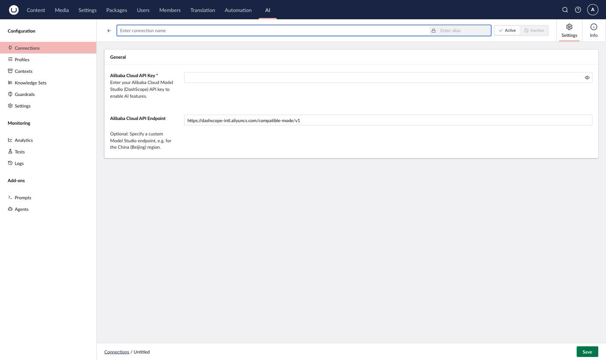

# Alibaba Cloud Model Studio

Alibaba Cloud Model Studio provides access to Qwen models, supporting the Chat and Embedding capabilities.

## Installation



```powershell
Install-Package Umbraco.AI.Alibaba
```



Or via .NET CLI:



```bash
dotnet add package Umbraco.AI.Alibaba
```



## Connection Settings

| Setting  | Required | Description                                                                                                            |
| -------- | -------- | ------------------------------------------------------------------------------------------------------------------------ |
| API Key  | Yes      | Your Alibaba Cloud Model Studio API key from [bailian.console.alibabacloud.com](https://bailian.console.alibabacloud.com/) |
| Endpoint | No       | Custom endpoint URL (defaults to `https://dashscope-intl.aliyuncs.com/compatible-mode/v1`, the international region)     |



### Getting an API Key

1. Sign up at [bailian.console.alibabacloud.com](https://bailian.console.alibabacloud.com/).
2. Navigate to **API Key Management**.
3. Create a new API key.
4. Copy the key (it won't be shown again).


Keep your API key secure. Never commit it to source control or expose it in client-side code.


### China Region

Model Studio also serves a China (Beijing) region. To use it, set **Endpoint** to `https://dashscope.aliyuncs.com/compatible-mode/v1`.


The default model is `qwen-plus` for chat and `text-embedding-v4` for embeddings. Model Studio's catalog also includes other vendors' models behind the same endpoint; this provider only surfaces Qwen models.


## Related

- [Providers Overview](README.md).
- [Managing Connections](../backoffice/managing-connections.md).
