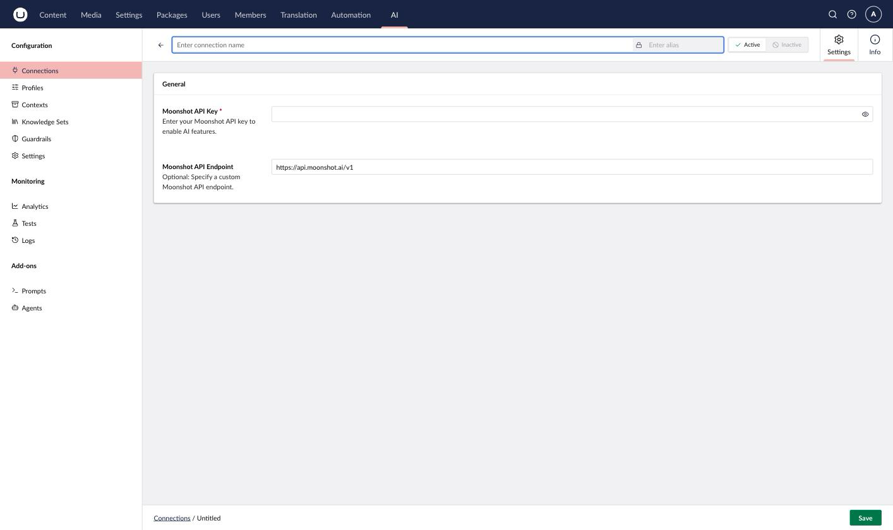

# Moonshot AI

Moonshot AI provides access to Kimi models, supporting the Chat capability.

## Installation



```powershell
Install-Package Umbraco.AI.Moonshot
```



Or via .NET CLI:



```bash
dotnet add package Umbraco.AI.Moonshot
```



## Connection Settings

| Setting  | Required | Description                                                                    |
| -------- | -------- | -------------------------------------------------------------------------------- |
| API Key  | Yes      | Your Moonshot API key from [platform.kimi.ai](https://platform.kimi.ai/)       |
| Endpoint | No       | Custom endpoint URL (defaults to `https://api.moonshot.ai/v1`)                 |



### Getting an API Key

1. Sign up at [platform.kimi.ai](https://platform.kimi.ai/).
2. Navigate to **API Keys**.
3. Create a new key.
4. Copy the key (it won't be shown again).


Keep your API key secure. Never commit it to source control or expose it in client-side code.



The default model is `kimi-k3`. Moonshot doesn't document an embeddings endpoint, so this provider supports Chat only.


## Related

- [Providers Overview](README.md).
- [Managing Connections](../backoffice/managing-connections.md).
