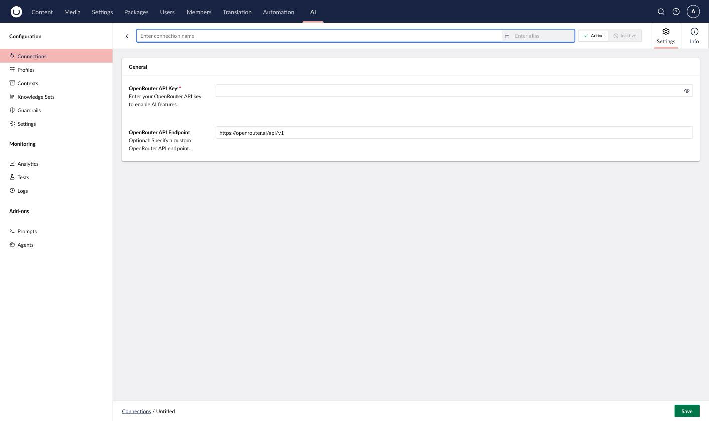

# OpenRouter

OpenRouter provides access to hundreds of chat models from dozens of vendors through a single API key, supporting the Chat capability.

## Installation



```powershell
Install-Package Umbraco.AI.OpenRouter
```



Or via .NET CLI:



```bash
dotnet add package Umbraco.AI.OpenRouter
```



## Connection Settings

| Setting  | Required | Description                                                            |
| -------- | -------- | -------------------------------------------------------------------------- |
| API Key  | Yes      | Your OpenRouter API key from [openrouter.ai/keys](https://openrouter.ai/keys) |
| Endpoint | No       | Custom endpoint URL (defaults to `https://openrouter.ai/api/v1`)       |

### Getting an API Key

1. Sign up at [openrouter.ai](https://openrouter.ai/)
2. Navigate to **Keys**
3. Create a new key
4. Copy the key (it won't be shown again)


Keep your API key secure. Never commit it to source control or expose it in client-side code.


### Choosing a Model

OpenRouter model IDs include the originating vendor, for example `openai/gpt-4o` or `anthropic/claude-3.5-sonnet`. Umbraco.AI lists the available models directly from the OpenRouter catalog.


This provider supports Chat only. OpenRouter's provider routing and fallback options, reasoning-effort settings, and embeddings aren't available yet.




## Related

- [Providers Overview](README.md)
- [Managing Connections](../backoffice/managing-connections.md)
