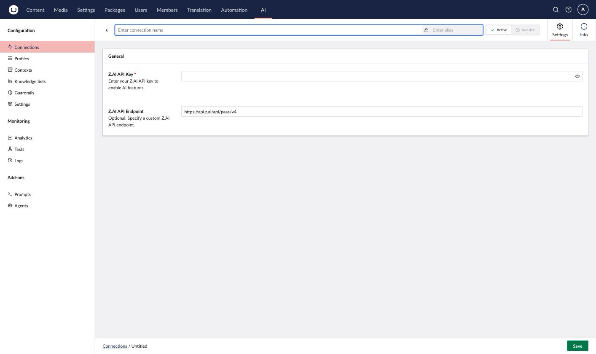

# Z.AI

Z.AI provides access to GLM models, supporting the Chat capability.

## Installation



```powershell
Install-Package Umbraco.AI.ZAI
```



Or via .NET CLI:



```bash
dotnet add package Umbraco.AI.ZAI
```



## Connection Settings

| Setting  | Required | Description                                                          |
| -------- | -------- | -------------------------------------------------------------------- |
| API Key  | Yes      | Your Z.AI API key from [z.ai/model-api](https://z.ai/model-api)      |
| Endpoint | No       | Custom endpoint URL (defaults to `https://api.z.ai/api/paas/v4`)     |

### Getting an API Key

1. Sign up at [z.ai/model-api](https://z.ai/model-api)
2. Navigate to **API Keys**
3. Create a new key
4. Copy the key (it won't be shown again)


Keep your API key secure. Never commit it to source control or expose it in client-side code.



Z.AI's global API doesn't offer an embeddings endpoint, so this provider supports Chat only.




## Related

- [Providers Overview](README.md)
- [Managing Connections](../backoffice/managing-connections.md)
