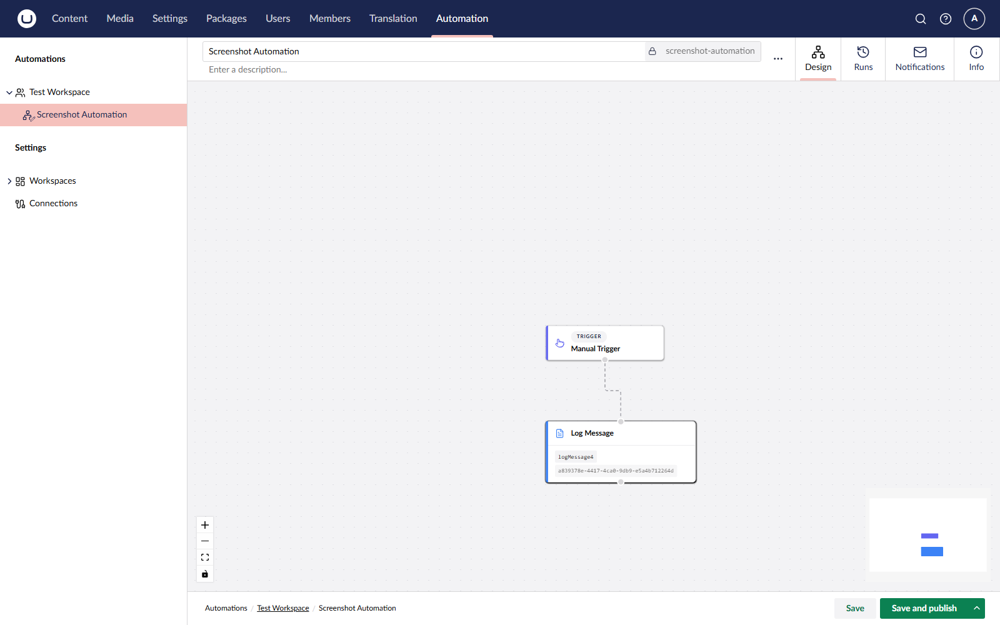

# Umbraco Automate

Umbraco Automate brings event-driven automation directly into Umbraco CMS. You build workflows on a visual canvas in the backoffice by combining triggers (events that start a flow) with actions (units of work). No external automation platform is needed.

<figure><figcaption>
An automation built in the visual canvas editor.
</figcaption></figure>

## Key Features

* **Visual canvas editor** — Build automations by dragging triggers and actions onto a canvas and connecting them.
* **Built-in triggers and actions** — React to content, media, and member events. Make HTTP requests, send email, publish content, and more.
* **Add-on packages** — Install packages such as Slack, Forms, Commerce, Engage, AI, and Deploy to add more triggers and actions.
* **Workspaces** — Group automations and scope which connections and users have access.
* **Connections** — Reusable credential sets for external services such as Slack.
* **Bindings** — Pass data between steps using `${ ... }` syntax with filters.
* **Run history** — Every run is recorded with per-step inputs, outputs, errors, and timing.

## Explore the Documentation

<table data-view="cards"><thead><tr><th></th><th data-hidden data-card-target data-type="content-ref"></th><th data-hidden data-card-cover data-type="image">Cover image</th></tr></thead><tbody><tr><td><strong>Getting Started</strong> New to Umbraco Automate? Start here.</td><td><a href="getting-started/">getting-started</a></td><td><a href=".gitbook/assets/Documentations Icons_Umbraco_Commerce_Get_Started.png">Documentations Icons_Umbraco_Commerce_Get_Started.png</a></td></tr><tr><td><strong>Core Concepts</strong> Learn how Umbraco Automate is structured.</td><td><a href="concepts/">concepts</a></td><td><a href=".gitbook/assets/Documentations Icons_Umbraco_Commerce_Key_Concepts.png">Documentations Icons_Umbraco_Commerce_Key_Concepts.png</a></td></tr><tr><td><strong>Using the Backoffice</strong> Manage workspaces, build automations, and review runs.</td><td><a href="backoffice/">backoffice</a></td><td><a href=".gitbook/assets/Documentations Icons_Umbraco_CMS_Fundamentals_Backoffice.png">Documentations Icons_Umbraco_CMS_Fundamentals_Backoffice.png</a></td></tr><tr><td><strong>Add-ons</strong> Install add-on packages to expand the catalogue of triggers and actions.</td><td><a href="add-ons/">add-ons</a></td><td><a href=".gitbook/assets/Documentations Icons_Umbraco_CMS_Extending_Packages.png">Documentations Icons_Umbraco_CMS_Extending_Packages.png</a></td></tr><tr><td><strong>Extending</strong> Create custom triggers, actions, and connection types.</td><td><a href="https://app.gitbook.com/s/GBKRsxTRbnrPZiQxwTe5/extending">Extending</a></td><td><a href=".gitbook/assets/Documentations Icons_Umbraco_CMS_Extending_Backoffice_UI_API.png">Documentations Icons_Umbraco_CMS_Extending_Backoffice_UI_API.png</a></td></tr></tbody></table>
