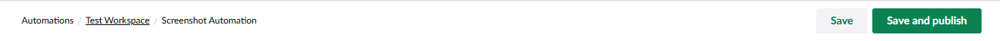

# Build an Automation

Automations are built on a visual canvas. You start with a trigger, add actions and control flow nodes, and connect them in the order you want them to run.

The automation editor has four tabs:

| Tab               | Purpose                                                           |
| ----------------- | ----------------------------------------------------------------- |
| **Design**        | The visual canvas where you build the automation.                 |
| **Runs**          | The list of recent executions of the automation.                  |
| **Notifications** | Per-automation failure notification settings.                     |
| **Info**          | Version history, automation metadata, and the **Enabled** toggle. |

<figure><figcaption>
The automation editor on the Design tab.
</figcaption></figure>

## Build an automation

Follow these steps to create, configure, and publish an automation.

### Create an Automation

1. In the tree, right-click the workspace where the automation should live.
2. Select **Create automation**.
3. Enter a name and click **Create**.

The new automation opens on the canvas with an empty trigger slot.

### Choose a Trigger

1. Click the trigger placeholder.
2. Select a trigger from the catalogue picker. The picker groups triggers by category, for example **Core**, **Content**, **Media**, **Members**, **Users**.
3. Configure the trigger settings in the dialog.
4. Click **Submit**.

<figure><figcaption>
Picking a trigger.
</figcaption></figure>

### Add Steps

To add a step:

1. Click the **+** button below the trigger or any existing step.
2. Pick an action or a control flow node.
3. Configure its settings. Use the binding picker to insert values from the trigger or earlier steps.
4. Click **Submit**.

Repeat to chain more steps.

### Use Bindings

Any setting that supports bindings shows a binding picker icon. Click the icon to insert a `${ ... }` placeholder that resolves to data from the trigger or a previous step at runtime. See [Bindings](../concepts/bindings.md) for the syntax.

### Branch with Control Flow

To branch or loop, pick a control flow node such as **If**, **Switch**, or **For Each** from the picker. Each control flow node has one or more inner branches that you fill with steps the same way you fill the main canvas.

### Save and Publish

The automation toolbar has a split button:

| Action               | Effect                                                                                                          |
| -------------------- | --------------------------------------------------------------------------------------------------------------- |
| **Save**             | Save the current draft. The live version is unchanged.                                                          |
| **Save and Publish** | Save and make the current draft the live version. Triggers fire against the new version from this point onward. |

<figure><figcaption>
The save and publish split button.
</figcaption></figure>


A draft automation does not respond to triggers. The automation only goes live after the first **Save and Publish**.


## Disable an Automation

To stop an automation from responding to triggers without losing its published state, open the **Info** tab and toggle the **Enabled** switch off. Toggle it back on to resume.

## Delete an Automation

Right-click an automation in the tree and select **Delete**. Deleting an automation deletes its run history.

## See Also

* [Triggers](../concepts/triggers.md)
* [Actions](../concepts/actions.md)
* [Versioning](../concepts/versioning.md)
