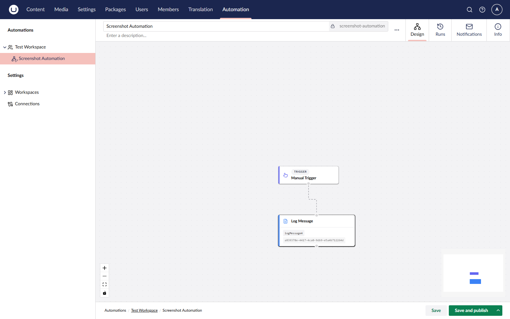
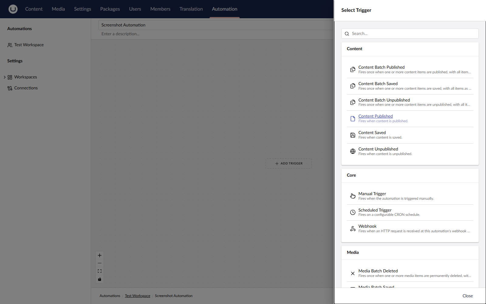
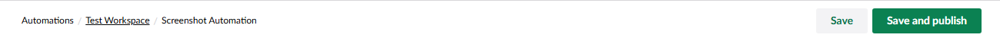

# Build an Automation

Automations are built on a visual canvas. You start with a trigger, add actions and control flow nodes, and connect them in the order you want them to run.

The automation editor has four tabs:

| Tab               | Purpose                                                           |
| ----------------- | ----------------------------------------------------------------- |
| **Design**        | The visual canvas where you build the automation.                 |
| **Runs**          | The list of recent executions of the automation.                  |
| **Notifications** | Notification channels for this automation, and which run events each one reports, such as a failed or suspended run. |
| **Info**          | Version history, automation metadata, the **Enabled** toggle, and the webhook URL (for automations using the Webhook trigger). |

<figure><figcaption>
The automation editor on the Design tab.
</figcaption></figure>

## Build an automation

Follow these steps to create, configure, and publish an automation.

### Create an Automation

1. In the tree, click **+** next to the workspace where the automation should live.
2. Select **Create automation**.
3. Enter a name and click **Save and publish**.

The new automation opens on the canvas with an empty trigger slot.

### Choose a Trigger

1. Click the trigger placeholder.
2. Select a trigger from the catalogue picker. The picker groups triggers by category, for example **Core**, **Content**, **Media**, **Members**, **Users**.
3. Configure the trigger settings in the dialog.
4. Click **Save**.

<figure><figcaption>
Picking a trigger.
</figcaption></figure>

### Add Steps

To add a step:

1. Click the **+** button below the trigger or any existing step.
2. Pick an action or a control flow node.
3. Configure its settings. Use the binding picker to insert values from the trigger or earlier steps.
4. Click **Save**.

Repeat to chain more steps.

Clicking **+** on an output that is already connected inserts the new step between that output and the step it connects to. The step it connected to now runs after the new step. The same applies when you drag from a connected output onto an empty part of the canvas. On the **Body** handle of a **Parallel** node, **+** adds a new branch instead.

Automate places new steps so that they do not overlap existing steps.

To add a step between two connected steps, hover the connection and click the **Insert action** (+) button. When you insert a control flow step, the step that followed connects to the output that continues the flow. That is **Done** for **For Each**, **While**, and **Parallel**, and **True** for **If**. For **Switch**, it is the first case, or **default** when there are no cases. For **Request Approval**, it is **Approved**. Automate moves the downstream steps down to make room.

### Use Bindings

Any setting that supports bindings shows a binding picker icon. Click the icon to insert a `${ ... }` placeholder that resolves to data from the trigger or a previous step at runtime. See [Bindings](../concepts/bindings.md) for the syntax.

### Branch with Control Flow

To branch or loop, pick a control flow node such as **If**, **Switch**, or **For Each** from the picker. Each control flow node has one or more inner branches that you fill with steps the same way you fill the main canvas.

### Save and Publish

The automation toolbar has a split button:

| Action               | Effect                                                                                                          |
| -------------------- | --------------------------------------------------------------------------------------------------------------- |
| **Save**             | Save the current draft. The live version is unchanged.                                                          |
| **Save and Publish** | Save and make the current draft the live version. Triggers fire against the new version from this point onward. |

<figure><figcaption>
The save and publish split button.
</figcaption></figure>


A draft automation does not respond to triggers. The automation only goes live after the first **Save and publish**.




If any steps on the canvas aren't connected to the trigger, Automate shows a warning naming them when you save or publish. Disconnected steps are never run, but the warning doesn't block saving. The canvas shows these steps faded, with a dashed outline. Reconnect or remove them once you see it.



## Run an Automation On Demand

For triggers that support it (Manual, Scheduled, and Webhook), open the automation's context menu (the three dots next to it in the tree). Select **Run now** to start the automation immediately. **Run now** is only offered while the automation is published. See [Running a Trigger On Demand](../concepts/triggers.md#running-a-trigger-on-demand) for the full list of supported triggers and webhook-specific behavior.

## Disable an Automation

To stop an automation from responding to triggers without losing its published state, open the **Info** tab and toggle the **Enabled** switch off. Toggle it back on to resume.

## Delete an Automation

Open the automation's context menu (the three dots next to it in the tree) and select **Delete**. Deleting an automation deletes its run history.

## See Also

* [Triggers](../concepts/triggers.md)
* [Actions](../concepts/actions.md)
* [Versioning](../concepts/versioning.md)
