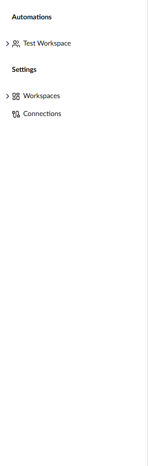
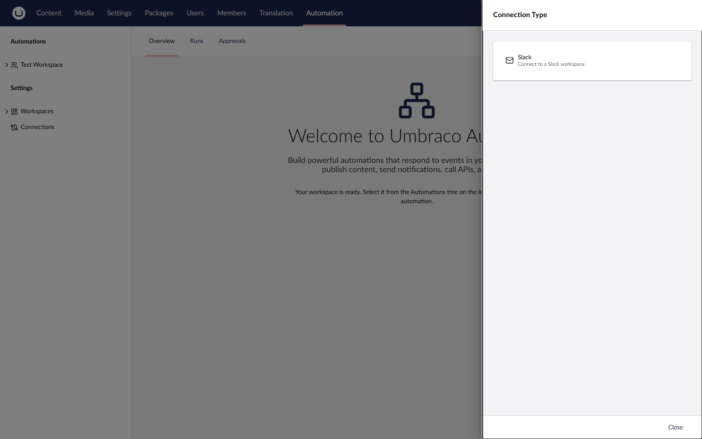

# Manage Connections

A connection stores the credentials an action needs to talk to an external service. See [Connections](../concepts/connections.md) for the underlying concept.

## Where Connections Live

Connections are managed from the **Settings** sidebar in the **Automate** section. The Settings sidebar is only visible to administrators.

<figure><figcaption>
Connections live under the Settings menu in the Automate sidebar.
</figcaption></figure>

## Create a Connection

1. Open the **Automate** section.
2. Switch to the **Settings** sidebar.
3. Open **Connections** in the tree.
4. Right-click the **Connections** root and select **Create connection**.
5. Pick a connection type from the picker, for example **Slack**.
6. Enter a name and configure the type-specific settings.
7. Click **Save**.
8. Click **Test connection** to verify the credentials.

<figure><figcaption>
Creating a connection.
</figcaption></figure>

## Allow a Connection in a Workspace

A connection only appears in an action's connection picker when its workspace has explicitly allowed it.

1. Open the workspace that needs the connection.
2. On the **Settings** tab, find the **Allowed Connections** field.
3. Pick the connection from the connection picker.
4. Save the workspace.

## Authenticate an OAuth Connection

OAuth connection types, such as Slack, have an **Authenticate** button. It opens the provider's sign-in page in a popup window. After you sign in, the connection editor shows the connection as connected. Save the connection to keep the new authentication.

If the browser blocks the popup, the editor shows a warning with a **Continue in this tab** button. The button reads **Save and continue in this tab** when the connection is new or has unsaved changes, and saves the connection first. Select it to sign in with the provider in the same browser tab. After signing in, you return to the connection with the authentication applied. Click **Save** to keep it.

Keep the following in mind when you authenticate a connection:

* Save the connection within 15 minutes of signing in. After that, saving fails with a message asking you to authenticate again.
* Each authentication belongs to one connection. To use the same provider account in another connection, authenticate again from that connection.
* Automate removes authentications that were never saved to a connection after 24 hours.

## Test a Connection

The **Test connection** button calls the connection type's validator. For OAuth connections, this confirms the access token is still valid and can reach the provider's API. For credential-based connections, it attempts a real call.

The button appears once the connection is saved. If the connection has unsaved changes, **Test connection** saves them first and then runs the test. If the form has validation errors, a warning asks you to fix them and save the connection. The test runs only after a successful save.

A failed test shows the error message so you can correct the settings. Connection types that do not implement a validator return a warning instead of a success.

## Use a Connection in an Action

When you configure an action that requires a connection, the connection picker only shows connections of the matching type that the current workspace has allowed.

## Delete a Connection

Open the connection from the Settings sidebar and click **Delete**. Any automation step that uses the deleted connection will fail at runtime until the step is reconfigured.

## Environment Safety

Connection definitions can transfer between environments via Umbraco Deploy, but sensitive credential values are stripped by default. See [Transfer Automations](../add-ons/deploy/transferring-automations.md) for the rules Deploy applies.

## See Also

* [Connections](../concepts/connections.md)
* [Transfer Automations](../add-ons/deploy/transferring-automations.md)
