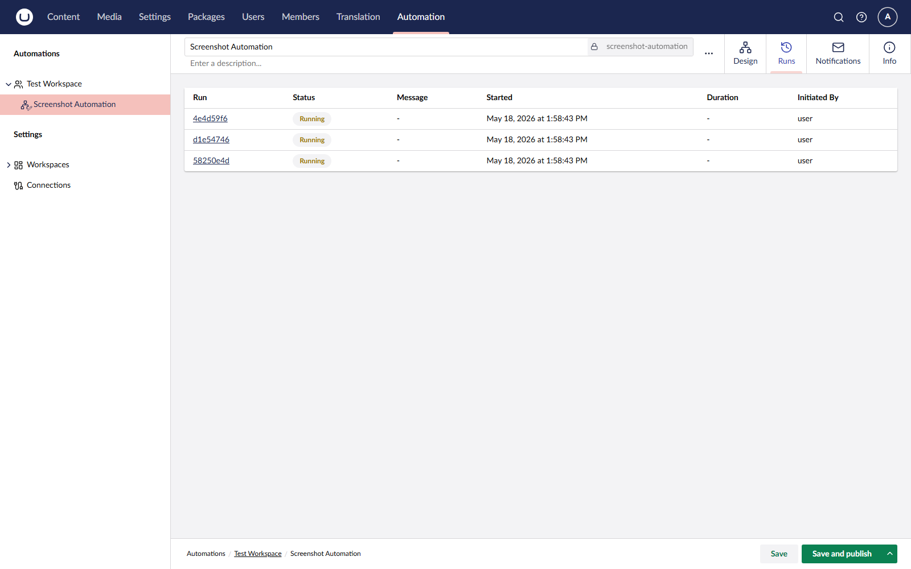

# Reviewing Runs

Every execution of an automation produces a **run** record. Use the **Runs** view to find a specific run and inspect its data step by step.

## Find a Run

1. Open the automation in the tree.
2. Switch to the **Runs** tab.
3. Scroll or page through the list of runs, most recent first.

<figure><figcaption>
The runs list view.
</figcaption></figure>

## Inspect a Run

Click a run to open the run detail view. The canvas replays the automation with each step coloured by execution status:

| Colour | Status                                                   |
| ------ | -------------------------------------------------------- |
| Grey   | Pending — not yet run                                    |
| Blue   | Running                                                  |
| Green  | Completed                                                |
| Red    | Failed                                                   |
| Yellow | Waiting for input (for example, an approval) or sleeping |

Click a step to open its data panel.

## Read Step Data

The data panel shows three sections for the selected step:

| Section      | Contents                                                             |
| ------------ | -------------------------------------------------------------------- |
| **Settings** | The resolved settings used for this run, with all bindings replaced. |
| **Output**   | The data the step produced, available to downstream bindings.        |
| **Error**    | The exception message and category if the step failed.               |

## Retention

Old run data is purged based on the `AuditLogRetentionDays` setting. See [Configuration](../getting-started/configuration.md).

## See Also

* [Runs](../concepts/runs.md)
* [Versioning](../concepts/versioning.md)
