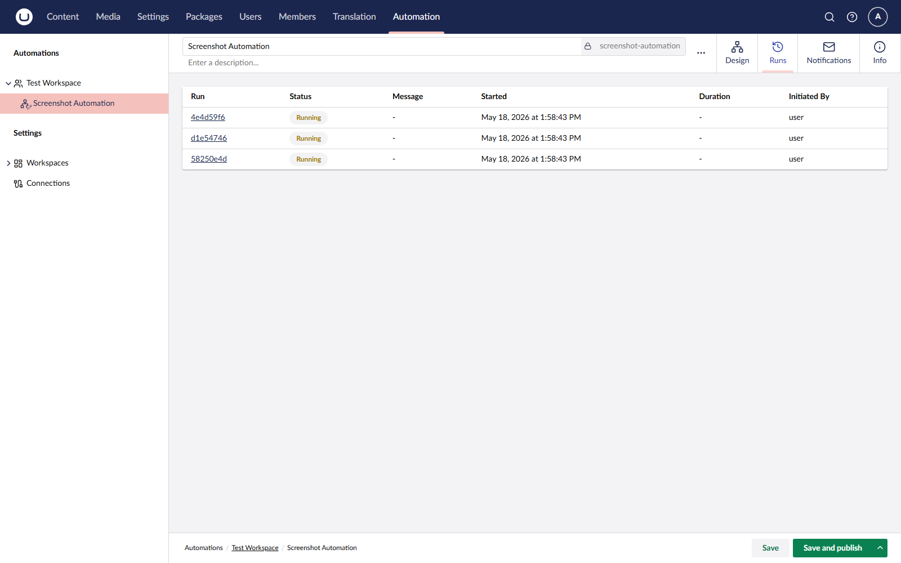

# Reviewing Runs

Every execution of an automation produces a **run** record. Use the **Runs** view to find a specific run and inspect its data step by step.

## Find a Run

1. Open the automation in the tree.
2. Switch to the **Runs** tab.
3. Scroll or page through the list of runs, most recent first. The list refreshes automatically as new runs start and finish.

<figure><figcaption>
The runs list view.
</figcaption></figure>

## Inspect a Run

Click a run to open its details. The main area lists the trigger first, followed by each step that ran, in order. Each step row shows the action name, how long the step took, and its status.

The **Run Info** panel shows the run's status, start and completion times, and who or what initiated it. It also shows the automation version that ran and any error that ended the run. When a failing step ended the run, the error is that step's error.

Depending on the run's status, you can act on it from the buttons at the bottom:

* **Suspend** pauses a running run.
* **Resume** continues a suspended run. It isn't offered while a step waits for an approval. Approve or reject the approval instead.
* **Terminate** stops a running or suspended run, after you confirm.
* **Replay** starts a new run with the same trigger data, once a run has completed, failed, or been rejected. **Replay** is unavailable while the automation is unpublished.

## Read Step Data

Click the trigger row or a step row to expand it. Expanding the trigger row shows the data the trigger passed into the run.

When a step failed, its error appears above the tabs. An expanded step has these tabs:

| Tab         | Contents                                                                                  |
| ----------- | ----------------------------------------------------------------------------------------- |
| **Details** | When the step started and completed, and how many times it was retried.                   |
| **Input**   | The step's settings as they were used for this run, with bindings and configuration references resolved. |
| **Output**  | The data the step produced, available to downstream bindings.                             |
| **Logs**    | The log entries the action wrote while it ran. Only shown when the step wrote at least one entry. |

Input, output, and trigger data are shown as a list of properties, with nested objects and JSON text formatted for reading. Switch on **Raw JSON** to see the value exactly as it was stored. Values longer than 65,536 characters are truncated.

Sensitive settings, such as passwords and API keys, are always masked as `********`. Automate masks them before storing the step's input, so a resolved secret is never saved with the run.

### Log Entries

Each log entry shows the time it was written, its level (Debug, Info, Warning, or Error), and a message. The built-in actions write entries that describe what they did. For example:

* **HTTP Request** writes the method, URL, status code, response time, and response size. User names, passwords, and query strings are left out of the URL. A removed query string shows as `?…`.
* **Run Script** writes the script's `console` output. `console.warn` becomes a Warning and `console.error` an Error.
* **Create Content** writes the item it created, and warns about property aliases it could not set.

Request and response bodies, headers, email addresses, and property values are never logged. Any sensitive setting value that appears in a message is redacted.

Entries below `Execution:MinimumLogLevel` (Info by default) are not recorded. Each step keeps its first `Execution:MaxLogEntriesPerStep` entries (200 by default). Later entries are dropped without a warning. See [Configuration](../getting-started/configuration.md).

## Retention

Automate deletes runs older than `RunCleanup:RetentionDays` (90 by default). It also keeps at most `RunCleanup:MaxRunsPerAutomation` runs per automation (1,000 by default). See [Run Cleanup](../getting-started/configuration.md#run-cleanup).

## See Also

* [Runs](../concepts/runs.md)
* [Versioning](../concepts/versioning.md)
