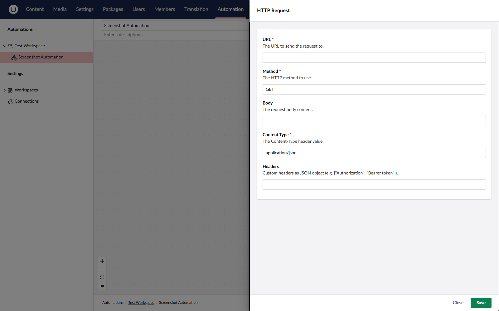

# Actions

An action is a reusable unit of work. You add actions to an automation as steps and configure each step with its own settings.

## **Available** Built-in Actions

Use built-in actions to send data, update Umbraco entities, and control automation flow.

### General

| Action               | Purpose                                                                                                                                                                    |
| -------------------- | -------------------------------------------------------------------------------------------------------------------------------------------------------------------------- |
| **HTTP Request**     | Send an HTTP request to an external URL.                                                                                                                                   |
| **Send Email**       | Send an email to one or more recipients.                                                                                                                                   |
| **Log Message**      | Write a message to the application log. Useful for debugging.                                                                                                              |
| **Delay**            | Pause the automation for a configurable duration.                                                                                                                          |
| **Set Variable**     | Output a named value that downstream steps can bind to.                                                                                                                    |
| **Notify Editor**    | Send a realtime toast to any backoffice user currently editing a content item.                                                                                             |
| **Request Approval** | Suspend the run and wait for a user to approve or reject.                                                                                                                  |
| **Run Script**       | Run a short JavaScript snippet in a sandbox to transform or compute data, with optional outbound `fetch` support and a configurable output schema for downstream bindings. |
| **Start Automation** | Start another published automation in the same workspace, optionally passing trigger data. See [Start Another Automation](actions.md#start-another-automation).          |

### Content

| Action                      | Purpose                                                                        |
| --------------------------- | ------------------------------------------------------------------------------ |
| **Create Content**          | Create a content item under a parent or at the content root (draft save).      |
| **Move Content**            | Move a content item to a new parent or to the content root.                    |
| **Publish Content**         | Publish an Umbraco content item.                                               |
| **Unpublish Content**       | Unpublish an Umbraco content item.                                             |
| **Get Content**             | Fetch a published content item and expose its properties for downstream steps. |
| **Find Content**            | Find content items by name, optionally filtered by content type.               |
| **Get Content Property**    | Read a single property value from a published content item.                    |
| **Update Content Property** | Write a single property value on a content item (draft save).                  |

### Media

| Action                    | Purpose                                                            |
| ------------------------- | ------------------------------------------------------------------ |
| **Create Media**          | Create a media item in a folder or at the media root, optionally downloading its file from a URL. |
| **Move Media**            | Move a media item to a new folder or to the media root.            |
| **Get Media**             | Fetch a media item and expose its properties for downstream steps. |
| **Find Media**            | Find media items by name, optionally filtered by media type.       |
| **Get Media Property**    | Read a single property value from a media item.                    |
| **Update Media Property** | Write a single property value on a media item.                     |

Add-on packages contribute additional actions. See [Add-ons](../add-ons/add-ons.md) for the catalogue.

You can only select an action that needs a connection once the workspace allows a connection of the right type. Until then, the action picker shows it as unavailable, with the reason. See [Connections](../backoffice/connections.md).

## Action Settings

Each action exposes its own settings. The settings panel is generated from the action's settings model. Many settings support [Bindings](bindings.md) so values can be pulled in from the trigger or previous steps at runtime.

<figure><figcaption><p>Configuring an action's settings.</p></figcaption></figure>

## Action Output

Actions can produce output that downstream steps can bind to. For example, the HTTP Request action outputs the response status code and body:

```
${ steps.callApi.statusCode }
${ steps.callApi.responseBody }
```

Each step has a **Name** (its label on the canvas) and an **Alias** (`callApi` in the example). See [Step Behaviour](actions.md#step-behaviour) below for both.

## HTTP Request Headers and Body

**Headers** are optional. Click **Add** to add a row, one row per header. Removing a row that has a name or value asks you to confirm first. Each value can include [bindings](bindings.md), for example `Bearer ${ steps.getToken.result }`. Header values are treated as sensitive: they are encrypted when stored and masked in the run view.

Automate ignores rows where both the name and the value are empty. The following rows fail the step with a validation error, and the request is not sent:

* A row with a value but no name.
* A header name with invalid characters.
* A content header, such as `Content-Type`, on a request that sends no body.

On a request with a body, a content header applies to the body and overrides the content type the body sets.

**Body type** controls how the request body is built. Only `POST`, `PUT`, and `PATCH` requests send a body.

* **Raw** sends the **Body** text as written, with the **Content Type** you set. Use it for JSON or XML.
* **Form** sends the **Form fields** rows as an `application/x-www-form-urlencoded` body and sets the content type for you. Rows without a name are skipped.

Form field values are not treated as sensitive, so keep credentials in **Headers**.

The settings panel only shows the fields for the selected body type. Values you entered for the other type are kept, so switching back restores them.

Steps saved with the earlier JSON **Headers** field keep working. Automate reads the JSON as header rows when the step runs, and stores them as rows the next time you save the step.



The HTTP Request action rejects responses larger than `Execution:MaxHttpResponseBodyBytes` (10 MB by default). The step fails with a terminal error that names the response size and the limit. Raise the limit in [Configuration](../getting-started/configuration.md) for larger payloads.

The HTTP Request action only calls public destinations. See [Outbound Requests](../getting-started/configuration.md#outbound-requests) for the address categories Automate refuses and how it handles proxies.





The Run Script action runs in a JavaScript sandbox with a 5 MB memory cap and a 15-second total execution timeout by default. Configure both via `Scripting:*` settings. See [Run Script Settings](../getting-started/configuration.md#run-script-settings).

A script can only make outbound `fetch` calls when both of these are on:

* **Allow fetch** on the step. This is off for new Run Script steps, so turn it on for each step that needs `fetch`. Existing steps keep the value they were saved with. A step created through the Management API or imported from JSON without an `allowFetch` value has fetch turned off.
* `Scripting:FetchEnabled` for the whole site. This is `true` by default. Set it to `false` to turn off `fetch` for every Run Script step. A step with **Allow fetch** on then writes a warning to its **Logs** tab.

To restrict which hosts scripts can call, list them in `Scripting:FetchAllowedHosts`. When the list is empty, `fetch` can call any public host. `fetch` follows the same destination rules as the HTTP Request action. See [Outbound Requests](../getting-started/configuration.md#outbound-requests).

When a `fetch` request fails, the promise rejects with a short error message, for example, `http request was blocked` or `fetch failed: connection refused`. Automate writes the full details to the server log.



## Run Script Data

A Run Script step exports a default function. The function receives a `data` argument and returns the step's output.

`data` holds the values a binding can reach, at the same paths. If a binding would use `${ steps.getMedia.properties.umbracoBytes }`, the script reads `data.steps.getMedia.properties.umbracoBytes`.

| Binding                              | Script                                                           |
| ------------------------------------ | ---------------------------------------------------------------- |
| `${ trigger.<path> }`                | `data.trigger.<path>`                                            |
| `${ steps.<alias>.<path> }`          | `data.steps.<alias>.<path>`                                      |
| `${ previous.<path> }`               | `data.previous.<path>`. Not present for the first step.          |
| `${ loop.item }` / `${ loop.index }` | `data.loop.item` / `data.loop.index`. Inside a **For Each** only. |


```javascript
export default function (data) {
    const bytes = data.steps.getMedia.properties.umbracoBytes;
    return {
        name: data.trigger.contentName.toUpperCase(),
        sizeKb: Math.round(bytes / 1024)
    };
}
```


Keep the following in mind when you read from `data`:

* Property names in a script are case-sensitive, unlike bindings. Match the casing of each alias and property exactly.
* A step without an alias appears under its ID, for example `data.steps['<id>']`.
* Only steps that already ran are present. A step on a branch that did not run is missing, so guard optional paths, for example `data.steps.maybe?.result`.
* Automate does not resolve `${ ... }` bindings inside the script body. Read the values from `data` instead.
* `data` is a copy. Changing it has no effect on later steps. Return any values that later steps need.
* Data nested more than 64 levels deep, or data that refers to itself, fails the step with a validation error.

The returned value becomes the step's `result` output. Downstream steps bind to it with `${ steps.<alias>.result }`.

Output from `console.log` and the other `console` methods appears in the step's **Logs** tab in the run view. See [Reviewing Runs](../backoffice/runs.md#log-entries).

## Start Another Automation

Use **Start Automation** to split a long flow into smaller automations. Pick the automation to start in **Automation**. The list only shows automations from the current workspace.

Use **Trigger Data** to pass a JSON object to the started automation. Its steps read the values with bindings such as `${ trigger.orderId }`. The started automation's own trigger does not fire, so its trigger output contains only this data.

The started automation must be published when the step runs. Automate runs its published version, not its draft. Rate limits and the circuit breaker still apply. The step does not wait for the started run to finish.

The step outputs `started`, `runId`, `automationKey`, and `skippedReason`. It fails without retrying in these cases:

* The target is missing, unpublished, or in another workspace.
* Starting the target would create a cycle.
* The chain would exceed `Execution:MaxChainDepth` Start Automation hops, 5 by default.

When the target's circuit breaker is open, the step succeeds with `started` set to `false`. The reason is in `skippedReason` and the step's log.

You can save a draft before you pick an automation. Publishing checks that an automation is selected, that it is not the automation itself, and that it exists in this workspace.

## Create and Move Items

**Create Content** saves a new draft. Add a **Publish Content** step after it to publish the item. Leave **Parent** empty to create the item at the content root. The content type must allow being created at the root.

Set **Culture** when the content type varies by culture, for example `en-US`. Culture-variant properties in **Property Values** are set for that culture.

Enter **Property Values** as a JSON object of property aliases and values, for example `{"bodyText": "Hello", "rating": 4, "featured": true}`. Keep the following in mind:

* Strings, numbers, and `true`/`false` values are set as they are. Umbraco converts them to the property's storage type.
* Objects and arrays are stored as JSON text. Write them in the format the property stores, for example for a block or picker property.
* `null` values are skipped.
* Automate skips unknown aliases, and writes a warning to the step's **Logs** tab.
* If the text is not valid JSON, or is not a JSON object, Automate ignores all of it and writes a warning.
* A value that can't be converted to the property's storage type fails the step.

**Create Media** saves a new media item. Media has no draft, so the item is live straight away. Leave **Parent** empty to create it at the media root.

Set **Source URL** to download a file onto the item, for example `${ loop.item.imageUrl }`. Leave it empty for media types without a file, such as folders. Downloads follow the [Outbound Requests](../getting-started/configuration.md#outbound-requests) rules. They are capped by `Execution:MaxMediaFileBytes`, 10 MB by default. **Property Values** on **Create Media** sets invariant properties only, and cannot set the file.

When a download fails, Automate still creates the item, without a file. The step writes a warning, and the `fileName` output is empty. One unreachable file does not stop a **For Each** loop.

When the parent, content type, or media type no longer exists, both create actions succeed without creating anything. The `contentKey` or `mediaKey` output is then an empty GUID. Check it with an **If** step before later steps use it.

**Move Content** and **Move Media** move an item to **Target Parent**. Leave it empty to move the item to the root. The service account needs access to both the item and the destination. The step fails when the item is missing or in the recycle bin.

Creating or moving an item at the content or media root needs root access for the service account of the workspace. See [Service-Account Permissions](workspaces.md#service-account-permissions).

## Step Behaviour

Each step has additional settings on the canvas:

| Setting            | Description                                                                                                                                                                                                   |
| ------------------ | ------------------------------------------------------------------------------------------------------------------------------------------------------------------------------------------------------------- |
| **Name**           | The step's display label on the canvas.                                                                                                                                                                       |
| **Alias**          | The identifier used to reference the step's output in bindings, for example `${ steps.callApi.responseBody }`. Automate suggests one automatically when you add the step, adding a number if another step already uses it, for example `tellTeam2`. Edit it any time before publishing. |
| **Error behavior** | What to do when the step fails: **Retry**, **Suspend** the run for manual intervention, **Terminate** the run, or **Compensate** before terminating.                                                          |
| **Max retries**    | When the error behavior is **Retry**, how many times the step retries before giving up.                                                                                                                       |
| **Retry interval** | When the error behavior is **Retry**, how long to wait between retries.                                                                                                                                       |


An alias must start with a letter and contain only letters and numbers, and must be unique within the automation. Renaming a step's **Name** after it's been added does not change its **Alias**: the two are independent once set. Publishing fails if any binding elsewhere in the automation still references an alias that no longer exists.


The engine-wide default step timeout is controlled by the `Execution:DefaultTimeout` setting. See [Configuration](../getting-started/configuration.md).

## See Also

* [Build an Automation](../backoffice/building-an-automation.md)
* [Connections](connections.md)
* [Create a Custom Action](../extending/custom-action.md)
