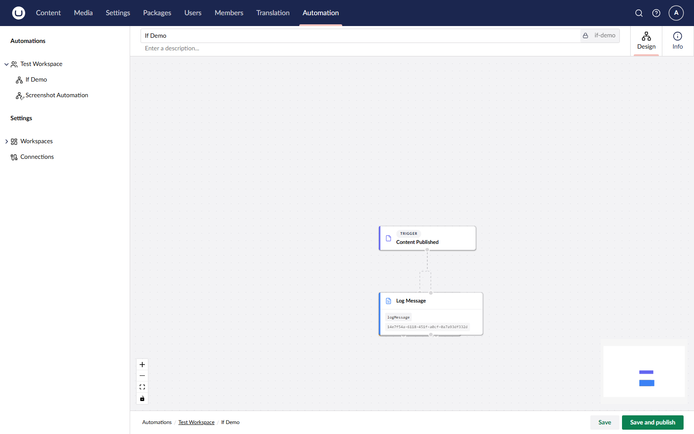

# Automations

An automation is a workflow you build in the backoffice. Every automation has:

* Exactly one trigger: the event that starts the workflow.
* Zero or more step&#x73;**:** actions and control-flow nodes that run in sequence.
* A draft version and an optional published version.

## Anatomy of an Automation

<figure><figcaption>
An automation made up of a trigger and several steps.
</figcaption></figure>

| Part                    | Purpose                                                                          |
| ----------------------- | -------------------------------------------------------------------------------- |
| **Trigger node**        | Subscribes to an event. Outputs data that downstream steps can bind to.          |
| **Action node**         | Performs a unit of work — make an HTTP request, send a message, publish content. |
| **Control flow node**   | Adds branching or looping — If, Switch, While, For Each, Parallel.               |
| **Connections (edges)** | Define the order in which nodes execute.                                         |

## Lifecycle

| Status        | Triggers fire? | Description                                                                                       |
| ------------- | -------------- | ------------------------------------------------------------------------------------------------- |
| **Draft**     | No             | The automation is being edited. It does not respond to events.                                    |
| **Published** | Yes            | The live version runs when its trigger fires.                                                     |
| **Inactive**  | No             | The automation has been explicitly disabled. The published version is retained for re-activation. |

Editing a published automation saves draft changes without disturbing the live version. See [Versioning](versioning.md) for details on rollback.

## See Also

* [Build an Automation](../backoffice/building-an-automation.md)
* [Triggers](triggers.md)
* [Actions](actions.md)
* [Runs](runs.md)
