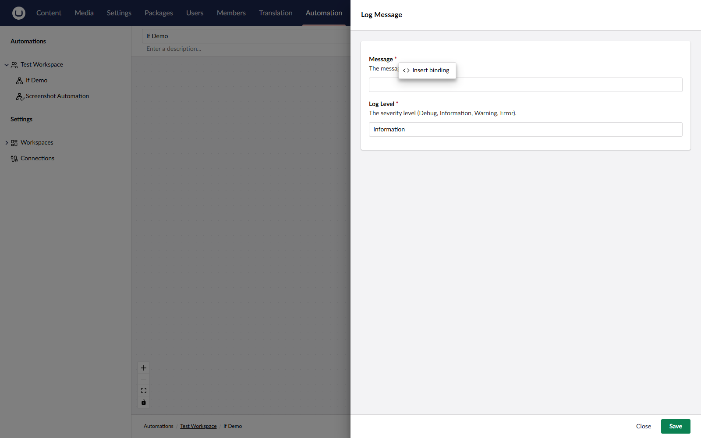

# Bindings

Bindings pass data between the steps of an automation. A binding is a `${ ... }` placeholder inside an action setting that is resolved at runtime against the data produced by previous steps.

## Syntax

A binding has a path and zero or more filters:

```
${ <path> }
${ <path> | <filter> }
${ <path> | <filter>:<arg> | <filter>:<arg> }
```

Output property names are exposed to bindings in camelCase — `ContentName` on the trigger output becomes `${ trigger.contentName }`.

## Root Paths

| Root                    | Resolves to                                                                                             |
| ----------------------- | ------------------------------------------------------------------------------------------------------- |
| `trigger.<field>`       | A field on the trigger output.                                                                          |
| `steps.<alias>.<field>` | A field on a previous step's output. The alias is set in the step settings. The step's GUID also works. |
| `previous.<field>`      | The output of the step immediately before this one.                                                     |
| `loop.item.<field>`     | Inside a **For Each**, the current item.                                                                |
| `loop.index`            | Inside a **For Each**, the zero-based iteration index.                                                  |

Paths support nested dictionaries, array indexes (`items[0]`), and dictionary keys (`headers["Content-Type"]`). A `length` or `count` segment on a list resolves to the list size.

## Examples

```
${ trigger.contentName }
${ trigger.firedAtUtc | formatDate:yyyy-MM-dd }
${ steps.callApi.responseBody | truncate:200 }
${ trigger.body | stripHtml | truncate:500 }
${ previous.statusCode }
```

## Built-in Filters

| Filter                | Purpose                                                                                                           |
| --------------------- | ----------------------------------------------------------------------------------------------------------------- |
| `truncate:<length>`   | Truncate the value to the given length. An optional second argument appends a suffix when the value is truncated. |
| `formatDate:<format>` | Format a `DateTime` or `DateTimeOffset` using a .NET format string.                                               |
| `fallback:<value>`    | Use the provided value if the path resolves to null or empty.                                                     |
| `stripHtml`           | Remove HTML tags from a string.                                                                                   |
| `uppercase`           | Convert the value to uppercase.                                                                                   |
| `lowercase`           | Convert the value to lowercase.                                                                                   |
| `json`                | Serialize the value to JSON.                                                                                      |

Filters can be chained using the `|` separator. Arguments are colon-separated, so an argument value must not contain a literal colon.

## Where Bindings Work

A setting supports bindings when the underlying setting model marks the field with `SupportsBindings = true`. The settings editor surfaces a binding picker on those fields. The picker lists every binding source available at that point: the trigger output and the output of every preceding step.

<figure><figcaption><p>The binding picker in an action setting.</p></figcaption></figure>
