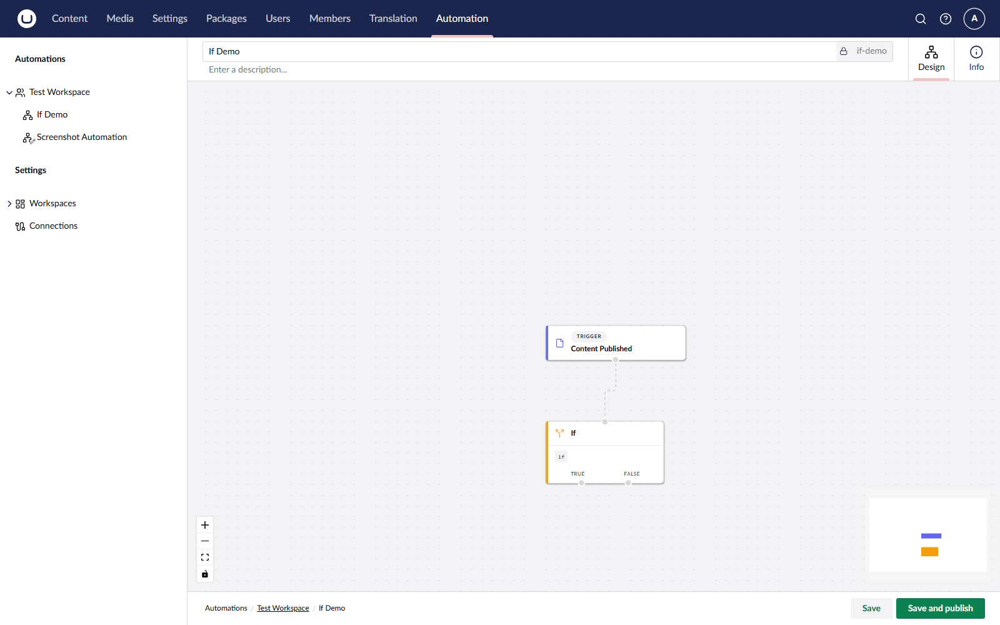

# Control Flow

Control flow nodes let an automation branch based on data or run steps repeatedly. They are added to the canvas in the same way as actions, from the same picker.

## Available Built-in Control Flow Nodes

| Node         | Behaviour                                                                            |
| ------------ | ------------------------------------------------------------------------------------ |
| **If**       | Run the **then** branch when a condition is true, otherwise run the **else** branch. |
| **Switch**   | Run the first case whose condition is true, or a **default** branch if none match.   |
| **While**    | Repeat the inner branch while a condition is true.                                   |
| **For Each** | Run the inner branch once per item in a collection.                                  |
| **Parallel** | Run multiple branches concurrently and wait for all of them to finish.               |

## If

The **If** node evaluates a binding expression and routes the run down one of two branches. Use it to send only certain events to an action — for example, only Slack-notify when a content item of type `News` is published.

<figure><figcaption><p>An If node with two outgoing branches.</p></figcaption></figure>

## For Each

The **For Each** node iterates over a collection. The current item and index are exposed inside the inner branch so you can reference them from steps:

```
${ loop.item.title }
${ loop.item.url }
${ loop.index }
```

## See Also

* [Bindings](bindings.md)
