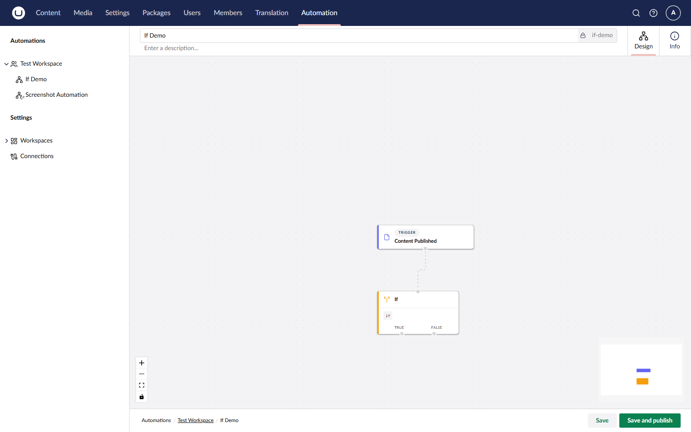

# Control Flow

Control flow nodes let an automation branch based on data or run steps repeatedly. They are added to the canvas in the same way as actions, from the same picker.

## Available Built-in Control Flow Nodes

| Node         | Behaviour                                                                            |
| ------------ | ------------------------------------------------------------------------------------ |
| **If**       | Run the **then** branch when a condition is true, otherwise run the **else** branch. |
| **Switch**   | Run the first case whose condition is true, or a **default** branch if none match.   |
| **While**    | Repeat the inner branch while a condition is true.                                   |
| **For Each** | Run the inner branch once per item in a collection.                                  |
| **Parallel** | Run multiple branches concurrently and wait for all of them to finish.               |

## If

The **If** node evaluates a binding expression and routes the run down one of two branches. Use it to send only certain events to an action — for example, only Slack-notify when a content item of type `News` is published.

<figure><figcaption><p>An If node with two outgoing branches.</p></figcaption></figure>

## Body and Done: While, For Each, and Parallel

**While**, **For Each**, and **Parallel** are container nodes — instead of a single next step, each owns a body of steps and renders two handles:

* **Body** — the step(s) that run inside the loop, or as a branch of the Parallel.
* **Done** — the step that runs once, after every iteration or branch has finished.

Connect whatever comes next after the loop to the **Done** handle, not the Body handle. Otherwise, it runs on every iteration instead of once at the end.

For **Parallel** only, the Body handle accepts more than one connection — each one becomes its own concurrent branch. Every other handle, on every node, accepts at most one.


Automations built before these handles existed keep working as they did. With no Done connection, Automate works out what runs next from the shape of the steps drawn after the loop.


## For Each

The **For Each** node iterates over a collection. The current item and index are exposed inside the inner branch so you can reference them from steps:

```
${ loop.item.title }
${ loop.item.url }
${ loop.index }
```

## Other Steps That Branch

Not every branch comes from a control flow node. Some actions declare their own outcome handles. **Request Approval** branches on **Approved** and **Rejected** instead of running a single next step — see [Use Approvals](../backoffice/approvals.md).

## See Also

* [Bindings](bindings.md)
* [Use Approvals](../backoffice/approvals.md)
