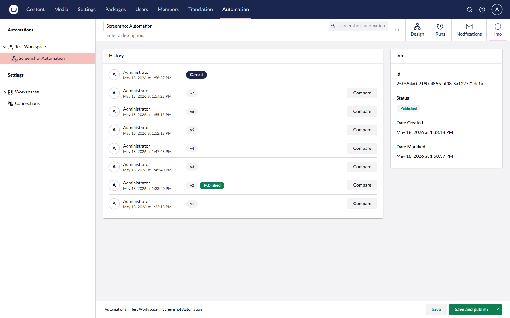

# Versioning

Umbraco Automate uses the same draft and published model as Umbraco content. Every save creates an immutable version. Only the published version responds to triggers.

## Draft and Published

| State                   | What it means                                            |
| ----------------------- | -------------------------------------------------------- |
| **Draft**               | Your in-progress edits. Does not run when triggers fire. |
| **Published**           | The live version. Runs when triggers fire.               |
| **Unpublished changes** | The draft is ahead of the published version.             |

Editing a published automation creates a new draft. The live version keeps running until you publish your draft.

## Version History

The **Info** tab on an automation lists every version with its publish date and the user who published it. From the version list you can:

* **View** a previous version on the canvas.
* **Rollback** to a previous version. Rollback creates a new draft based on the chosen version.

<figure><figcaption>
The version history of an automation.
</figcaption></figure>

## In-Flight Runs

A run always completes on the version that was live when the run started. Publishing a new version, or rolling back, does not interrupt runs that are already in progress.

## See Also

* [Automations](automations.md)
* [Runs](runs.md)
