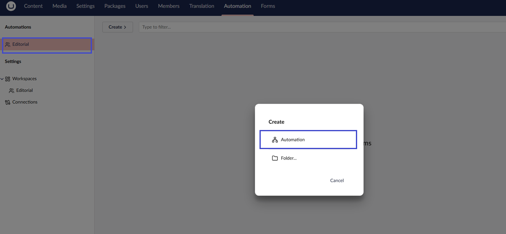
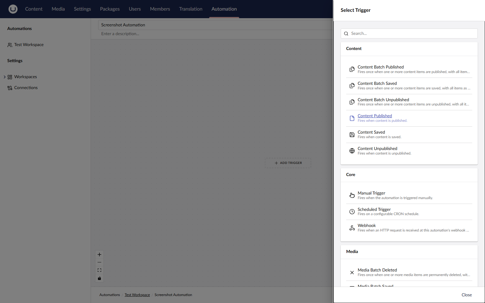
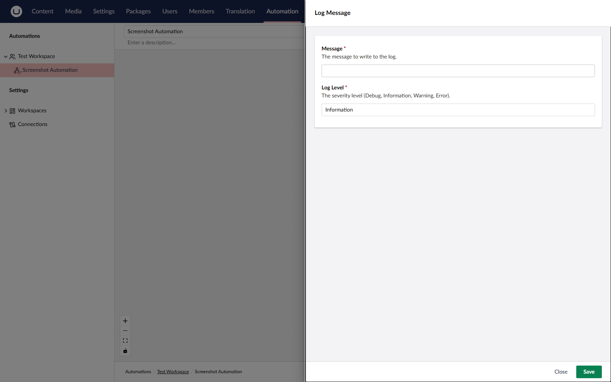
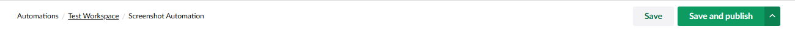

# Create Your First Automation

Follow this guide to build an automation that writes a message to the application log whenever a content item is published.

## Prerequisites

* Umbraco Automate is installed and the database is configured.
* An administrator user (workspace creation and connection management are admin-only).
* Access to the **Automate** section in the backoffice.
* At least one publishable content item.

## Build a publish-triggered automation



### Step 1: Create a Workspace

The first time you open the **Automation** section, the dashboard shows a welcome panel because no workspaces exist yet.

1. Click **Create a Workspace** on the welcome panel.
2. Enter a name, for example `Editorial`.
3. On the **Settings** tab, pick a **Service Account Key** and at least one **User Group**.
4. Click **Save**.

A workspace groups automations together and controls which user groups and connections have access.



### Step 2: Create the Automation

1. In the tree, expand your new workspace.
2. Select **Create automation** from the actions panel.
3. Enter a name, for example `Log on publish`, and click **Create**.

<figure><figcaption>
Creating a new automation.
</figcaption></figure>

The new automation opens on the visual canvas with an empty trigger placeholder.



### Step 3: Configure the Trigger

1. Click the trigger placeholder.
2. In the picker, select **Content Published**.
3. Leave the content types field blank to match all content types.
4. Click **Submit**.

<figure><figcaption>
Picking a trigger from the catalogue.
</figcaption></figure>



### Step 4: Add an Action

1. Click the **+** button below the trigger.
2. In the picker, select **Log Message**.
3. Set the message to `Content "${ trigger.contentName }" was published.`
4. Click **Submit**.

The `${ trigger.contentName }` placeholder is a binding. The binding is replaced at runtime with the name of the published content item.

<figure><figcaption>
Configuring the Log Message action with a binding.
</figcaption></figure>



### Step 5: Publish the Automation

Automations only react to events when they are published. Draft automations do not run.

Click **Save and Publish** in the workspace toolbar.

<figure><figcaption>
Publishing the automation.
</figcaption></figure>



### Step 6: Trigger the Automation

1. Open the **Content** section.
2. Publish any content item.
3. Return to the **Automate** section and open the automation.
4. Switch to the **Runs** tab to see the run record.
5. Click on the **Log Message** step to inspect the resolved message and output data for the run.


Your automation is working when the run appears in the **Runs** tab and the **Log Message** step shows the resolved message.




## Next Steps

Read **Core Concepts** to understand workspaces, bindings, and connections.


[concepts](../concepts/)


Then explore **Add-ons** to add triggers and actions for Slack, Forms, Commerce, and more.


[add-ons](../add-ons/)

