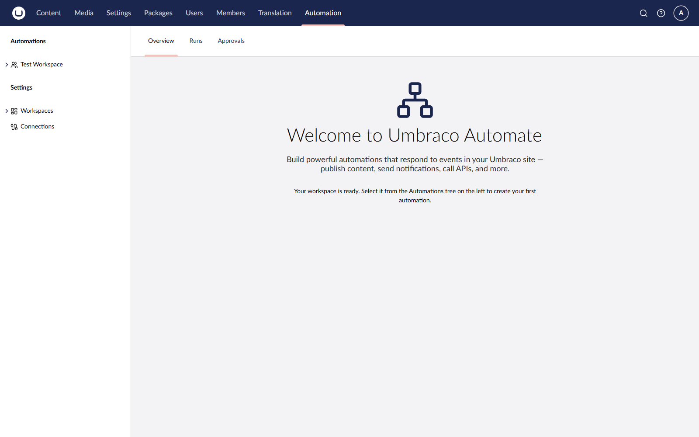

# Installation

Umbraco Automate is distributed as a NuGet package. Install it into your Umbraco project to add the automation engine, backoffice section, and built-in triggers and actions.

## Install the Package

Add the package using any of the methods below:



```bash
dotnet add package Umbraco.Automate
```



```powershell
Install-Package Umbraco.Automate
```



## Package Contents

The `Umbraco.Automate` package bundles everything needed for the core engine, including core services, backoffice UI, Management API, and database migrations.

## Verify Installation

Build and run your Umbraco site. The first run applies the Umbraco Automate database migrations to the configured database.

After the site starts, a new **Automate** section is available in the backoffice.

<figure><figcaption><p>The Automate section in the backoffice.</p></figcaption></figure>


**User permissions** — Automate is a standalone section. If you cannot see the Automate section, grant your user group access:

1. Go to **Users** > **User Groups**.
2. Edit the relevant user group, for example _Administrators_.
3. Enable **Automate** in the **Sections** list.
4. Save the user group.
5. Refresh your browser.


## Next Steps


[configuration.md](configuration.md)

