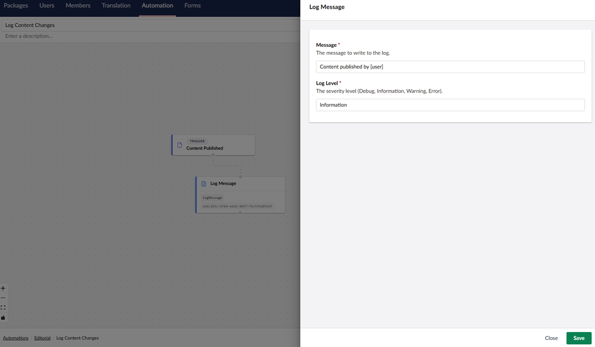
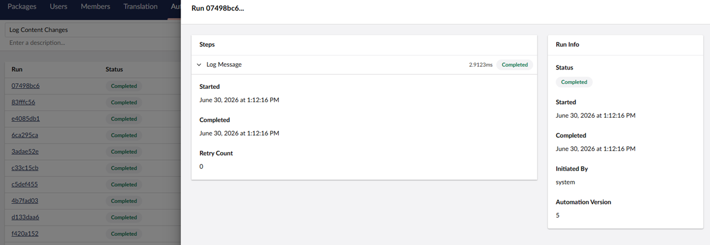
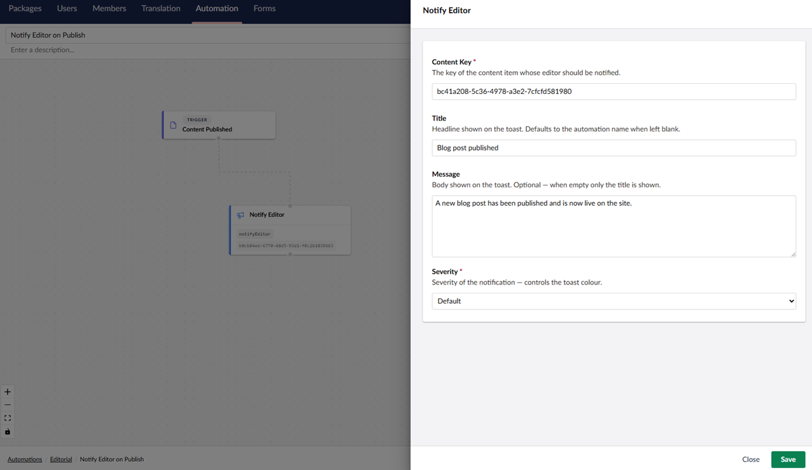
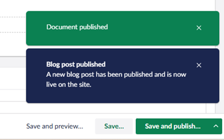
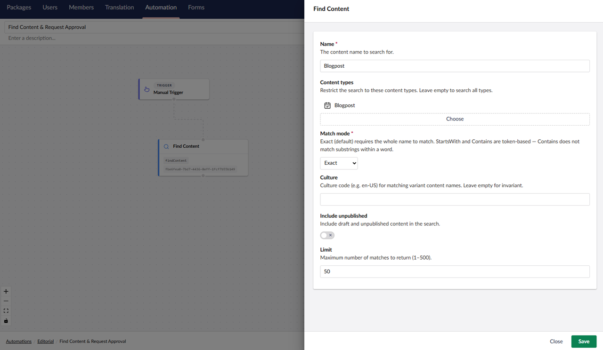
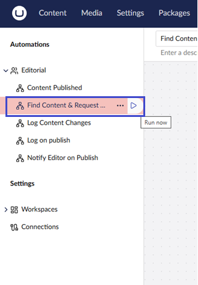
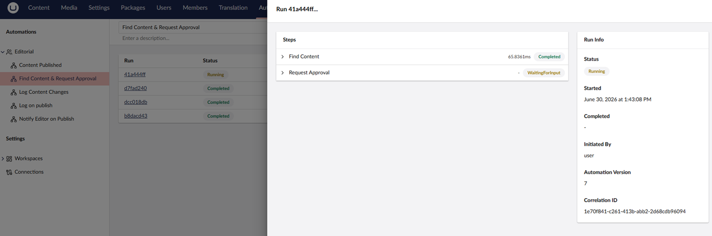
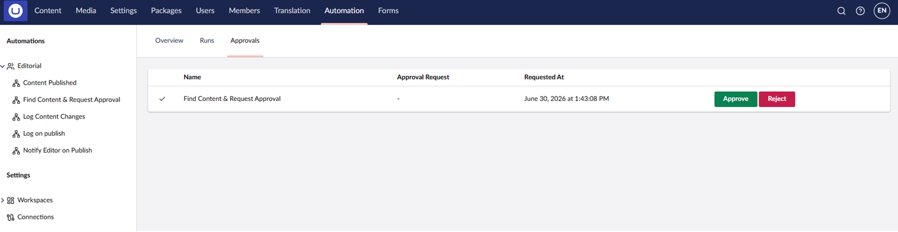

# Getting Started for Editors

Umbraco Automate is an event-driven automation engine that lives natively inside your CMS. Think of it like a personal assistant. It watches your website for specific events, like publishing new content. Then, it automatically triggers actions, like sending a Slack message to your team.

## Before You Start

Your site administrator handles the primary infrastructure. Before you begin building, make sure they have:

- **Assigned you to a Workspace** – Workspaces control who can view and edit specific automations.
- **Configured Connections** – Connections are reusable sets of credentials for external services (like Slack or an email provider).  

If you cannot access the Workspace or see your team's external services, ask your administrator to invite your user group to the workspace.

## Key Concepts

- Trigger — The event that starts an automation. Examples: "When content is published", "When a form is submitted", "At a specific time each day".
- Action — What happens after the trigger. Examples: "Send an email", "Post a message to Slack", "Publish another piece of content".
- Automation — A visual workflow combining a single trigger and a sequence of actions.
- Bindings: Placeholders using `${ ... }` syntax that pass dynamic information from a trigger or previous action step down to a later action.Example: Pulling a customer's name out of a form to personalize an email.

## Accessing Automation in the Backoffice

1. Log into the Umbraco Backoffice.
2. Locate **Automation** in the top bar.

.

## Build Your First Automation

Start with the [Create Your First Automation](../getting-started/first-automation.md) article, which walks you through:

- Creating your first automation
- Adding triggers and actions
- Publishing and testing

Once you're comfortable with the basics, continue to explore couple of workflows you can build.

## Example Workflows

Now that you understand the basics, here are few common automations you can build:

### Workflow 1: Log Important Events

This automation creates a log entry every time something happens, useful for auditing and debugging.

#### Why use this?

- Track what happened and when.
- Helpful for debugging if something goes wrong.
- Creates an audit trail for compliance
- Simplest automation to set up

#### What you'll see

- Trigger: "Content Published"
- Action: "Log Message"

#### Setup

1. Go to **Automation** in the Umbraco backoffice.
2. Create a new automation called *Log Content Changes*.
3. Click **Add trigger** and select **Content Published**.
4. Click **+** to add an action and select **Log Message**.
5. Enter a **Message**. For example: *Content published by [user]*.

.

6. Click **Save**.
7. Click **Save and Publish**.


The logged message appears in Umbraco's application logs. To view it, go to **Settings** → **Log Viewer** in the backoffice. You can also see a summary in the Automation **Runs** history showing when the action completed.


#### Test it

1. Publish any content.
2. Go to **Automation** > **Runs** to see the log entry.

You'll see a list of every time it ran. Click on a run to expand it and see the logged message

.

### Workflow 2: Notify Editors when content is Published

When a content node is published, backoffice editors see an instant notification (toast message) alerting them that the content is live.

#### Why use this?

- Keep your team informed in real-time when important content goes live.
- Everyone editing in Umbraco gets notified immediately.

#### What you'll see

- Trigger: "Content Published"
- Action: "Notify Editor"

#### Setup

1. Go to **Automation** in the Umbraco backoffice.
2. Create a new automation called *Notify Editor on Publish*.
3. Click **Add trigger** and select **Content Published**.
4. Click **+** to add an action and select **Notify Editor**.
5. Enter a Content ID in the **Content Key** field.

To find your content's ID, open the content item in the editor. The ID appears in the right panel under **Info** Workspace View.

6. Enter a **Title**. For example: *Blog post published*.
7. Enter a **Message**. For example: *A new blog post has been published and is now live on the site.*
8. Select the **Severity** of the notification from the dropdown.

.

6. Click **Save**.
7. Click **Save and Publish**.

#### Test it

Publish any content. You'll see a notification appear in the backoffice. Only editors who are currently logged into the backoffice will see the notification.

### Workflow 3: Find Content & Request Approval

When you click "Run Now," the automation searches for content and then pauses to wait for someone to approve before continuing.

#### Why use this?

- Ensures important changes get reviewed before they happen
- Creates an audit trail (you can see who approved and when)
- Reduces mistakes on critical content

#### What you'll see

- Trigger: "Manual Trigger"
- Action: "Find Content"
- Action: "Request Approval"

#### Setup

1. Go to **Automation** in the Umbraco backoffice.
2. Create a new automation called *Find Content & Request Approval*.
3. Click **Add trigger** and select **Manual Trigger**.
4. Click **+** to add an action and select **Find Content**.
5. In the **Find Content** action, enter:

    - **Name**. For example, "blog" to find all content with "blog" in the name.
    - Optionally filter by **Content Type**.

.

6. Click **Save**.
7. Click **+** to add an action and select **Request Approval**.
8. Enter a **Prompt**. For example: *Please review the content found and approve to continue.*.

.

9. Click **Save**.
10. Click **Save and Publish**.

#### Test it

1. Click **Run Now** next to the automation name.

.

The automation finds content and pauses at the approval step.

2. In the **Runs** Workspace View, you'll see "WaitingForInput" status.

.

3. In the **Approvals** Workspace View, an approver can approve/reject to complete the workflow.

If no one approves within the timeout period (if set), the automation stops waiting. You can see pending approvals in the **Approvals** workspace view.

## Common Questions & Troubleshooting

### How do I stop an automation?

To disable a single automation:

1. Go to the automation.
2. Click **Unpublish**.

It will no longer run automatically.

### What if I made a mistake?

To edit a published automation:

1. Go to the automation.
2. Edit the trigger or actions set up.
3. Click **Save and Publish**.

To revert to a previous version:

1. Go to the **Info** Workspace View.
2. Select **Compare**.
3. Click **Rollback to version x**.

## Next Steps

- Try building an automation from the three workflows above.
- Check the Runs history to make sure it worked.
- Explore other [triggers](../concepts/triggers.md) and [actions](../concepts/actions.md).

Happy automating!
