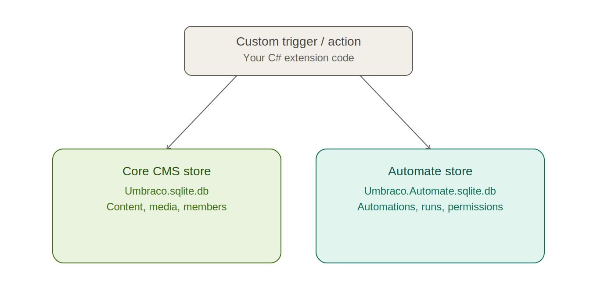
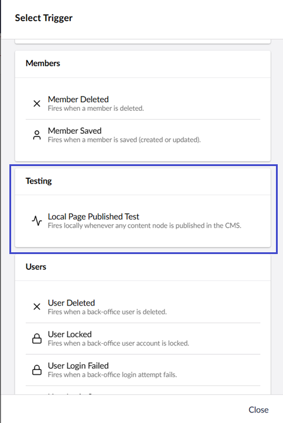
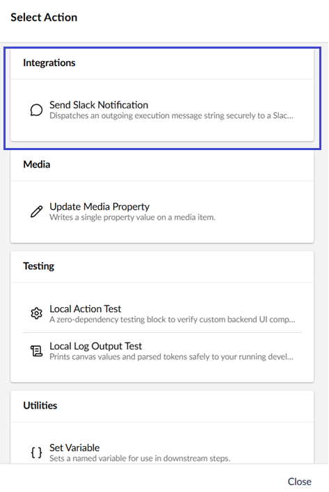
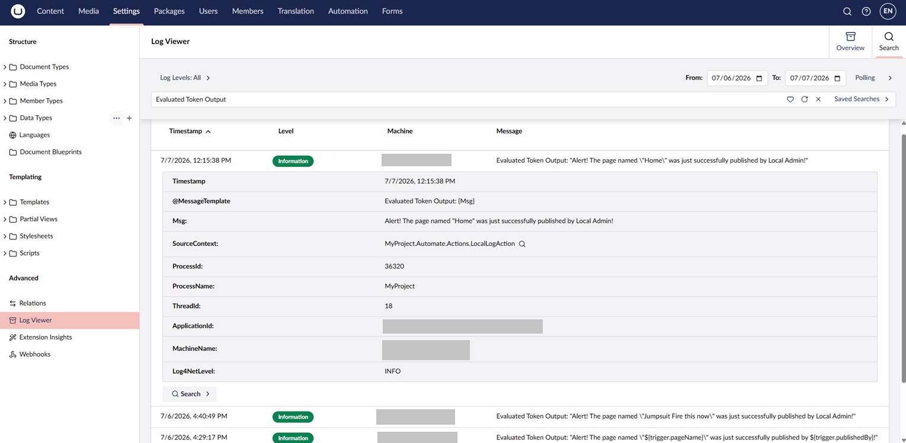

# Technical Runbook: Extending Automate for Developers

This reference outlines local conventions, configuration structures, and implementation patterns used to create custom blocks and triggers for Umbraco Automate.

## Case Study: The Architectural Goal

To understand why custom extensions are necessary, consider a typical enterprise content ecosystem. Umbraco Automate provides built-in assets for common tasks like logging messages or sending generic emails. However, custom triggers and actions are required to bridge your specific domain business logic with the automation canvas.

This guide showcases two distinct development patterns:

- **[The Zero-Dependency Local Flow:](#blueprint-1-zero-dependency-local-testing-flow)** A testing suite used to verify that your custom fields, attributes, and backend schemas are registering properly in the backoffice UI without connecting to external networks.

- **[The Production Integration Flow:](#blueprint-2-production-integration-flow-slackwebhook-variant)** A real-world blueprint modeling how an e-commerce ecosystem tracks paid invoices and securely dispatches structured payloads to external HTTP webhooks (such as Slack) while properly respecting engine timeouts, authorization constraints, and retry circuit breakers.

## Core Database & Architecture Layout

Visual automation workflows designed on the backoffice canvas read and query data across two separate database files to keep your primary website fast and responsive:

- **Core CMS Stores (`Umbraco.sqlite.db`):** Managed via `umbracoDbDSN`. This holds standard content pages, media assets, and member profiles.
- **Automate Schemas & Run Trackers (`Umbraco.Automate.sqlite.db`):** Managed via `umbracoAutomateDbDSN`. This holds your visual canvas configurations, workspace permissions, and historical execution run trackers.

.

## Blueprint 1: Zero-Dependency Local Testing Flow

Use this blueprint to verify your local workspace installation or troubleshoot core canvas execution paths without configuring external networks or API endpoints.

### File 1: Custom Trigger

- File Name: `LocalPagePublishedTrigger.cs`
- Directory Location: `MyProject/Automate/Triggers/`



```csharp
using System;
using System.Collections.Generic;
using Umbraco.Automate.Core.Settings;
using Umbraco.Automate.Core.Triggers;
using Umbraco.Cms.Core.Notifications;

namespace MyProject.Automate.Triggers;

// The data model exposed as selectable canvas tokens (e.g., ${trigger.pageName})
public sealed class LocalPagePublishedOutput
{
    public string PageName { get; init; } = string.Empty;
    public string PublishedBy { get; init; } = string.Empty;
}

// The configuration settings displayed to the editor in the canvas sidebar panel
public sealed class LocalPagePublishedSettings
{
    [Field(
        Label = "Debug Mode",
        Description = "Enable to pass extra diagnostic data down the line.",
        EditorUiAlias = "Umb.PropertyEditorUi.Toggle")]
    public bool DebugMode { get; set; }
}

// The implementation class. Extending NotificationTriggerBase automatically hooks 
// this block into Umbraco's core INotification async publishing bus.
[Trigger("myCompany.localPagePublished", "Local Page Published Test",
    Description = "Fires locally whenever any content node is published in the CMS.",
    Group = "Testing",
    Icon = "icon-activity")]
public sealed class LocalPagePublishedTrigger(TriggerInfrastructure infrastructure)
    : NotificationTriggerBase<LocalPagePublishedSettings, LocalPagePublishedOutput,
        ContentPublishedNotification>(infrastructure)
{
    public override IEnumerable<TriggerEvent> MapEvent(ContentPublishedNotification notification)
    {
        foreach (var entity in notification.PublishedEntities)
        {
            yield return new TriggerEvent<LocalPagePublishedOutput>
            {
                TriggerAlias = Alias,
                InitiatorType = TriggerInitiatorType.System,
                InitiatorId = entity.Id.ToString(),
                Output = new LocalPagePublishedOutput
                {
                    PageName = entity.Name ?? "Unnamed Node",
                    PublishedBy = "Local Admin"
                }
            };
        }
    }
}
```



### File 2: Custom Action

- File Name: `LocalLogAction.cs`
- Directory Location: `MyProject/Automate/Actions/`



```csharp
using System;
using System.Threading;
using System.Threading.Tasks;
using Microsoft.Extensions.Logging;
using Umbraco.Automate.Core.Actions;
using Umbraco.Automate.Core.Settings;

namespace MyProject.Automate.Actions;

public sealed class LocalLogSettings
{
    [Field(
        Label = "Log Title", 
        Description = "The header block message context.",
        SupportsBindings = true,
        EditorUiAlias = "Umb.PropertyEditorUi.TextBox")]
    public string LogTitle { get; set; } = string.Empty;

    [Field(
        Label = "Dynamic Message Blueprint", 
        Description = "Supports dynamic string tokens like ${trigger.pageName}.",
        SupportsBindings = true,
        EditorUiAlias = "Umb.PropertyEditorUi.TextArea")]
    public string MessageBlueprint { get; set; } = string.Empty;
}

[Action("myCompany.localLogAction", "Local Log Output Test", 
    Description = "Prints canvas values and parsed tokens safely to your running developer console log stream.", 
    Group = "Testing", 
    Icon = "icon-script")]
public sealed class LocalLogAction : ActionBase<LocalLogSettings>
{
    private readonly ILogger<LocalLogAction> _logger;

    // Custom actions must accept ActionInfrastructure and pass it down to the base constructor
    public LocalLogAction(ActionInfrastructure infrastructure, ILogger<LocalLogAction> logger) 
        : base(infrastructure)
    {
        _logger = logger;
    }

    public override Task<ActionResult> ExecuteAsync(ActionContext context, CancellationToken ct)
    {
        // context.GetSettings extracts the user configurations saved in the backoffice
        var settings = context.GetSettings<LocalLogSettings>();

        _logger.LogInformation("=========================================");
        _logger.LogInformation("--- TEST LOG COMPONENT RUNNING ---");
        _logger.LogInformation("Header Context: {Title}", settings?.LogTitle);
        _logger.LogInformation("Evaluated Token Output: {Msg}", settings?.MessageBlueprint);
        _logger.LogInformation("=========================================");
        
        return Task.FromResult(ActionResult.Success());
    }
}
```



## Blueprint 2: Production Integration Flow (Slack/Webhook Variant)

This implementation shows an advanced automation flow. A custom business notification triggers the run, filters high-value orders, and sends an external HTTP payload.

### File 1: Domain Notification Model

- File Name: `OrderPaidNotification.cs`
- Directory Location: `MyProject/Automate/Triggers/`



```csharp
using System;
using Umbraco.Cms.Core.Notifications;

namespace MyProject.Automate.Triggers;

public sealed class OrderPaidNotification(Guid invoiceKey, string customerEmail, decimal totalAmount) : INotification
{
    public Guid InvoiceKey { get; } = invoiceKey;
    public string CustomerEmail { get; } = customerEmail;
    public decimal TotalAmount { get; } = totalAmount;
}
```



### File 2: Custom Trigger

- File Name: `OrderPaidTrigger.cs`
- Directory Location: `MyProject/Automate/Triggers/`



```csharp
using System;
using System.Collections.Generic;
using Umbraco.Automate.Core.Settings;
using Umbraco.Automate.Core.Triggers;

namespace MyProject.Automate.Triggers;

public sealed class OrderPaidOutput
{
    public Guid InvoiceKey { get; init; }
    public string CustomerEmail { get; init; } = string.Empty;
    public decimal TotalAmount { get; init; }
}

public sealed class OrderPaidSettings
{
    [Field(
        Label = "High Value VIP Filter",
        Description = "Only run when transaction values exceed baseline limits.",
        SupportsBindings = true,
        EditorUiAlias = "Umb.PropertyEditorUi.Toggle")]
    public bool OnlyHighValue { get; set; }
}

[Trigger("myCompany.orderPaid", "Order Invoice Paid",
    Description = "Fires when the billing ecosystem flags an order invoice status as successfully paid.",
    Group = "E-Commerce",
    Icon = "icon-coins")]
public sealed class OrderPaidTrigger(TriggerInfrastructure infrastructure)
    : NotificationTriggerBase<OrderPaidSettings, OrderPaidOutput, OrderPaidNotification>(infrastructure)
{
    public override IEnumerable<TriggerEvent> MapEvent(OrderPaidNotification notification)
    {
        yield return new TriggerEvent<OrderPaidOutput>
        {
            TriggerAlias = Alias,
            InitiatorType = TriggerInitiatorType.System,
            InitiatorId = notification.InvoiceKey.ToString(),
            Output = new OrderPaidOutput
            {
                InvoiceKey = notification.InvoiceKey,
                CustomerEmail = notification.CustomerEmail,
                TotalAmount = notification.TotalAmount
            }
        };
    }

    // CanHandle processes the canvas-level configuration settings per automation instance.
    // If it evaluates to false, the trigger skips execution for that specific automation.
    protected override bool CanHandle(OrderPaidOutput output, OrderPaidSettings? settings)
        => settings is not { OnlyHighValue: true } || output.TotalAmount >= 500.00m;
}
```



### File 3: Custom Action

- File Name: `SlackNotificationAction.cs`
- Directory Location: `MyProject/Automate/Actions/`



```csharp
using System;
using System.Net.Http;
using System.Text;
using System.Text.Json;
using System.Threading;
using System.Threading.Tasks;
using Microsoft.Extensions.Logging;
using Umbraco.Automate.Core.Actions;
using Umbraco.Automate.Core.Settings;

namespace MyProject.Automate.Actions;

public sealed class SlackActionSettings
{
    [Field(
        Label = "Slack Webhook URL", 
        Description = "The target incoming application webhook webhook channel endpoint.",
        SupportsBindings = true,
        EditorUiAlias = "Umb.PropertyEditorUi.TextBox")]
    public string WebhookUrl { get; set; } = string.Empty;

    [Field(
        Label = "Notification Payload Message", 
        Description = "Supports dynamic canvas formatting text string bindings (e.g., ${trigger.customerEmail}).",
        SupportsBindings = true,
        EditorUiAlias = "Umb.PropertyEditorUi.TextArea")]
    public string Message { get; set; } = string.Empty;
}

[Action("myCompany.sendSlackNotification", "Send Slack Notification", 
    Description = "Dispatches an outgoing execution message string securely to a Slack channel webhook endpoint.", 
    Group = "Integrations", 
    Icon = "icon-chat-active")]
public sealed class SlackNotificationAction : ActionBase<SlackActionSettings>
{
    private readonly ILogger<SlackNotificationAction> _logger;
    private readonly HttpClient _httpClient;

    public SlackNotificationAction(
        ActionInfrastructure infrastructure, 
        ILogger<SlackNotificationAction> logger,
        HttpClient httpClient) 
        : base(infrastructure)
    {
        _logger = logger;
        _httpClient = httpClient;
    }

    public override async Task<ActionResult> ExecuteAsync(ActionContext context, CancellationToken ct)
    {
        var settings = context.GetSettings<SlackActionSettings>();

        // CONFIGURATION CORRECTION: Bad or missing configuration settings are non-transient errors. 
        // Returning ActionResult.Failed flags a permanent failure instantly and blocks wasteful background retries.
        if (settings == null || string.IsNullOrWhiteSpace(settings.WebhookUrl))
        {
            return ActionResult.Failed(
                new ArgumentNullException(nameof(settings.WebhookUrl), "Slack destination URL configuration missing."),
                StepRunErrorCategory.Validation
            );
        }

        try
        {
            _logger.LogInformation("Dispatching outbound webhook notification transport request.");

            var payload = new { text = settings.Message };
            using var requestContent = new StringContent(JsonSerializer.Serialize(payload), Encoding.UTF8, "application/json");

            var response = await _httpClient.PostAsync(settings.WebhookUrl, requestContent, ct);
            response.EnsureSuccessStatusCode();

            return ActionResult.Success();
        }
        catch (Exception ex)
        {
            _logger.LogError(ex, "Slack alert channel communication transport failure encountered.");
            
            // Transient network errors are thrown directly to instruct the engine to fire Circuit Breaker retry procedures.
            throw; 
        }
    }
}
```



### Local Testing Tip: Simulating the Domain Event

To test this blueprint locally without setting up a real checkout flow or billing application, you can temporarily hook into Umbraco's publishing loop. Create an `INotificationAsyncHandler<ContentPublishedNotification>` file and use the `IEventAggregator` to broadcast a fake payment notification whenever any content node is published:

#### File 4: The Mock Event Simulation Interceptor

- File Name: `OrderPaidSimulator.cs`
- Directory Location: `MyProject/Automate/Triggers/`



```csharp
using System;
using System.Threading;
using System.Threading.Tasks;
using Microsoft.Extensions.Logging;
using Umbraco.Cms.Core.Events;
using Umbraco.Cms.Core.Notifications;

namespace MyProject.Automate.Triggers;

public class OrderPaidSimulator : INotificationAsyncHandler<ContentPublishedNotification>
{
    private readonly IEventAggregator _eventAggregator;
    private readonly ILogger<OrderPaidSimulator> _logger;

    public OrderPaidSimulator(IEventAggregator eventAggregator, ILogger<OrderPaidSimulator> logger)
    {
        _eventAggregator = eventAggregator;
        _logger = logger;
    }

    public async Task HandleAsync(ContentPublishedNotification notification, CancellationToken cancellationToken)
    {
        foreach (var node in notification.PublishedEntities)
        {
            _logger.LogInformation("--- SIMULATOR ACTIVATED: Hijacking Starter Kit Publish Event ---");

            var fakeInvoiceId = Guid.NewGuid();
            var mockNotification = new OrderPaidNotification(
                fakeInvoiceId,
                "vip-customer@teststarterkit.com",
                750.00m
            );

            await _eventAggregator.PublishAsync(mockNotification, cancellationToken);
        }
    }
}
```




`OrderPaidSimulator` is local test scaffolding, not part of the pattern to replicate. Delete it in production. Your real billing/payment integration raises `OrderPaidNotification` directly. `OrderPaidTrigger` doesn't change either way. It's already listening for the real notification type.


Remember to register your temporary testing simulator inside a standard `IComposer` via `builder.AddNotificationAsyncHandler<ContentPublishedNotification, YourSimulatorClass>()`.

#### File 5: Registration Composer

- File Name: `AutomateRegistrationComposer.cs`
- Directory Location: `MyProject/` (Root Project Directory)



```csharp
using Umbraco.Cms.Core.Composing;
using Umbraco.Cms.Core.DependencyInjection;
using Umbraco.Cms.Core.Notifications;
using MyProject.Automate.Triggers;

namespace MyProject;

public class AutomateRegistrationComposer : IComposer
{
    public void Compose(IUmbracoBuilder builder)
    {
        // Registers custom system interceptors/simulators to the core CMS event pipeline
        builder.AddNotificationAsyncHandler<ContentPublishedNotification, OrderPaidSimulator>();
    }
}
```



## Code Integration & Testing Tips

### Automated Discovery

All custom assets derived from `[Trigger]` and `[Action]` attributes are auto-discovered at application startup via TypeLoader class scanning. You do not need to register your custom action or trigger blocks manually inside an `IComposer`.


This only applies to `[Trigger]`, `[Action]`, and `[ConnectionType]` classes. Plain Umbraco notification handlers, like the `OrderPaidSimulator` above, are standard CMS infrastructure and always need explicit `IComposer` registration.


## Local Testing Framework & Verification Loops

### The Cache-Buster Compilation Sequence

Because custom setting layouts modify the canvas UI panel structure dynamically via metadata serialization, standard hot-reloading often fails to update your configuration forms. Always run an explicit compilation refresh loop to confirm alterations:

```bash
# Force clear compiled assembly caches and target binaries
dotnet clean

# Recompile clean tracking references
dotnet build

# Launch the application
dotnet run
```

### Frontend Manifest Clearing

The modern backoffice frontend registry caches visual canvas block declarations aggressively. New groups, icons, or fields might not appear immediately inside the canvas side-panel. If this happens, execute a **Hard Refresh** on your browser (`Ctrl + F5` or `Cmd + Shift + R`) while the terminal host is running.

## Verify It's Working

A completed run with no errors is not the same as a correct run. A step can report `Success` while still producing the wrong output, if a binding failed to resolve silently. Always confirm both discovery and actual output before considering an extension done.

### Confirm Discovery in the Backoffice

Once refreshed, your custom trigger and action should appear under their configured `Group` in the respective pickers:

.

.

### Verify in Runs History

Trigger a run, then go to **Settings** > **Log Viewer** and expand the completed run to inspect the actual step output, not only its status:

.

## Resources

- [Core Concepts](../concepts/README.md)
- [Extension Points Overview](../extending/README.md)
- [Review Runs](../backoffice/runs.md)
- [GitHub Repository](https://github.com/umbraco/Umbraco.Automate)
